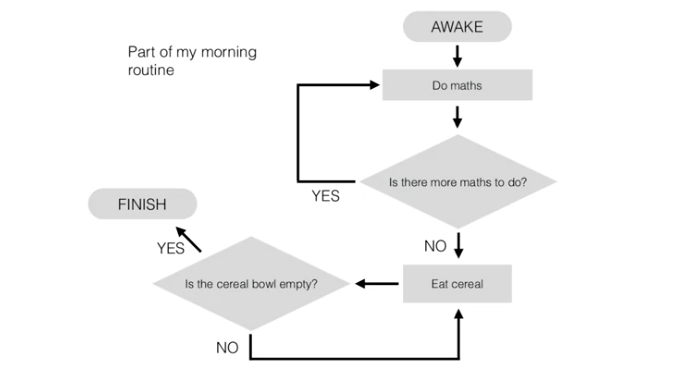

= Cheatsheet - Pseudocode, Data Structures & Time Complexity
Fabio Lama <fabio.lama@pm.me>
:description: Module: CM1015 Computational Mathematics, started 04. April 2022
:doctype: article
:sectnums: 4
:toclevels: 4
:stem:

== General Pseudocode Syntax (Example)

Pseudocode describes the logical steps of an algorithm or process in
(mostly) plain language.

. stem:[bb "function " "Morning"(tt "conscious, done, cereal")]
. stem:["    " bb "if " tt "conscious" = "TRUE" bb " then"]
. stem:["    " "    " tt "maths" larr 0]
. stem:["    " "    " bb "for " 1 <= i <= tt "done" bb " do"]
. stem:["    " "    " "    " tt "maths" larr tt "maths" + 1]
. stem:["    " "    " bb "end for"]
. stem:["    " "    " bb "while " tt "cereal" > 0 bb " do"]
. stem:["    " "    " "    " tt "cereal" larr tt "cereal" - 1]
. stem:["    " "    " bb "end while"]
. stem:["    " bb "end if"]
. stem:["    " bb "return " "ready!"]
. stem:[bb "end function"]

We can now call the stem:["Morning"] function:

. stem:[tt "status" larr "Morning"("TRUE", 10, 5)]

== Data Structures

=== Vector

A **vector** is a sequentially orderer collection of elements (like an ordered
set). For example, the following vector stem:[v] is of size _three_ and
contains the elements stem:[A], stem:[B] and stem:[C]:

[stem]
++++
"new Vector " v(3) = (A, B, C)
++++

The size of the vector is **fixed**, meaning one cannot add or remove items from
it (only replace individual items).

NOTE: In some programming languages, "vector" refers to a _growable_ collection
of data, which is very different and not the case here.

==== Operations

We can do operations on vectors:

* stem:["LENGTH"\[v\]]: Returns the size of vector stem:[v].
* stem:[v\[k\]]: Returns the element of the vector stem:[v] at index
stem:[k].
* stem:[v\[k\] larr o]: Stores the element stem:[o] into the vector stem:[v]
at index stem:[k].

For example, given vector:

[stem]
++++
"new Vector " v(4) = (A, B, C, D)
++++

Then:

[stem]
++++
"LENGTH"[v] = 4\
v[2] = B\
v[2] larr Z\
v[2] = Z\
v = (A, Z, C, D)
++++

NOTE: In programming languages, the index usually starts at stem:[0],
respectively the first element of the set is indexed at stem:[0], followed by
stem:[1, 2, ...]. In our case, we start the index at stem:[1].

=== Queue

A **queue** is a data structure where elements need to "wait" before they get
processed. Elements the get processed in the order the elements were added,
respectively "first in first out" (FIFO). Queues are not fixed sized. Elements
get added to the "tail" and come out at the "head".

[stem]
++++
"new Queue " q = (A, B, C)
++++

==== Operations

We can do operations on queues:

* stem:["HEAD"\[q\]]: Returns the element at the head of the queue.
* stem:["DEQUEUE"\[q\]]: Returns the element at the head of the queue and removes
that element from the queue.
* stem:["ENQUEUE"\[o, q\]]: Adds the element stem:[o] to the tail of the queue.
* stem:["EMPTY"\[q\]]: Returns _true_ if the queue is empty or _false_ if otherwise.

For example, given queue:

[stem]
++++
"new Queue " q = (A, B, C, D)
++++

Then:

[stem]
++++
"HEAD"[q] = D\
q = (A, B, C, D)\
"DEQUEUE"[q] = D\
q = (A, B, C)\
"ENQUEUE"[Z, q]\
q = (Z, A, B, C)\
"EMPTY"[q] = "false"
++++

=== Stack

A stack is like a queue, but elements are processed in the "last in first out"
(LIFO) order.

==== Operations

* stem:["PUSH"\[o,s\]]: Adds element stem:[o] to the stack.
* stem:["TOP"\[s\]]: Returns the last inserted element from the stack.
* stem:["POP"\[s\]]: Returns the last inserted element from the stack and
removes that element from the stack.
* stem:["EMPTY"\[s\]]: Returns _true_ if the stack is empty or _false_ if
otherwise.

For example, given stack:

[stem]
++++
"new Stack " s = (A, B, C)
++++

Then:

[stem]
++++
"PUSH"[Z,s]\
s = (A, B, C, Z)\
"TOP"[s] = Z\
s = (A, B, C, Z)\
"POP"[s] = Z\
s = (A, B, C)\
"EMPTY"[s] = "false"
++++

== Time Complexity

.Source: https://youtu.be/47GRtdHOKMg

