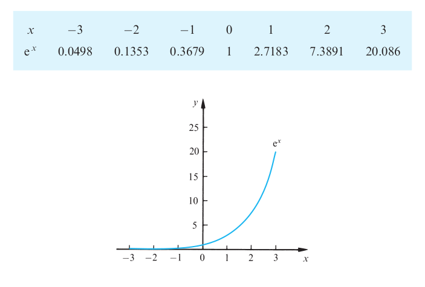

= Cheatsheet - Exponential & Logarithm Functions
Fabio Lama <fabio.lama@pm.me>
:description: Module: CM1015 Computational Mathematics, started 04. April 2022
:doctype: book
:sectnums: 4
:toclevels: 4
:stem:

== Exponential Expressions

An expression of the form stem:[a^x] is called an **exponential expression**,
where _a_ is the **base** and _x_ is the **exponent**,**power** or **index**.

NOTE: The most common exponential expression is stem:[e^x], where _e_ is the
constant _2.71828..._. Also known as "Euler's number". This number is found in
many natural phenomena.

== Exponential Functions

An exponential function has the form of stem:[y = e^x]. This function has important properties:

* _y_ is never negative.
* When stem:[x=0], then stem:[y = 1]
* As _x_ increases, then _y_ increases (**exponential growth**).

== Solving Equations with Exponential Terms

TODO...

== Logarithms

