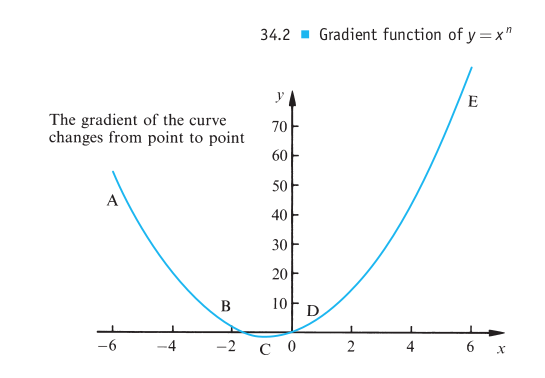
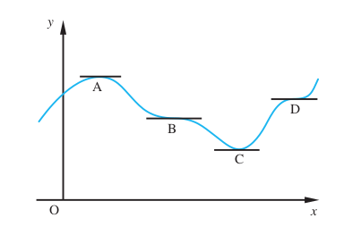

= Cheatsheet - Gradients of Curves & Differentiation
Fabio Lama <fabio.lama@pm.me>
:description: Module: CM1015 Computational Mathematics, started 04. April 2022
:doctype: article
:sectnums: 4
:toclevels: 4
:stem:

== Gradient Function

The **gradient** (or "slope") of a graph tells us something about the **rate of
change** and "steepness" of a function. Given a function stem:[y = f(x)] we
denote its gradient function by "dee _y_ by dee _x_" or simply by "_y_ dash".

[stem]
++++
(dy)/(dx) = y'
++++

NOTE: This is not defined as "_dy_ divided by _dx_", respectively _dy_ and _dx_ don't have any meaning here. Rather, we take stem:[(dy)/(dx)] as a symbol of its own, such as stem:[y'].

The gradient function is also called **first derivative**. The process of
obtaining this is also known as **differentiation**. Saying to differentiate
stem:[y = x^5] means to find its gradient function stem:[y]. _Differential
calculus_ studies this more in depth.

=== Gradient function of stem:[y = x^n]

For any function of the form stem:[y = x^n] the gradient function is found from
the following formula:

[stem]
++++
y = x^n " then " y' = nx^(n-1)
++++

For example:

[stem]
++++
"if " y = x^3 " then " y' = 3x^(3-1) = 3x^2
++++

Respectivelly:

[stem]
++++
y' = f'(x^3) = 3x^2
++++

When we substitute _x_ and the result is negative, the curve is falling. If the
result is positive, the curve is rising. We write stem:[y'(x = 2)] or simply
stem:[y'(2)] to denote the value of the gradient function when stem:[x = 2].

The gradient function of some common functions:

|===
|For: stem:[y=f(x)]|For: stem:[y'=f'(x)]|Notes

|constant|0|
|stem:[x]|1|
|stem:[x^2]|2x|
|stem:[x^n]|stem:[nx^(n-1)]|
|stem:[e^x]|stem:[e^x]|
|stem:[e^(kx)]|stem:[ke^(kx)]|_k_ is a constant
|stem:[sin x]|stem:[cos x]|
|stem:[cos x]|stem:[-sin x]|
|stem:[sin kx]|stem:[k cos kx]|_k_ is a constant
|stem:[cos kx]|stem:[-k sin kx]|_k_ is a constant
|stem:[ln kx]|stem:[1 // x]|_k_ is a constant
|===

== Rules for Finding Gradient Functions

=== Rule 1

To find the gradient function of a sum of two functions we can simply find the two gradient functions separately and those together.

[stem]
++++
y = f(x) + g(x) " then " y' = f'(x) + g'(x)
++++

For example:

[stem]
++++
y = x^2 + x^4\
f'(x^2) = 2x\
f'(x^4) = 4x^3\
"hence " y' = f'(x^2 + x^4) = 2x + 4x^3
++++

=== Rule 2

Extension of the first rule.

[stem]
++++
y = f(x) - g(x) " then " y' = f'(x) - g'(x)
++++

For example:

[stem]
++++
y = x^5 - x^7\
f'(x^5) = 5x^4\
f'(x^7) = 7x^6\
"hence " y' = f'(x^5 - x^7) = 5x^4 - 7x^6
++++

=== Rule 3

[stem]
++++
y = kf(x) " then " y' = kf'(x)
++++

where _k_ is a number.

For example:

[stem]
++++
y = 3x^2 = 3(x^2)\
x^2 = 2x\
"hence " y' = f'(3x^2) = 3(2x) = 6x
++++

== Higher Derivatives

To find the derivative of the derivative itself, known as the **second
derivative** and denoted as stem:[y"''"], we define:

[stem]
++++
y"''"" = (d^2y)/(dx^2)
++++

stem:[y"''"] is found by differentiating stem:[y']. For example:

[stem]
++++
"if " y' = 4x^3 " then " y"''" = 4(3x^2) = 12x^2
++++

== Maximum and Minimum Points

Points where the gradient is zero are known as **stationary points**, such as
points _A_, _B_, _C_ and _D_ (seen in the graph above). A point like _A_ is the
**maximum turning point** (or just **maximum**). A point like _C_ is the
**minimum turning point** (or just **minimum**). Points like _B_ and _D_ are
known as **points of inflexion**, where the curve falls and rises (unlike _A_
where the curve only falls and _C_ where the curve only rises).

IMPORTANT: Stationary points are located by setting the gradient function equal
to zero, that is stem:[y' = 0].

For example, to find the stationary points of:

[stem]
++++
y = 3x^2 - 6x + 8
++++

we deterime the gradient function stem:[y'] by differentiating _y_:

[stem]
++++
y' = nx^(n-1)\
y' = 3x^(3-1) = 3x^n\
y' = 9x
++++

//y = x^n " then " y' = nx^(n-1)