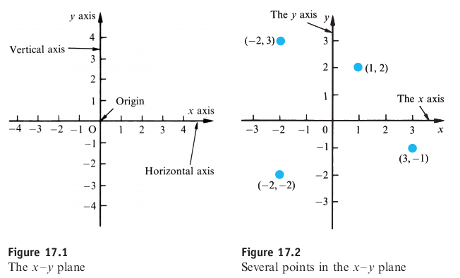
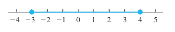
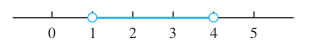
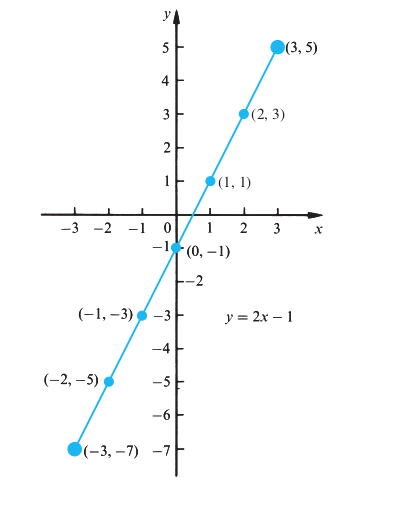
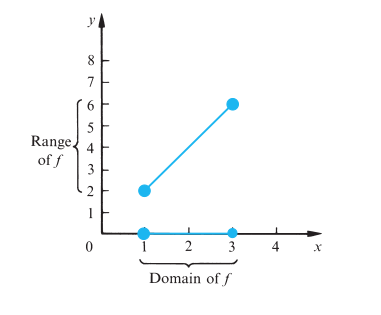

= Cheatsheet - Graphs of Functions and Kinematics
Fabio Lama <fabio.lama@pm.me>
:description: Module: CM1015 Computational Mathematics, started 04. April 2022
:doctype: article
:sectnums: 4
:toclevels: 4
:stem:

== Intro

We introduce horizontal and vertical axes. These axes intersect at a point
stem:[O] called the origin. The horizontal axis is used to represent the
*independent* variable, commonly stem:[x], and the vertical axis is used to
represent the *dependent* variable, commonly stem:[y]. The region shown is then
referred to as the stem:[x – y] plane.

== Intervals

We only need part of the stem:[x]/stem:[y] axis when plotting graphs. Each
coordinate on the axis is called an *interval*. There are three types of
intervals:

* _Closed interval_: includes its end-points, e.g. stem:[{x:x in bbb R, 1 <= x <= 3}], denoted as stem:[[1,3\]] (square brackets).
* _Open interval_: does not include its end-points, e.g. stem:[{x:x in bbb R, 1 < x < 3}], denoted as stem:[(1,3)] (round brackets).
* _Semi-open and semi-closed interval_: may be open at one end and closed at the other, e.g. stem:[{x:x in bbb R, 1 < x <= 3}], denoted as stem:[(1,3\]] (round and square bracket).

Closed intervals use the filled marking, stem:[[-3,4\]]:

Open intervals used the hollow marking, stem:[(1,4)]:

== Plotting Graphs of a Function

Plotting a graph of stem:[y = 2x - 1] for stem:[-3 <= x <= 3]:

|===
|stem:[x]|stem:[-3]|stem:[-2]|stem:[-1]|stem:[0]|stem:[1]|stem:[2]|stem:[3]
|stem:[y]|stem:[-7]|stem:[-5]|stem:[-3]|stem:[-1]|stem:[1]|stem:[3]|stem:[5]
|===

== Domain and Range of Function

The set of values that we allow the independent variable to take is called the
*domain* of the function. If the domain is not specified, we take the largest
set possible. The set of values taken by the output is called the *range* of
function. The domain and range can extend indefinitely (infinite) in one or both
directions.

For example, the function stem:[f] is given by stem:[y = f(x) = 2x], for
stem:[1 <= x <= 3].

== Kinematics

Describes the motion of objects without reference to forces, hence
**acceleration will always be constant**.

Basic definitions:

[stem]
++++
d = "displacement"\
v = "velocity"\
a = "acceleration"\
t = "time"
++++

**Velocity** and **displacement** can have subscripts that indicate initial
conditions:

[stem]
++++
v_o = v_i = "initial velocity"\
v_t = v_f = "final velocity"
++++

Fundamental equations:

* stem:[v_t = v_i + at]
** The velocity of any object at time stem:[t] is equal to
the _initial_ velocity plus the acceleration times stem:[t]
* stem:[x_t = x_o xx v_i t + 1/2 at^2]
** The  position of the object at time stem:[t] is qual to the _initial_
position stem:[x_o] plus its _initial_ velocity stem:[v_i] multiplied by time
stem:[t] plus stem:[1/2 at^2].
* stem:[v_f^2 = v_i^2 + 2ad]
** Velocity squared at time stem:[t] is equal to the _initial_ velocity squared
plus stem:[2ad].

Additionally:

[stem]
++++
d = v_i t + 1/2 at^2\
v_f^2 = v_i^2 + 2ad\
v_f = v_i + at\
d = ((v_i+v_f)/2)t
++++
