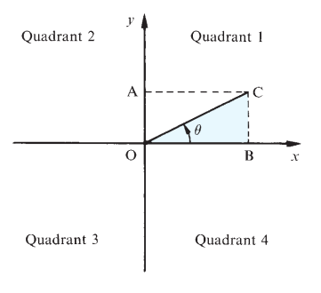
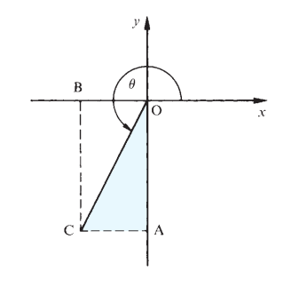
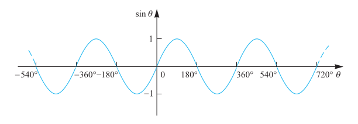
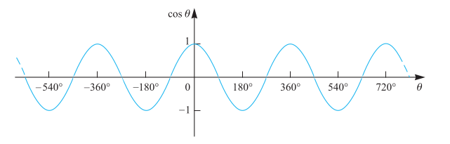
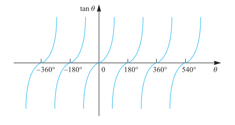

= Cheatsheet - Trigonometrical Functions & Identities
Fabio Lama <fabio.lama@pm.me>
:description: Module: CM1015 Computational Mathematics, started 04. April 2022
:doctype: book
:sectnums: 4
:toclevels: 4
:stem:

== Quadrants & Projections

The _x_ and _y_ axes divide the plane into four quadrants. The angle
stem:[theta] is of the following degree based where the arm is located:

* First quadrant, then stem:[0° <= theta <= 90°]
* Second quadrant, then stem:[90° <= theta <= 180°]
* Third quadrant, then stem:[180° <= theta <= 270°]
* Fourth quadrant, then stem:[270° <= theta <= 360°]

Consider the projection of the arm to be _OC_ and label the _x_ projection _OB_
and the _y_ projection _OA_. The trigonometrical ratios are defined as:

[stem]
++++
sin theta = "OA"/"OC" = "BC"/"OC"\
cos theta = "OB"/"OC" = "AC"/"OC"\
tan theta = "OA"/"OB" = "BC"/"AC"
++++

_(Note that in the image above, stem:["OA" = "BC"] and stem:["OB" = "AC"]. The
rules for those trignometrical functions are not any different than what's
already covered in 'Cheatsheet - Trigonometry')_

Given that _x_ and _y_ can be negative, this also means that stem:[sin theta],
stem:[cos theta] and/or stem:[tan theta] can either be positive or negative,
depending on in which quadrant the arm is located and which projection is used
for the calculation.

For example, in this graph:

stem:[sin theta] and stem:[cos theta] are negative and stem:[tan theta] is
positive, because _x_ (_OB_) and _y_ (OA) are negative, but _OC_ is positive.

== Adding/Subtracting 360°

Adding or subtracting 360° to/from the arm does not alter the ratios, since it's
a full rotation. Hence:

[stem]
++++
sin theta = sin(theta + 360°) = sin(theta - 360°)\
cos theta = cos(theta + 360°) = cos(theta - 360°)\
tan theta = tan(theta + 360°) = tan(theta - 360°)
++++

== The Sine, Cosine and Tans Functions

The sine function is stem:[y = sin theta], which repeats every 360°:

This cosine function is stem:[y = cos theta], which repeats every 360°:

The tangent function is stem:[y = tan theta], which repeats every 180°:

== Identities

Identities imply equations that are true for every value of the involved
variables. Important ones are:

[stem]
++++
(sin theta)/(cos theta) = tan theta
++++

and:

[stem]
++++
(sin A)^2 + (cos A)^2 \
= sin^2 A + cos^2 A = 1
++++

Additionally:

[stem]
++++
sin theta = -sin(theta - 180°)\
sin theta = sin(180° - theta)\
sin theta = -sin(360° - theta)\
\
cos theta = -cos(theta - 180°)\
cos theta = -cos(180° - theta)\
cos theta = cos(360° - theta)\
\
tan theta = -tan(180° - theta)\
tan theta = tan(theta - 180°)\
tan theta = -tan(360° - theta)
++++

This means that trigonometric functions can have more than one solutions.
