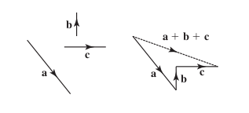

= Cheatsheet - Vectors
Fabio Lama <fabio.lama@pm.me>
:description: Module: CM1015 Computational Mathematics, started 04. April 2022
:doctype: article
:sectnums: 4
:toclevels: 4
:stem:

== Intro

Quantities that can be described as single numbers (**magnitudes**) are known as
**scalars**. Vectors are quantities that have a magnitude but also a
**direction** and are represented as arrows, where the length represents the
magnitude and the direction is given as points on a stem:[x-y] plane:

Here, the vector _A_ to _B_ is written as stem:[vec "AB"] (sometimes stem:[ul a]
or stem:[bb a]), where _A_ is the _tail_ and _B_ is the _head_. The
**magnitude** of stem:[vec "AB"] is written as stem:[vec abs(AB)] or stem:[bb
ul a].

Two vectors are **equal** if they have the same magnitude **and** the same
direction.

A **unit vector** has magnitude of 1, written as stem:[bb hat a]

== Multiplying Vector by Scalar

[stem]
++++
bb a = 4\
3 bb a = 12\
1/2 bb a = 2
++++

Multiplying by a negative number **reverses** the direction, but the magnitude
stays **positive**. 

[stem]
++++
bb a = 4\
-3 bb a = 12
++++

The unit vector of stem:[bb a] is given by:

[stem]
++++
bb hat a = (1)/(bb abs(a)) bba
++++

For example:

[stem]
++++
bb a = 4\
bb hat a = 1/4 bb a\
bb b = 1/2\
bb hat b = 1/(1/2) bb b = 2 bb b
++++

== Adding and Subtracting Vectors

If stem:[bb a] and stem:[bb b] are two vectors then we can form the vector
stem:[bb a + bb b]. We take stem:[bb b] by its tail and move it to the head of
stem:[bb a] while still maintaining magnitude and direction.

Or with more vectors:

When subtracting vectors, we consider that:

[stem]
++++
bb a - bb b = bb a + (- bb b)
++++

Therefore, we reverse the **direction** of stem:[bb b] and move the tail of
stem:[- bb b] to the head of stem:[bb a].

Additionally:

TODO: Add clear rules for head/tail usage.

== Cartesian Components

We have a stem:[x-y] plane, where unit vector of the _x_ axis is stem:[bb i] and
the unit vector of the _y_ axis is stem:[bb j].

We can see that:

[stem]
++++
vec "OP" = vec "OA" + vec "AP"\
vec "OA" = 2 bb i\
vec "AP" = 4 bb j\
vec "OP" = 2 bb i + 4 bb j
++++

The quantities 2 and 4 are **Cartesian components** of the vector stem:[vec
abs(OP)].

By using Pythagoras' theorem we can calculate the
magnitude of stem:[vec "OP"]:

[stem]
++++
vec abs(OP) = sqrt(x^2 + y^2)
++++

== Scalar Product

We have already seen how to multiply a vector by a scalar (single number). To
multiply a vector by a vector:

[stem]
++++
bb a xx bb b = abs(bb a) xx abs(bb b) xx cos theta
++++

where stem:[theta] is the angle between stem:[bb a] and stem:[bb b]. This scalar
product is also know as the **dot product**.
