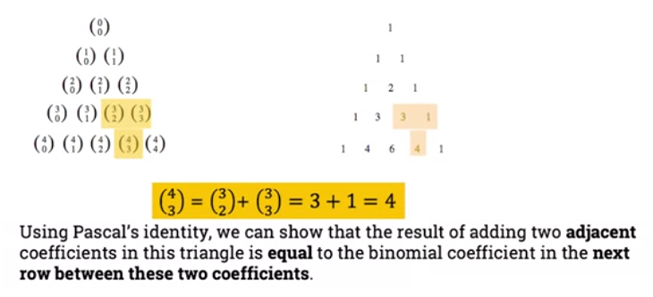

= Cheatsheet - Binomial Coefficients & Identities
Fabio Lama <fabio.lama@pm.me>
:description: Module: CM1020- Discrete Mathematics, started 25. October 2022
:doctype: article
:sectnums: 4
:stem:

== Binomial Theorem

An expression consisting of two terms, connected by a stem:[+] or stem:[-] sign,
is called a **binomial expression**. As we increase the power of binomials,
expanding them becomes more and more complicated:

[stem]
++++
(x+y)^1 = x + y\
(x+y)^2 = x^2 + 2xy + y^2\
(x+y)^3 = x^3 + 3x^2y + 3xy^2 + y^3\
...
++++

The **binomial theorem** helps us to simplify this expansion. Let stem:[x] and
stem:[y] be variables, and stem:[n] a non-negative integer. The expansion of
stem:[(x+y)^n] can be formalized as:

[stem]
++++
(x+y)^n = sum_(k=0)^n ((n),(k)) x^k y^(n-k)
++++

The **binomial coefficients** are the coefficients in the binomial theorem and
denoted as:

[stem]
++++
((n),(k)) = (n!)/(k!(n-k)!)
++++

Here we say **"n choose k"**.

For example:

> What is the coefficient of stem:[x^8 y^7] in the expansion of stem:[(3x
-y)^15].

We can view the expression as stem:[(3x+ (-y))^15]. By the binomial theorem:

[stem]
++++
(3x+ (-y))^15 = sum_(k=0)^15 ((15),(k)) (3x)^k (-y)^(15-k)
++++

The coefficient of stem:[x^8 y^7] in the expansion is obtained when stem:[k=8]:

[stem]
++++
((15),(8)) (3)^8 (-1)^7 = -3^8 (15!)/(8!7!)
++++

=== Pascal's Identity

If stem:[n] and stem:[k] are integers with stem:[n >= k >= 1], then:

[stem]
++++
((n),(k)) + ((n),(k-1)) = ((n+1),(k))
++++

=== Pascal's Triangle

**Pascals' triangle** is a number triangle with numbers arranged in staggered rows
such that **stem:[a_(n,r)] is the binomial coefficient stem:[((n),(r))]**.

