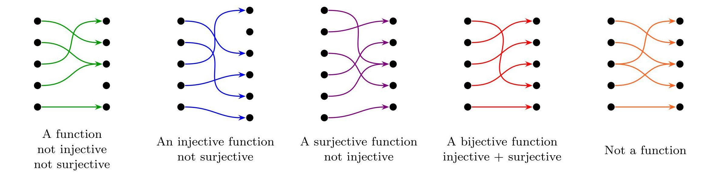

= Cheatsheet - Functions
Fabio Lama <fabio.lama@pm.me>
:description: Module: CM1020- Discrete Mathematics, started 25. October 2022
:doctype: article
:sectnums: 4
:stem:

== Intro

A function maps one element from a set to **exactly one** element of another (or
the same) set.

For example, we have sets:

[stem]
++++
A = {1, 2, 3}\
B = {2, 4, 6, 7, 8}
++++

and the function:

[stem]
++++
f: A -> B
++++

defined as:

[stem]
++++
f(x) = 2x
++++

Now lets apply each element from stem:[A] to stem:[f]:

[stem]
++++
f(1) = 2\
f(2) = 4\
f(3) = 6
++++

We call set stem:[A] the **domain** and set stem:[B] the **co-domain**. The set
of all possible values when mapping elements from set stem:[A] to set stem:[B],
respectively set stem:[R = {2, 4, 6}], is called the **range**. Hence stem:[R
sube B].

Additionally, we say that stem:[1] is the **pre-image** of stem:[2], which in
return is the **image** of stem:[1]. The element stem:[2] is the pre-image of
stem:[4], which in return is the image of stem:[2]. And so on.

== Injective, Surjective & Bijective Functions

.Source: https://twitter.com/JDHamkins/status/841318019397779456

* **General function**: stem:[A] has at most one stem:[B] (not injective, not surjective).
* **Injective**: stem:[A] has exactly one stem:[B] (not surjective).
* **Surjective**: _Each and every_ stem:[B] has one or many stem:[A] (not
injective).
* **Bijective**: _Each and every_ stem:[B] has exactly one stem:[A] (injective
and surjective).
* **NOT a function**: stem:[A] has many stem:[B].

=== Proofs

We can prove whether a function is injective, surjective or bijective by solving
an equation. Lets use the following function as an example:

[stem]
++++
f(x) = 2x + 3
++++

Injective Proof::

Let stem:[a, b in R], show that if stem:[a != b] then stem:[f(a) != f(b)]:

[stem]
++++
a != b " " xx 2\
2a != 2b " " + 3\
2a + 3 != 2b + 3\
=> f(a) != f(b)
++++

**Or:** Let stem:[a, b in R], show that if stem:[f(a) = f(b)] then stem:[a = b]:

[stem]
++++
f(a) = f(b) =>\
2a + 3 = 2b + 3 " " -3\
2a = 2b " " -: 2\
a = b
++++

Hence, function stem:[f] is injective.

Surjective Proof::

Let stem:[y in R], show that there exists stem:[x in R] such that stem:[f(x) = y]:

[stem]
++++
f(x) = y =>\
2x + 3 = y " " -3\
2x = y -3 " " -: 2\
x = (y -3)/2
++++

Hence, function stem:[f] is surjective.

== Composition

Function composition means we apply one function to the result of another.

For example:

[stem]
++++
(f @ g)(x) = f(g(x))
++++

which means that the result of stem:[g()] is passed on to stem:[f()]. If we
define stem:[f(x) = 2x] and stem:[g(x) = x^2], then:

[stem]
++++
(f @ g)(5) = f(g(x)) = 2xx(5^2) = 50
++++

Do note that function composition is not commutative, meaning stem:[f @ g != g
@ f]:

[stem]
++++
(f @ g)(5) = f(g(x)) = 2xx(5^2) = 50\
(g @ f)(5) = g(f(x)) = (5xx2)^2 = 100
++++

== Inverse Function

If function stem:[f] is bijective, then there exists an inverse function
stem:[f^(-1)].

[stem]
++++
f: A -> B\
f^(-1): B -> A
++++

For example, given stem:[f(x) = 2x], then stem:[f^(-1)(x) = x/2].

[stem]
++++
f(2) = 4\
f^(-1)(4) = 2
++++

Additionally:

[stem]
++++
(f @ f^(-1))(x) = (f^(-1) @ f)(x) = x
++++

== Exponential Functions

Properties of exponential the function:

[stem]
++++
y = f(x) = b^x " " (b > 0 " and " b != 1)
++++

* The domain is stem:[(-oo, oo)]
* The range is stem:[(0, oo)]
* It passes through the point stem:[(0, 1)]
* If stem:[b > 1] then it's increasing on stem:[(-oo, oo)] ("exponential growth")
* If stem:[b < 1] then it's decreasing on stem:[(-oo, oo)] ("exponential decay")

== Logarithmic Functions

The logarithmic function with base stem:[b] where stem:[b > 0] and stem:[b != 1]
is defined as:

[stem]
++++
log_b x = y " if and only if " x = b^y
++++

Respectively:

[stem]
++++
x = b^y hArr log_b(x) = y
++++

For example:

[stem]
++++
81 = 3^4 hArr log_3(81) = 4
++++

=== Laws

[stem]
++++
log_b (m xx n) = log_b m + log_b n\
log_b (m/n) = log_b m - log_b n\
log_b (m^n) = n xx log_b (m)\
log_b (1) = 0\
log_b (b) = 1
++++

Conventionally, we also define **natural logarithms** as:

[stem]
++++
log = log_(10)\
ln = log_e
++++

Where stem:[e] is the
https://en.wikipedia.org/wiki/E_(mathematical_constant)["Euler number"]
(stem:[e = 2.71828]).

== Floor and Ceiling Functions

We define the **floor** of the real number stem:[x] as (round **down** to the
previous integer **or equal**):

[stem]
++++
x = 3.6\
|__x__| = 3
++++

We define the **ceiling** of real number stem:[x] as (round **up** to the next
integer **or equal**):

[stem]
++++
x = 3.6\
|~x~| = 4
++++

Additionally (equal):

[stem]
++++
y = 5\
|__y__| = 5\
|~y~| = 5
++++

and (negative numbers)

[stem]
++++
x = -3.5\
|__x__| = -4\
|~x~| = -3
++++

Both the floor and the ceiling function convert a real number to an integer,
respectively stem:[RR -> ZZ].
