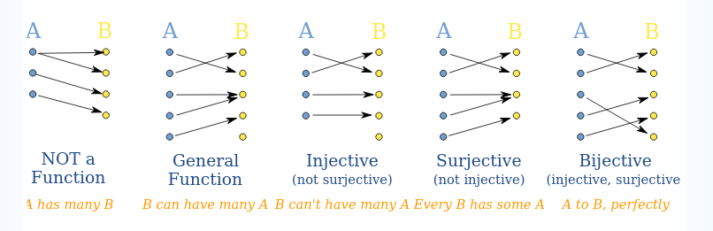

= Cheatsheet - Functions
Fabio Lama <fabio.lama@pm.me>
:description: Module: CM1020- Discrete Mathematics, started 25. October 2022
:doctype: article
:sectnums: 4
:stem:

== Intro

A function maps one element from a set to another set (can also be the same
set). Note that a function maps each element to exactly **one** other element.

.Source: https://www.mathsisfun.com/sets/injective-surjective-bijective.html

For example, we have sets:

[stem]
++++
A = {1, 2, 3}\
B = {2, 4, 6, 7, 8}
++++

and the function:

[stem]
++++
f: A -> B
++++

defined as:

[stem]
++++
f(x) = 2x
++++

Now lets apply each element from stem:[A] to stem:[f]:

[stem]
++++
f(1) = 2\
f(2) = 4\
f(3) = 6
++++

We call set stem:[A] the **domain** and set stem:[B] the **co-domain**. The set
of all possible values when mapping elements from set stem:[A] to set stem:[B],
respectively set stem:[R = {2, 4, 6}], is called the **range**. Hence stem:[R
sube B].

Additionally, we say that stem:[1] is the **pre-image** of stem:[2], which in
return is the **image** of stem:[1]. The element stem:[2] is the pre-image of
stem:[4], which in return is the image of stem:[2]. And so on.
