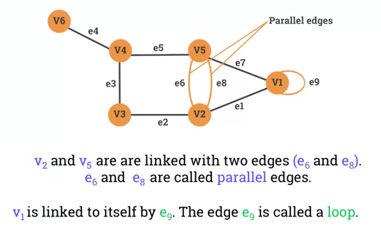
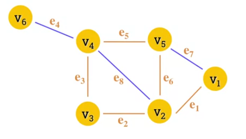
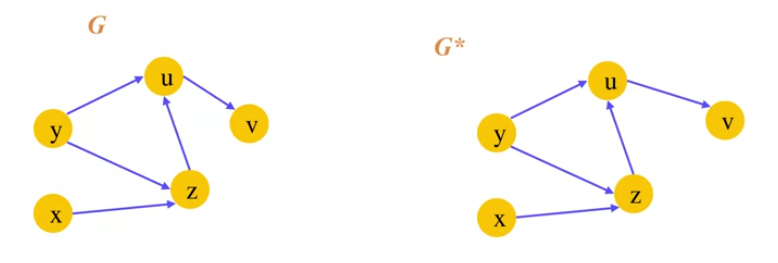

= Cheatsheet - Graphs
Fabio Lama <fabio.lama@pm.me>
:description: Module: CM1020- Discrete Mathematics, started 25. October 2022
:doctype: article
:sectnums: 4
:stem:

== Intro

Graphs are **discrete** structures consisting of **vertices (nodes)** and
**edges** connecting them. Graph theory is an area of discrete mathematics which
studies these types of discrete structures.

The **graph** stem:[G] can be represented as an ordered pair stem:[G = (V, E)],
where stem:[V] is a set of nodes/vertices and stem:[E] is a set of edges, lines
or connections. A **vertex** (singular of "vertices") is a basic element of a graph,
usually drawn as a node or a dot. The set of vertices of stem:[G] is usually
denoted by stem:[V(G)] or stem:[V].

image::./assets/vertex.png[align=center, width=300]

An **edge** is a link between 2 vertices, usually drawn as a line connecting two
vertices. The set of edges in a graph stem:[G] is usually denoted by stem:[E(G)]
or stem:[E].

image::./assets/edge.png[align=center, width=600]

Two vertices are said to be **adjacent** if they are endpoints of the same edge.
Two edges are said to be **adjacent** if they share the same vertex. If a vertex
stem:[v] is an endpoint of an edge stem:[e], then we say that stem:[e] and
stem:[v] are **incident**.

A **directed graph**, also called a **digraph**, is a graph in which the edges
have a direction. This is usually indicated with an arrow on the edge.

=== Examples

image::./assets/graph_example_1.png[align=center, width=600]

And an example of a directed graph:

image::./assets/graph_example_3.png[align=center, width=600]

== Concepts

=== Walk

A **walk** is a sequence of vertices and edges of a graph were vertices and
edges can be repeated. A **walk of length k** in a graph is a succession of
stem:[k] (not necessarily different) edges of the form stem:[uv, vw, wx, ...,
yz].

image::./assets/graph_walk.png[align=center, width=650]

=== Trail

A **trail** is a walk in which no edge is repeated. In a trail, vertices can be
repeated but no edge is ever repeated. For example, stem:[e1, e2, e3, e5, e6]
is a trail:

=== Circuit

A **circuit** is a closed trail. Circuits can have repeated vertices only. For
example, stem:[e7,e6, e8, e3, e2, e1] is a circuit:

image::./assets/graph_circuit.png[align=center, width=400]

=== Path

A **path** is a trail in which neither vertices nor edges are repeated.

=== Cycle

A **cycle** is a closed path, consisting of edges and vertices where a vertex is
reachable from itself.

image::./assets/graph_cycle.png[align=center, width=550]

=== Eulerian Path

A **Eulerian path** in a graph is a path that uses each edge precisely once. If
such a path exists, the graph is called **traversable**.

image::./assets/graph_euler_path.png[align=center, width=600]

=== Hamiltonian Path, Cycle & Graph

A **Hamiltonian path** (also called a _traceable path_) is a path that visits
each vertex exactly once. A **Hamiltonian cycle** is a cycle that visits each
vertex exactly once (except for the starting vertex, which is visited once at
the start and once again at the end).

image::./assets/graph_hamiltonian_cycle.png[align=center, width=500]

A graph that contains a Hamiltonian cycle is called a **Hamiltonian graph**. Any
Hamiltonian cycle can be converted to a Hamiltonian path by removing one of its
edges.

=== Connectivity

An **undirected** graph is **connected** if you can get from **any node to any other**
by following a **sequence of edges**. Or, **any two nodes** are **connected** by a path.

image::./assets/graph_connectivity.png[align=center, width=400]

A directed graph is **strongly connected** if there is a **directed path** from
any node to any other node.

image::./assets/graph_strong_connectivity.png[align=center, width=450]

=== Transitive Close

Given a digraph stem:[G], the transitive closure of stem:[G] is the digraph
stem:[G^**] such that stem:[G^**] has the same vertices as stem:[G]. If
stem:[G] has a directed path from stem:[u] to stem:[v] (stem:[u != v]),
stem:[G^**] has a directed edge from stem:[u] to stem:[v].

