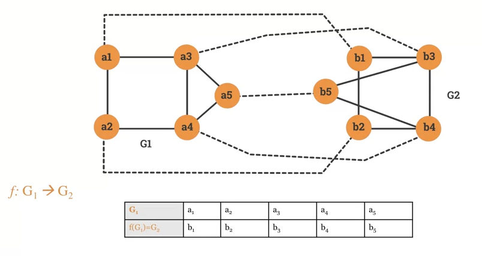
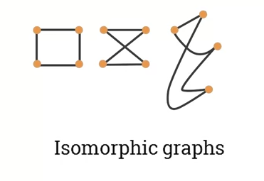
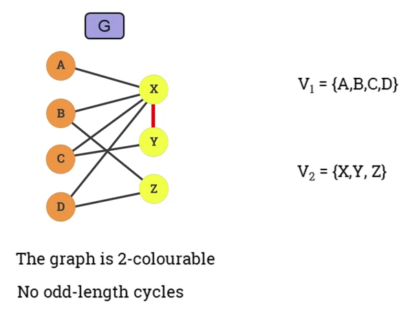
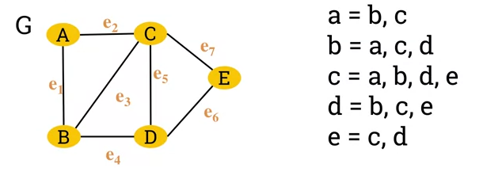
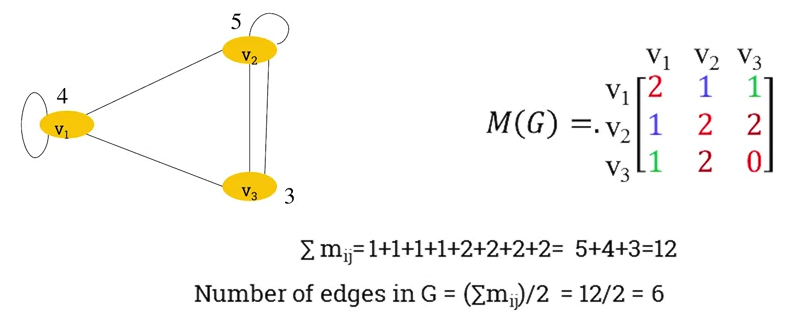

= Cheatsheet - Graphs: Isomorphism
Fabio Lama <fabio.lama@pm.me>
:description: Module: CM1020- Discrete Mathematics, started 25. October 2022
:doctype: article
:sectnums: 4
:stem:

== Definition

Two graphs stem:[G_1] and stem:[G_2] are isomorphic if there is a bijection
(invertible function) stem:[f: G_1 -> G_2] that preserves adjacency and
non-adjacency. Given two vertices stem:[u] and stem:[v], if stem:[u xx v] is in
stem:[E(G_1)] then stem:[f(u) xx f(v)] is in stem:[E(G_2)].

Two graphs with different degree sequences **cannot be isomorphic**. Two graphs
with the same degree sequence **are not necessarily isomorphic**.

== Bipartite Graph

A graph stem:[G(V,E)] is called a bi-partite graph if the set of vertices
stem:[V] can be partitioned in two non-empty disjoint sets stem:[V_1] and
stem:[V_2] in such a way that each edge stem:[e] in stem:[G] has one endpoint in
stem:[V_1] and another endpoint in stem:[V_2].

=== Matching

A **matching** is a set of pairwise non-adjacent edges, none of which are loops.
That is, no two edges share a common endpoint. A vertex is matched (or
saturated) if it is an endpoint of one of the edges in the matching. Otherwise
the vertex is unmatched.

A **maximum** matching is a matching of maximum size such that if any edge is
added, it is no longer a matching. The **Hopcroft-Karp algorithm** is commonly
used for solving the maximum matching problem in a bipartite graph
(_the algorithm is not specified in this cheatsheet_).

== Adjacency Matrix of Graph

The adjacency list of a graph stem:[G] is a list of all the vertices in stem:[G]
and their corresponding individual adjacent vertices.

A graph can also be represented by its **adjacency matrix**. The number of edges
in an **undirected** graph is equal to half the sum of all the elements
(stem:[m_(ij)]) of it's corresponding adjacency matrix.

