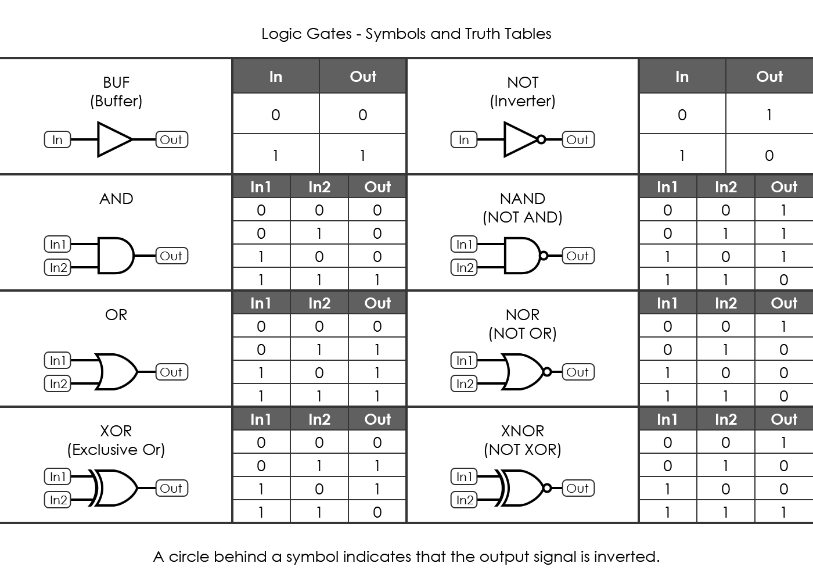

= Cheatsheet - Logic Gates
Fabio Lama <fabio.lama@pm.me>
:description: Module: CM1020- Discrete Mathematics, started 25. October 2022
:doctype: article
:sectnums: 4
:stem:

== Intro

(NOTE: Reading the _Postulates of Boolean Algebra_ cheatsheet is recommended here)

Logic gates are basic elements of circuits implementing Boolean operations. The
most basic circuits are **OR** gates, **AND** gates and invertors (**NOT**
gates). All boolean functions can be written in terms of these three logic
operations.

* **AND** operation is represented as stem:[f = x . y] or stem:[f = xy].
* **OR** operation is represented as stem:[f = x + y].
* **NOT** operation is represented as stem:[f = bar x].

Other gates:

* **XOR** operation is _true_ only when the value of the inputs differ.
* **NAND** operations is equivalent to "not AND".
* **NOR** operation is equivalent to "not OR".
* **XNOR** operation is equivalent to a "not XOR".

AND, OR, XOR and XNOR are **commutative** (e.g. stem:[a + b = b + a]) and
**associative** (e.g. stem:[a + (b + c) = (a + b) + c]). NAND and NOR are
commutative but not associative.

.Source: http://www.exclusivearchitecture.com/?page_id=2425

== Circuits

We describe the combination of logic gates as a **circuit**.

A circuit that's used for the **addition** of inputs is called an **adder**. A
**half adder** takes two inputs and generates a **carry** and a **sum**. A
**full adder** takes three inputs and generates a carry and a sum.

For example, an **half adder**:

[stem]
++++
"sum" = xy' + x'y = x o+ y\
"carry" = xy
++++

And a **full adder**:

[stem]
++++
"sum" = x o+ y " carry in"\
"carry out" = xy + "carry in" . (x o+ y)
++++

=== Simplification of Circuits (example)

Let's consider the following boolean expression:

[stem]
++++
E = ((xy)'z)'((x' + z)(y' + z'))'
++++

Using the **De Morgan's laws** and **involution**:

[stem]
++++
E = ((xy)'' + z')((x' + z)' + (y' + z')')\
= (xy + z')((x'' . z') + y'' . z'')\
= (xy + z')(xz' + yz)
++++

Using the **distributive laws**:

[stem]
++++
E = xyxz' + xyyz + z'xz' + z'yz
++++

Using **commutative, idempotent** and **complement** laws:

[stem]
++++
E = xyz' + xyz + xz' + 0
++++

Using **absorption** law:

[stem]
++++
E = xyz + xz'
++++
