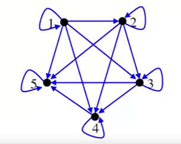

= Cheatsheet - Relations
Fabio Lama <fabio.lama@pm.me>
:description: Module: CM1020- Discrete Mathematics, started 25. October 2022
:doctype: article
:sectnums: 4
:stem:

== Intro

**Relations** between **elements** of sets occur in many contexts. In
mathematics, we study relationships such as:

* a relation between a **positive integer** and one that it **divides**.
* a relation between a **real number** and **one** that is **larger** than it.
* a relation between a **real number** stem:[x] and the **value f (stem:[x])**
where stem:[f] is a function, and so on.

== Definition

A relation can be defined between elements of a set stem:[A] and elements of
another set stem:[B]. It can also be defined between elements of the same set.
We always use the letter stem:[R] to refer to a relation.

For example, we say that stem:[x] **is related** to stem:[y] with respect to the
relation stem:[R] and we write:

[stem]
++++
x R y " where " x in A, y in B
++++

=== Cartesian Product & Binary Relation

The **Cartesian product** stem:[A xx B] is defined by a **set of pairs**
stem:[(x,y)] such that stem:[x in A] and stem:[y in B].

[stem]
++++
A xx B = {(x,y): x in A " and " y in B}
++++

For example:

[stem]
++++
A = {a_1, a_2} " and " B = {b_1, b_2, b_3}\
A xx B = {(a_1, b_1), (a_1, b_2), (a_1, b_3), (a_2, b_1), (a_2, b_2), (a_2, b_3)}
++++

A **binary relation** from stem:[A] to stem:[B] is a **subset** of a **Cartesian
product** stem:[A xx B]:

[stem]
++++
R sube A xx B
++++

which means that stem:[R] is a set of ordered pairs of the form stem:[(x, y)]
where stem:[x in A] and stem:[y in B].

[stem]
++++
(x, y) in R " means " x R y " (... is related to ...)"
++++

For example:

[stem]
++++
A = {a, b, c} " and " B = {1, 2, 3}\
R = {(a,1), (b,2), (c,3)}\
a R 1\
b R 2\
c R 3
++++

NOTE: Relations are **defined arbitrarily**.

==== Relation on a Set

When stem:[A = B], a relation stem:[R] **on the set stem:[A]** is a relation
from stem:[A] to stem:[A]:

[stem]
++++
R sube A xx A
++++

For example:

[stem]
++++
A = {1, 2, 3, 4}\
R = {x, y in A, xRy | "if and only if " x < y}\
"We have " 1R2, 1R3, 1R4, 2R3, 2R4, 3R4 " respectively:"\
R = {(1, 2), (1, 3), (1, 4), (2, 3), (2, 4), (3, 4)}
++++

== Matrices

Given a **relation** stem:[R] from a set stem:[A] to set stem:[B]. We can list
the elements of sets stem:[A] and stem:[B] in a particular order.

Let stem:[n_a = |A|] and stem:[n_b = |B|]. The **matrix of stem:[R]** is stem:[n_a xx n_b]:

[stem]
++++
M_r = [m_(ij)] n_(ax) n_b\
m_(ij) = {(1 " if " (a_i, bj) in R),(0 " if " (a_i, bj) !in R):}
++++

Example:

[stem]
++++
A = {a, b, c}\
B = {1, 2, 3}\
R = {(a, 1), (a, 2), (b, 2), (b, 3), (c, 1), (c, 3)}\
M_r = [[1, 1, 0],[0, 1, 1],[1, 0, 1]]
++++

=== Combining Relations

The **union** of two relations is a new set that contains all of the pairs of
elements that are in at least one of the two relations. The union is written as
stem:[R uu S] or **"R or S"**.

[stem]
++++
R uu S = {(a, b): (a, b) in R " or " (a, b) in S}
++++

The **intersection** of two relations is a new set that contains all of the
pairs that are in both sets. The intersection is written as stem:[R nn S] or **"R
and S"**.

[stem]
++++
R nn S = {(a, b): (a, b) in R " and " (a, b) in S}
++++

For example, given:

[stem]
++++
M_R = [[1, 0, 1],[1, 0, 0],[0, 1, 0]] " " M_S = [[1, 0, 1],[0, 1, 1],[1, 0, 0]]
++++

To **join** (union):

[stem]
++++
M_(R uu S) = M_R vv M_S = [[1, 0, 1],[1, 1, 1],[1, 1, 0]]
++++

To **meet** (intersection):

[stem]
++++
M_(R nn S) = M_R ^^ M_S = [[1, 0, 1],[0, 0, 0],[0, 0, 0]]
++++

== Graphs

When a relation is defined on a set, it can be represented by a digraph. First,
the elements of stem:[A] are written down, then stem:[(a, b) in R] arrows are
drawn from stem:[a] to stem:[b].

For example:

[stem]
++++
A = {1, 2, 3, 4, 5}\
R = {x, y in A, xRy | "if and only if " x <= y}
++++

