= Cheatsheet - Trees
Fabio Lama <fabio.lama@pm.me>
:description: Module: CM1020- Discrete Mathematics, started 25. October 2022
:doctype: article
:sectnums: 4
:stem:

NOTE: It's recommended to read the cheatsheets on Graphs, first.

== Definition

In computer science, **trees** are used in a wide range of algorithms, such as
data structures for efficient lookups or making decisions. A tree is a
**connected acyclic undirected graph**.

=== Acyclic Graphs

A graph stem:[G] is called an **acyclic** graph if and only if stem:[G] has **no
cycles**.

.stem:[G_1] is NOT an acyclic graph, while stem:[G_2] is.
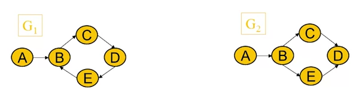

Not all acyclic graphs are trees.

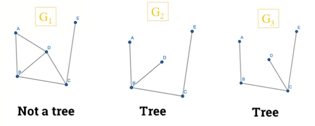

=== Forest

A **forest** is a **disconnected graph** containing no cycles.

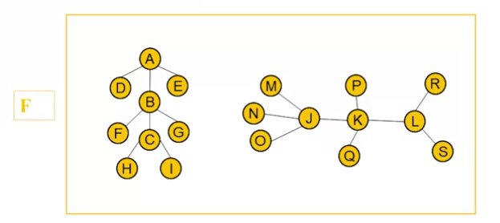

Theorem 1::

An undirected graph is a **tree** if and only if there is a **unique simple
path** between **any two** of its vertices.

Theorem 2::
A tree with **stem:[n] vertices** has **stem:[n-1] edges**.

=== Rooted Tree

A **rooted tree** is when one vertex has been **designated as the root** and
every edge is **directed away from the root**.

== Spanning Tree

A **spanning tree** of a graph stem:[G] is a **connected** sub graph of stem:[G]
which **contains all vertices of stem:[G]**, but with **no cycles**.

.All stem:[T_n] are spanning sub graphs of graph stem:[G].
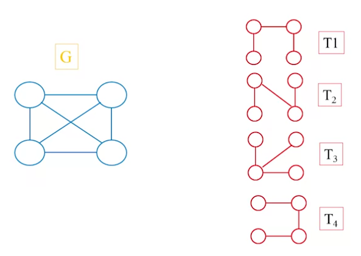

=== Constructing a Spanning Tree

To get a spanning tree of a graph stem:[G]:

. Keep all vertices of stem:[G]
. Break all the cycles but keep the tree connected.

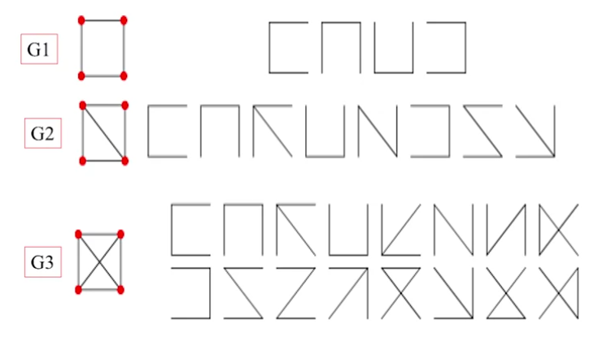

Two spanning trees are said **isomorphic** if there is a **bijection preserving
adjacency** between the two trees.

.stem:[T_1], stem:[T_3] and stem:[T_4] are all **isomorphic** to each others. stem:[T_1], stem:[T_3] and stem:[T_4] are all **non-isomorphic** to stem:[T_2].
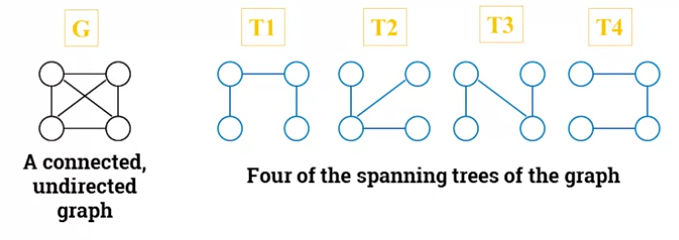

=== Minimum-cost Spanning Tree

The **cost** (or **weight**) of a spanning tree is the **sum of the costs** of
its edges. A **minimum-cost** spanning tree is a spanning tree that has the
**lowest weight** (lowest cost).

.The weight of stem:[T_2] is stem:[w = 6+4+1+2+7 = 20].
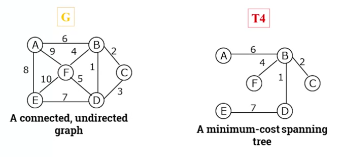

There are two basic algorithms for finding minimum-cost spanning trees:

Kruskal's algorithm::

Start with the cheapest edges in the spanning tree, then repeatedly add the
cheapest edge that does not create a cycle.

Prim's algorithm::

Start with any one node in the spanning tree, then repeatedly add the cheapest
edge, and the node it leads to, for which the node is not already in the
spanning tree.

== Rooted Tree

A rooted tree is a **directed tree** having one **distinguished** vertex
stem:[r], called the root, such that for every vertex stem:[v] there is a
**directed path** from stem:[r] to stem:[v]

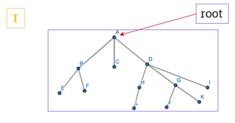

A directed tree is represented as a rooted tree **if and only if one vertex**
has in-degree stem:[0] whereas **all** other **vertices** have in-degree
stem:[1].

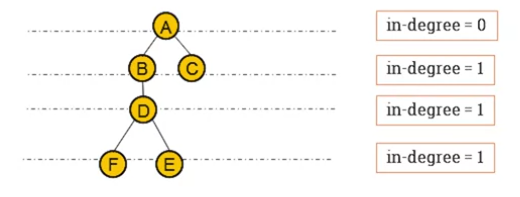

=== Terminology

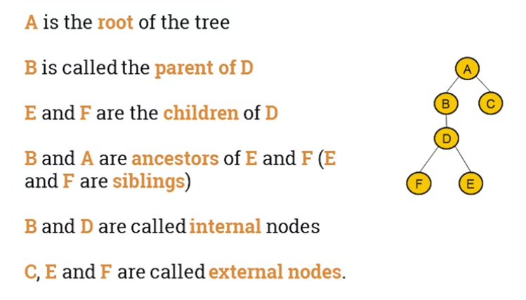

The **depth** or **path length** of a node in a tree is the number of edges from
the root to that node. The **height** of a node in a tree is the longest path
from that node to a leaf. The **depth or the height** of a tree is the maximum
path length across all its nodes.

=== Special Trees

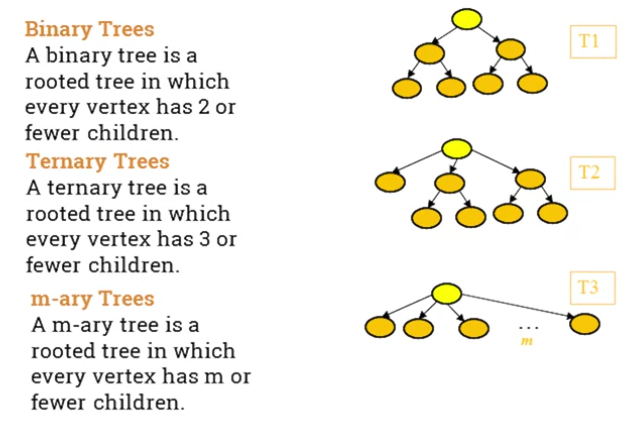

=== Regular Rooted Trees

An stem:[m]-ary tree is **regular** if every one of its **internal** notes **has
exactly** stem:[m] children.

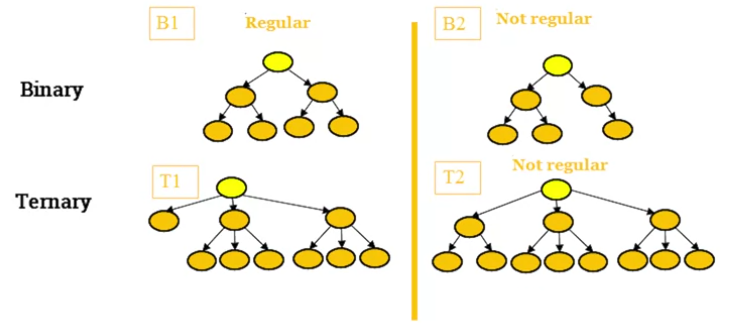

An **stem:[m]-ary tree** has at most stem:[m^h] vertices at level stem:[h].

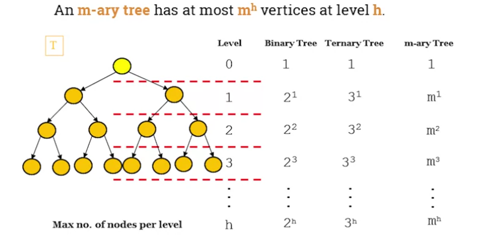

== Isomorphic Trees

Two trees stem:[T_1] and stem:[T_2] are isomorphic if there is a **bijection**:

[stem]
++++
f: V(T_1) -> V(T_2)
++++

which **preserves adjacency** and **non-adjacency**. That is, if stem:[uv] is in
stem:[E(T_1)] and stem:[f(u)f(v)] is in stem:[E(T_2)].

Respectively:

[stem]
++++
T_1 ~= T_2
++++

Two trees with **different degree sequences** are **not isomorphic**. Two trees
with the **same degree** sequence **are not necessarily isomorphic**.

=== Example

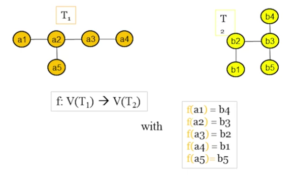

=== Isomorphic Rooted Trees

Two isomorphic trees are **isomorphic as rooted trees** if and only if there is
a **bijection** that maps the **root** of one tree to the root of the other.
Isomorphic trees **may** or **may not** be isomorphic as **rooted trees**.

== Binary Search Trees

A binary search tree is a **binary tree** in which the vertices are **labelled**
with items so that a **label of a vertex is greater than** the labels of all
vertices in the **left subtree** of this vertex and **is less than** the labels
of all vertices in the **right subtree** of this vertex.

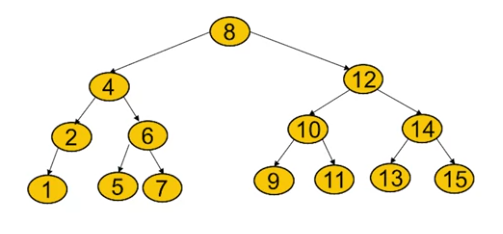

=== Application

The usage of binary search trees apply in the case where we want to **store a
modifiable collection** in a **computer's memory** and be able to **search,
insert** or **remove** elements from the collection in an efficient way.

=== Height of the Binary Search Tree

There are two methods that one can use to find the height of a binary search
tree, where stem:[N] is number of nodes in the tree and stem:[h] is the height
(the following formula must be satisfied):

[stem]
++++
2^(h-1) < N + 1 <= 2^h\
-=\
h-1 < log_2 (N + 1) <= h
++++

or the second method (hint: stem:[|~ ... ~|] means _ceiling_, i.e round up):

[stem]
++++
...\
-=\
h = |~ log_2(N+1) ~|
++++

For example, if stem:[N=15], then stem:[h = 4].

[stem]
++++
h = |~ log_2(15+1) = |~ log_2(16) ~| = 4
++++

=== Binary Search Algorithm

The algorithm starts by comparing the searched element to the middle term of the
list. The list is then split into two smaller sub-lists of the same size, or
where one of these smaller lists has one fewer term than the other. The search
continues by restricting the search to the appropriate sub-list based on the
comparison of the searched element and term in the middle.

For example, when searching for stem:[21] in the list of:

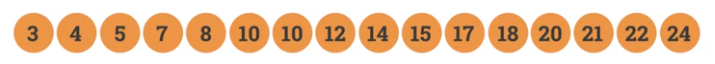

[stem]
++++
darr
++++

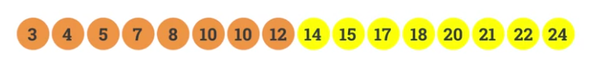

[stem]
++++
darr
++++

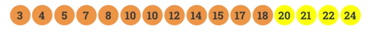

[stem]
++++
darr
++++

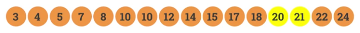

[stem]
++++
darr
++++

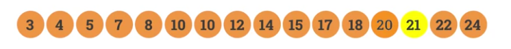
