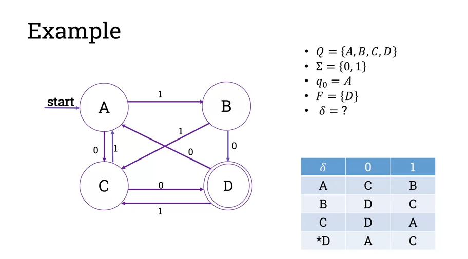

= Cheatsheet - Automata Theory
Fabio Lama <fabio.lama@pm.me>
:description: Module: CM1025 Fundamentals to Computer Science, started 25. October 2022
:doctype: article
:sectnums: 4
:stem:

== Basics of (finite) Automata

An **alphabet**, stem:[Sigma], is a non-empty set of symbols.

[stem]
++++
Sigma = {0, 1} " binary alphabet"\
Sigma = {a, b, ..., z} " collection of lowercase letters"
++++

A **string** or word is a finite sequence of letters drawn from an alphabet.
**Empty strings**, stem:[epsilon], are strings with zero occurrences of letters.
Empty strings can be from any alphabet.

The **length** of a string stem:[x] is denoted as stem:[|x|]:

[stem]
++++
x = '"hello"'\
|x| = 5
++++

Other string related notations:

* The set of **all strings** composed from the letters in stem:[Sigma] is denoted
by stem:[Sigma^**].
* The set of **all non-empty strings** composed from letters
in stem:[Sigma] is denoted by stem:[Sigma^+]
* The set of **all strings of length stem:[k]** composed from letters in stem:[Sigma] is denoted by stem:[Sigma^k].

[stem]
++++
Sigma = {0, 1}\
Sigma^** = {epsilon, 0, 1, 00, 01, 10, 11, ...}\
Sigma^+ = {0, 1, 00, 01, 10, 11, ...}\
Sigma^2 = {00, 01, 10, 11}
++++

Note that the size of stem:[Sigma^k] is denoted as stem:[|Sigma|^k].

== Automaton

A **finite automaton** is a simple mathematical machine; it is a representation
of how computations are performed with _limited memory_ space. It is a model of
computation, which consists of a set of states that are connected by
transitions. It has an input and it has an output.

An automaton stem:[M] is a 5-tuple (stem:[Q, Sigma, delta, q_0, F]) where:

* stem:[Q] is a finite set called the **states**.
* stem:[Sigma] is a finite set called **the alphabet**.
* stem:[delta: Q xx E -> Q] is the **transition function**.
* stem:[q_0 in Q] is the **start state**.
* stem:[F sube Q] is the set of **accepted states**.

.Note: Bottom right is the transition table. D is the only accepted state.

For example, based on the automaton in the picture above:

* Input stem:[0010] results in state stem:[D]; the input is **accepted** (stem:[D in F]).
* Input stem:[0011] results in state stem:[A]; the input is **rejected**
(stem:[A !in F]).
