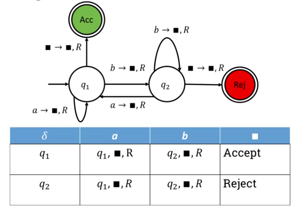
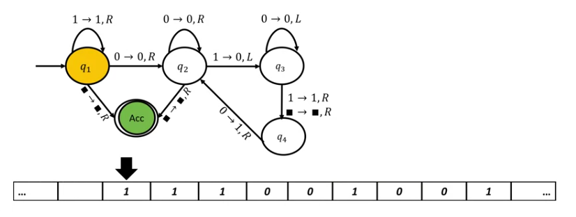

= Cheatsheet - Turing Machines
Fabio Lama <fabio.lama@pm.me>
:description: Module: CM1025 Fundamentals to Computer Science, started 25. October 2022
:doctype: article
:sectnums: 4
:stem:

NOTE: Make sure to check the _Automata Theory_ cheatsheet, too.

== Intro

A **turing machine** is a finite automation with **unbounded random access
memory**. The **finite state automaton** (FSA) provides instructions on an
**infinite tape**, where the input is given and can also be the working space.
Every cell contains one character, but some cells are empty. A **tape head** reads
and writes according to the instructions given by the FSA.

== Formal Definition

A turing machine (TM) consists of:

[stem]
++++
(Q, Sigma, Gamma, delta, q_1, q_("Acc"), q_("Rej"))
++++

where

* stem:[Gamma] is the tape alphabet that included the blank symbol.
* stem:[Sigma sube Gamma] is the input alphabet.
* stem:[delta: Q xx Gamma -> (Q xx Gamma xx {L, R})] is the transition function.
* stem:[q_1 in Q] is the start state.
* stem:[q_("Acc")] is the accepting state.
* stem:[q_("Rej")] is the rejecting state.

The **transition function** takes one state and one letter from stem:[Gamma] and
returns a **state** of the automaton, a **letter to be written** on the current
cell of the tape and the **direction** instructing the tape head where to go,
stem:[L] for left, stem:[R] for right.

.Note that the black box means "blank".

NOTE: Seeing an interactive example makes the behavior of the direction
stem:[{L, R}] clearer. See Week 13, "7.201 Turing machines: examples" and "7.202
Designing Turing Machines" in the FCS course.

=== Example

Given stem:[w in (1 uu 0)^**], make stem:[w in 1^** 0^**]. For example, given
stem:[111001001], make stem:[111110000].

NOTE: For the interactive process, see Week 14, "7.301 The power of Turing machines".

== DFA vs TM

The difference between a Deterministic Finite Automata (DFA) and a Turing
Machine ( TM ) is that a TM **may not terminate** when the input is completely
processed and may process the input **several times**. A TM **always terminate**
at the accepting or rejecting state, while in DFA the process can pass through
those states and continue. Additionally, a TM may **manipulate** the input, may
enter **an infinite loop** and is **deterministic**.

== The Language of Turing Machines

The language of a TM is:

[stem]
++++
cc L(M) = {w in Sigma^** | M " accepts " w}
++++

If stem:[w in cc L(M)], stem:[M] reached accept state. If stem:[w !in cc L(M)],
stem:[M] **does not** reach accept state (either it reaches reject state or
enters an infinite loop). A language is **recognizable** if it is accepted by a
TM, where the TM is called the **recognizer** of stem:[cc L(M)].

A TM that does not enter an infinite loop is called a **decider**. The language
is decidable if it is **accepted** by the decider.

=== Halting Problem

stem:[RE] ("recursively enumerable") is a class of **all** recognizable
languages stem:[R] is a class of **all** decidable languages.

Additionally:

[stem]
++++
R sube RE
++++

In other words, every decider is a recognizer, but not the other way around. The
**halting problem** states that we cannot determine whether an arbitrary TM and
an input will eventually halt or run forever.

=== Language Hierarchy

[stem]
++++
"RL" sube "CFL" sube R sube RE sube "all languages"
++++

where "RL" refers to Regular Languages and "CFL" refers to Context-Free Languages.

==== Chomsky Hierarchy

|===
|Grammar|Languages|Automaton|Example

|Type-0|Recursively enumerable|Turing machine|
|Type-1|Context-sensitive|Turing machines with bounded tape|stem:[a^nb^nc^n]
|Type-2|Context-free|Push-down|stem:[a^nb^n]
|Type-3|Regular|Finite state|stem:[a^** b^**]
|===
