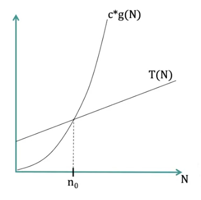

= Cheatsheet - Asymptotic Analysis
Fabio Lama <fabio.lama@pm.me>
:description: Module: CM2035 Algorithms and Data Structures II, started April 2024
:doctype: article
:sectnums: 4
:toclevels: 4
:stem:

NOTE: Make sure to check the _Time and Space Complexity_ cheatsheet, too.

== About

Asymptotic analysis is an alternative way of describing the time or memory
requirements of an algorithm.

== Big O Notation

Big O notation (stem:[O(x)]) defines a set of functions that act as an upper bound (stem:[g(N)]) for
stem:[T(N)].

Formally defined as:

stem:[T(N)] is stem:[O(g(N))] if there exist **positive** constants stem:[c] and
stem:[n_0] such that:

[stem]
++++
T(N) <= c xx g(N) " for all " N > n_0
++++

Alternatively:

[stem]
++++
T(N) in O(g(N)) hArr EE c > 0 EE n_0 > 0 AA N (N <= n_0 -> c xx g(N) >= T(N))
++++

Note that there can be **multiple** functions (stem:[g_x(N)]) that act as an upper
bound for stem:[T(N)]. Additionally, do notice that it's **not necessary** that
stem:[c xx g(N)] is equal to or greater than stem:[T(N)] for all values of
stem:[N].

For example, consider:

[stem]
++++
T(N) = 10 N^2 + 15N + 5\
g(N) = N^2\
c = 1
++++

Here, stem:[c xx g(N)] is never greater than stem:[T(N)], because there is no
solution for:

[stem]
++++
10 N^2 + 15N + 5 <= 1 xx N^2
++++

However, consider:

[stem]
++++
c = 25
++++

In case of stem:[N = 1] we get:

[stem]
++++
10 xx 1^2 + 15 xx 1 + 5 <= 25 xx 1^2\
= 10 + 15 + 5 <= 25\
= 30 <= 25
++++

Which is false. However, for stem:[N = 2] we get:

[stem]
++++
10 xx 2^2 + 15 xx 2 + 5 <= 25 xx 2^2\
= 40 + 30 + 5 <= 100\
= 75 <= 100
++++

Which is true. Therefore:

[stem]
++++
T(N) " is " O(N^2) " because"\
T(N) <= 25 xx g(N) " for all " N >= 2
++++

There choice for stem:[c] **is arbitrary**, as long as it satisfies the conditions.