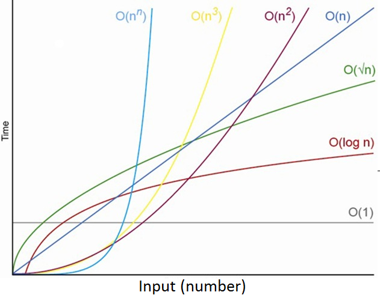

= Cheatsheet - Time and Space Complexity
Fabio Lama <fabio.lama@pm.me>
:description: Module: CM2035 Algorithms and Data Structures II, started April 2024
:doctype: article
:sectnums: 4
:toclevels: 4
:stem:

== About

To analyze an algorithm, we must determine its processing and memory requirements. The processing requirement is the time complexity, and the memory requirement is the space complexity.

== Counting Up Time and Space Units

=== Simple Algorithm

Consider:

. stem:[bb "function " "F1"(a, b, c)]
. stem:["    " tt "max" = a]
. stem:["    " bb "if " (b> tt "max")]
. stem:["    " "    " tt "max" = b]
. stem:["    " bb "if " (c> tt "max")]
. stem:["    " "    " tt "max" = c]
. stem:["    " bb "return " tt "max"]

If we analyze this function one by one:

==== Step 1.

. stem:["    " tt "max" = a]

1 memory read (a), 1 memory write (max), or **2 time units**.

==== Step 2.

. stem:["    " bb "if " (b> tt "max")]

2 memory reads (b, max), 1 comparison, 1 evaluation, or **4 time units**.

==== Step 3.

. stem:["    " "    " tt "max" = b]

1 memory read (b), 1 memory write (max), or **2 time units**.

==== Step 4.

. stem:["    " bb "if " (c> tt "max")]

2 memory reads (c, max), 1 comparison, 1 evaluation, or **4 time units**.

==== Step 5.

. stem:["    " "    " tt "max" = c]

1 memory read (c), 1 memory write (max), or **2 time units**.

==== Step 6.

. stem:["    " bb "return " tt "max"]

1 memory read (max), 1 return, or **2 time units**.

==== Total

In **total**, this function has a time complexity of **16 time units**. The only variable created is stem:["max"], so the space complexity is **1 space unit**.

=== Complex Algorithm

Consider:

. stem:[bb "function " "F2"(A, N, x)]
. stem:["    " bb "for " 0 <= i < N]
. stem:["    " "    " bb "if " (A\[i\] " == " x)]
. stem:["    " "    " "    " bb "return " i]
. stem:["    " bb "return " -1]

A loop is not a single instruction, meaning we need to analyze the inner
instructions carefully. If we analyze this function one by one:

==== Step 1.

. stem:["    " bb "for " 0 <= i < N]

We expand this to:

. stem:[i = 0]
. stem:[bb "if " (i < N)]
. stem:["    " tt "<instructions>"]
. stem:["    " i = i + 1]

Respectively:

. stem:[i = 0]

1 memory write (i), or **1 time unit**.

. stem:[bb "if " (i < N)]

2 memory reads (i, N), 1 comparison, 1 evaluation, or 4 time units. But since
this is in a loop, we can consider this as **4*(N+1) time units**. Plus one
because it's executed at least once, even if N is 0 (and the if-statement is
skipped).

. stem:["    " i = i + 1]

1 memory read (i), 1 numerical op (+1), 1 memory write (i), or **3*N time units**.
Times N because it's executed in a loop.

For the full time complexity, excluding the inner instructions, we get:

[stem]
++++
1 + 4 (N + 1) + 3 N\
= 1 + 4N + 4 + 3 N\
= 7N + 5
++++

In other words, this for loop takes **7N + 5 time units**, excluding the inner instructions.

==== Step 2.

. stem:["    " "    " bb "if " (A\[i\] " == " x)]

3 memory reads (x, i, stem:[A\[i\]]), 1 comparison, 1 evaluation, or **5*N time units**.
Times N because it's executed in a loop.

==== Step 3.

Only one of the two return statements is executed.

. stem:["    " "    " "    " bb "return " i]
. stem:["    " bb "return " -1]

We are going to assume the case where the number is not in the array (worst
case), so the second return statement is executed which is **1 time unit**.

=== Total

To summarize all the steps:

[stem]
++++
7N + 5\
+ 5N\
+ 1\
= 12N + 6
++++

In **total**, this function has a time complexity of **12*N + 6 time units**.
This means it's running time depends on the size of the input array. The bigger
the array, the longer the runtime. Additionally, we only create one new variable
(i), so the space complexity is **1 space unit**.

=== Growth of Function

As we have seen, the simple algorithm has a time complexity of **16 time units**.
This means that the time complexity is a constant (stem:[C_x]),
regardless of the size of the input.

We can specify this as:

[stem]
++++
T(N) = C_1
++++

In comparison, the complex algorithm has a time complexity of **12*N + 6 time units**:

[stem]
++++
T(N) = C_1 N + C_2
++++

This means that the time complexity is linearly dependent on the size of the input. Hypothetically, if we had a time complexity of **N^2**, we would have a
quadratic time complexity, and so on.

Common time complexities are:

.Source: https://www.codeproject.com/articles/1012294/algorithm-time-complexity-what-is-it

=== Growth of Function Without Counting

We can calculate the growth of the running time of an algorithm without counting
every single time unit.

Consider:

. stem:[bb "function " "SumDiag"(A)]
. stem:["    " tt "sum" = 0]
. stem:["    " N = "length"(A\[0\])]
. stem:["    " bb "for " (0 <= i < N)]
. stem:["    " "    " tt "sum" = tt "sum" + A\[i, i\]]
. stem:["    " bb "return " tt "sum"]

If we analyze this function one by one:

==== Step 1.

. stem:["    " tt "sum" = 0]

Constant time stem:[C_0]

==== Step 2.

. stem:["    " N = "length"(A\[0\])]

Here we have to analyze the stem:["length"] function, but let's say we already
knew its time complexity of stem:[T(N) = C_1 N + C_2]

==== Step 3.

. stem:["    " bb "for " (0 <= i < N)]

As we analyzed in the section on counting time units of a for loop, for example
stem:[7N + 5] (excluding inner instructions), we hence know that stem:[T(N) = C_3 N + C_4].

==== Step 4.

. stem:["    " "    " tt "sum" = tt "sum" + A\[i, i\]]

Constant time stem:[C_5] times N because it's executed in a loop. Respectively:
stem:[C_5 N].

==== Step 5.

. stem:["    " bb "return " tt "sum"]

Constant time stem:[C_6].

==== Total

To summarize all the steps:

[stem]
++++
C_0\
+ C_1 N + C_2\
+ C_3 N + C_4\
+ C_5 N\
+ C_6\
= T(N) = (C_1 + C_3 + C_5) N + (C_0 + C_2 + C_4 + C_6)
++++

To simplify, we can group the constants together:

[stem]
++++
T(N) = C_7 N + C_8
++++

This means that the algorithm grows linearly with the size of the input.

=== Worst and Best Cases

An algorithm can have different time complexities depending on the input.
Generally, we're interested in the worst-case scenario, but we can also analyze
the best-case scenario.

Consider:

. stem:[bb "function " "L_Search"(A, x)]
. stem:["    " N = "length"(A)]
. stem:["    " bb "for " 0 <= i < N]
. stem:["    " "    " bb "if " (A\[i\] " == " x)]
. stem:["    " "    " "    " bb "return " i]
. stem:["    " bb "return " -1]

And a given array:

[stem]
++++
A = (13, 8, 2, 24, 5, 17, 6, 9)
++++

The **best case** is where the number we're looking for is the first element in the
array, respectively stem:[x = 13]. In such a case, the function returns immediately:

[stem]
++++
T(N) = C_1
++++

**Worst case**, the number we're looking for is not in the array at all, for
example stem:[x = 7]. In that case, the function checks every element in the
array (N amount), eventually returning stem:[-1]:

[stem]
++++
T(N) = C_1 N + C_2
++++

We notate this as stem:["L_Search"(A, 7)] having a running time of stem:[T(N) a N]
(worst case). Meanwhile, stem:["L_Search"(A, 13)] has a running time of
stem:[T(N) a 1] (best case).
