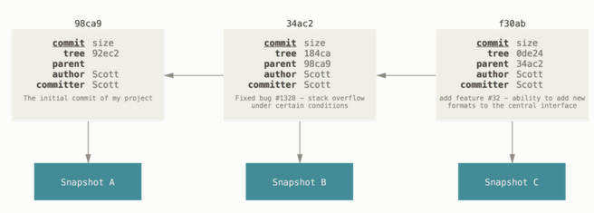
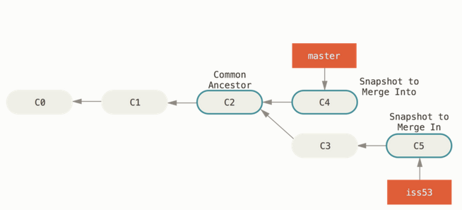
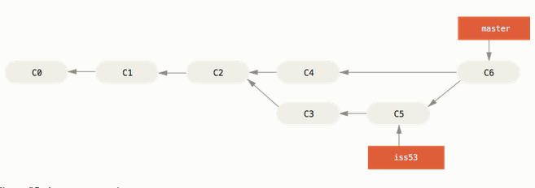

<!-- omit in toc -->
# Version Control with Git

Notes are summaries of Chacon and Straub, *Pro Git*, 2nd ed. 2014.

- [Git Basics](#git-basics)
  - [Git Highlights](#git-highlights)
  - [The Three States of Files](#the-three-states-of-files)
  - [Basic Config](#basic-config)
  - [Basic Commands](#basic-commands)
    - [Local Commands](#local-commands)
    - [log commands](#log-commands)
    - [Remote Commands](#remote-commands)
- [Git Branching](#git-branching)
  - [Git Branch Basics](#git-branch-basics)
  - [Merging](#merging)
  - [Remote branches](#remote-branches)
  - [Rebasing](#rebasing)

## Git Basics

### Git Highlights

The major difference between Git and prior VCS is the way Git perceives its data. Most systems store information as a list of file-based changes, they think of their information they manage as a series of files and the changes to each file over time.

Git does not think of or store its data in this way, rather as a *stream of snapshots* of a miniature file system. Every time you commit, or save the state of your project in Git, it takes a picture of what all your files look like at that moment and stores a reference to that snapshot. This makes Git more like a mini filesystem with some powerful tools built on top of it, rather than just a VCS. It has other distinguishing features:

*Nearly all operations are local*. Your local git repository includes a full history of the project so most operations are local and don't require network access.

*Integrity*. Everything in Git is check-summed before it is stored so you cannot change the contents of any file or directory without Git's knowledge. It uses an SHA-1 hash to produce the checksum, giving a 40 character string of hex characters. You will see these all over the place in Git. Everything in the Git database is stored by the hash value.

*Git usually only adds data*. Nearly all changes to the Git database only add data rather than deleting it. So it is very hard to actually lose information after it has been committed.

### The Three States of Files

The main thing to remember on the basics side is that there are three main states that your files can reside in when managed by Git:

- ***Committed*** - the data is safely stored in the local database.
- ***Modified*** - means that you have changed the file but have not committed it to the database yet.
- ***Staged*** - means that you have marked a modified file in its current version to go into your next commit snapshot.

This results in three main sections of any Git project: The *Git directory*, the *working directory*, and the *staging area* (also called the *index*).

- The Git directory is where Git stores the metadata and object database for your project. It's the most important part of Git, and is what is copied when you clone a repo from another machine.
- The working directory is a single checkout of one version of the project. These files are pulled out of the compressed database in the Git directory and placed on your disk for reading and modification.
- The staging area is a file, usually contained in the Git Directory, which stores info on what will go into the next commit.


So if a file in the working directory is the same as the version in the Git directory it is committed; if has been modified and added to the staging area it is staged; if it has been changed but not added to the staging area it is modified. Files might also be untracked, if they have never been added to the project, or ignored.


Your basic workflow will be checkout a project, modify files, add them to the staging area, and then take a snapshot by making a commit.

### Basic Config

Git comes with a tool called `git config` which sets config variables. They might be scoped system wide (in `/etc/gitconfig`), to the user (in `~/.gitconfig` or `~/.config/git/config`), or to the project (in `.git/config` in the project directory). Each level down overrides the more general.

Some useful config commands:

```bash

#list your settings
git config --list 

#set defaults at the user level rather than in the local project by passing --global
git config --global user.name "John Doe" 
git config --global user.email johndoe@hotmail.com

#set editor for commit messages
git config --global core.editor vim

#get help
git help <verb>
git <verb> --help
man git-<verb>

#for example
git help config
```

### Basic Commands

A cheat sheet of basic git commands:

#### Local Commands

```bash
#initialize a local repository
git init

#or clone a remote one
git clone <URL>

#check the status of your files
git status

#add files to be tracked by Git, save state of file to the staging area
git add <filename>

#or the whole directory
git add .
git add --all

#see what's changed but not staged
git diff

#see what's staged for the next commit, compares staged changes to last commit
git diff --staged

#scrap current changes to a file in the working directory and revert file to last commit
#note this permanently deletes any changes to the file in the working directory and cannot be undone
git checkout -- <filename>

#take a snapshot, without opening the text editor for a message
git commit -m "my commit message"

#skip the staging area altogether and just commit all modified, tracked files
git commit -a -m "skipping staging"

#amend the last commit, taking the current staging area as the basis
git commit --amend

#remove a file from the staging area
git reset HEAD <file>

#remove and stop tracking a file
git rm <file>

#keep the file on your hard drive, but stop git tracking it
git rm --cached <file>

#useful aliases
git config --global alias.unstage 'reset HEAD --'
git config --global alias.last 'log -1 HEAD'

#now we can do
git unstage <file> #remove file from staging area
git last #show the last commit details

#other abbreviations
git config --global alias.co checkout
git config --global alias.br branch
git config --global alias.co commit
git config --global alias.st status


```

#### log commands

see p. 27ff for logging

```bash
#see the commit history
git log

#see the last two commits and the changes introduced
git log -p -2

#abbreviated stats
git log --stat

#format output (eg for machine parsing):
# see p. 29 for options
git log --pretty=format:"%h - %an, %ar : %s"

#see a branch graph
git log --graph

```

We can use git logs for debugging. We can filter by grep filters on messages, or code itself with the commands:

`--grep` - search commits with a commit message containing a string

`--S` - search commits that added or removed code matching the string

And we can search the history of a line or function with the `-L` flag

```bash

#find when a constant was introduced
git log -S ZLIB_BUF_MAX --oneline

#see every change made to the function get_user in the user.js file
git log -L :get_user:user.js
```

We can also use `log` to see where our `HEAD` and branch pointers are pointing with: `git log --oneline --decorate`.

You can also use it to see which commits are unique to particular branches relative to others. See [the Git book](https://git-scm.com/book/en/v2/Git-Tools-Revision-Selection#_commit_ranges)

#### Remote Commands

```bash
#show remotes with urls
git remote -v

#add a remote with an alias
git remote add <alias> <url>

#show info about a remote
git remote show <alias>

#fetch repo data from a remote with alias
git fetch <alias>

#push to a remote (requires write permission)
#only works if no-one has pushed to the same branch since you pulled
git push <alias> <branch>

#rename a remote
git remote rename <old_alias> <new_alias>

#remove a remote
git remote rm <alias>

```

## Git Branching

### Git Branch Basics

Branching is Git's killer feature, because it is so cheap and easy to create, merge, and delete branches we use branches all the time in Git, much more than other VCS. To understand why you need to understand Git's data model.

When you make a commit, Git stores a snapshot of the project. It also stores a commit object that contains a pointer to the snapshot of the content you staged. This object contains some other info too, like the message, author's name and email and pointers to the parent commit(s) of the current commit.

The initial commit will have 0 parents, otherwise a normal commit will have 1 parent, a merge commit will have 2 or more parents. Here is a simple example of commits objects on a single branch:



***A Git branch is a lightweight, movable pointer to one of the commits***. That's all it is. The *master* branch is just the default branch name for when you initialize a git repo. As you commit, the pointer moves forward automatically with your commits.

You can create a new branch with the command `git branch <branchname>`. This will create a new pointer to the commit you are currently on. Git keeps track of which branch you are currently on with another pointer, called *HEAD*. Again *HEAD* is just a pointer, to a branch pointer, which itself is just a pointer to a commit. It's all just pointers.

`git branch` just creates a new pointer, it doesn't switch you to working on that branch. To switch to an existing branch you run `get checkout <branch>`. Or to create a branch and switch immediately it is `git checkout -b <new_branch>`

***Switching branches changes the files in your working directory*** So if you checkout an older branch, your working directory will switch back too. Be careful to commit changes to avoid losing data.

### Merging

Take a common example. You branch from master to start working a new feature, then you have to do an urgent patch. So you commit the feature work, revert to master and create another branch for the hotfix. You commit that and your working tree looks like this:


The hotfix branch has none of the changes made for the new feature, and it is also ahead of the master branch.

Now you can merge the hotfix work into the master branch as follows:

```bash
git checkout master
git merge hotfix
```

This will 'fast forward' the merge. Because the commit C4 pointed to by the branch hotfix was directly ahead of the master branch you were on, Git simply moves the branch pointer forward. Now the state looks like this:


You can now delete the hotfix branch with `git branch -d hotfix`

Now you go back to the feature branch and make some another commit. You want to merge the feature work with the master branch. The state looks like this:



Now the development history has diverged from a common point. Git cannot just 'fast forward' the pointer. It creates a new snapshot that results from the three-way merging of the common ancestor, the branch you're merging in, and the branch you're merging into.

The commands would be:
```bash
git checkout master
git merge iss53
```

And the result would be a *merge commit* a special type of commit object that has more than one parent:



If the same line has been modified differently while the branches diverged you will have a *merge conflict*. At this point git will modify the file in the working directory to show you the alternative text from the different branches and you will have to manually edit the files to choose the correct text, before running `git add` on the resolved file to stage it for commit. Staging it again marks it as resolved.

### Remote branches

Remote branches are just pointers to the state of branches on your remote repositories. You cannot change them directly, they change automatically when you communicate over the network. They serve as bookmarks for the state of remote branches the last time you communicated with them. They take the form `<alias>/<branch>`

When you run `git push <alias> <branch>` you are saying, "take my local <branch> and push it to update the remote <alias>'s branch called <branch>'". It doesn't have to be called the same thing, you could say `git push <alias> <local_branch>:<alias_branch>` to rename as suggested.

When you run `git fetch` you don't automatically have local editable versions of remote branches, you just have an immutable `<alias>/<branch>` pointer. You can either merge the remote branch into your local working branch, or create a new local branch as follows:

```bash
#to merge the remote into your current working branch
git merge <alias>/<branch>

#to create a new branch based off the remote one
git checkout -b <new_local> <alias>/<branch>
```

When you checkout a local branch from a remote branch Git creates automatically a *tracking branch* or *upstream branch*. These are local branches with a direct relationship with a remote branch such that if you run `git push` Git will infer the remote and branch to push to. Likewise `git pull` when on a tracking branch will automatically pull the remote version and merge it with your working directory.

Some useful commands for remote branches:

```bash
# A shortcut to create a local branch with the same name as an existing remote branch:
git checkout --track <alias>/<branch>

#setup a local branch with a different name to track remote
git checkout -b <local_name> <alias>/<remote_name>

#set or change the upstream branch for an existing local branch
git branch -u <alias>/<branch>
```


### Rebasing

Rebasing is an alternative to merging for integrating changes from one branch into another.

Rebasing works by going to the common ancestor of two branches - the one you are on adn the one you're rebasing onto - getting the diff introduced by each commit of the branch you are on, saving those diffs to temporary files, resetting the current branch to the same commit as the branch you are rebasing onto, and applying each change in turn.

You can then do a fast forward merge to catch the other branch up.

The result is the same as merging except for the appearance of a clean, single branch history. It makes the history and log a lot easier to follow. 

You might often do this to create a clean history ahead of pushing to a local repository. For example if you want to contribute to a repo you don't maintain you might do your work in a branch and then rebase onto origin/master when you are ready to submit your patches to the main project. Then the maintainer can fast forward and clean apply, or reject the changes, without doing the integration work themselves.

Here is the visual picture of what happens:

The original state:


Then `git checkout experiment` and `git rebase master`:


Then `git checkout master` and `get merge experiment`


See p. 70 for a more complex rebase example.

One major problem: ***Do not rebase commits that exist outside your local repository***

If you push commits to a repository and others work from them, it can get very messy if you then rebase the commits and push them up again. See p. 73 for more on the problems of this and avoiding them by not doing it!


