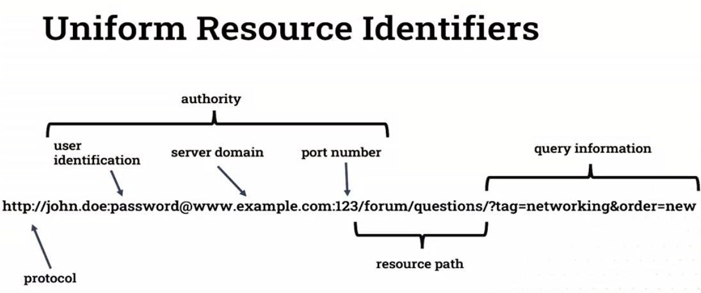

# Week 1

## Lesson 1.0 Welcome to Advanced Web Development

You would need to install following component in order to work on projects:
- Visual Studio Code (or IDE that you are familar with)
- Python (>3.8)
- Django (>3.0)

Optional:
- Python extension for VS Code (formatting, debugging, Intellisense,...).

Please refer to lecture videos for more detail.

## Lesson 1.1 Background: Introducing the full stack Web Server

### TCP/IP

This topic is already covered in level 4 modules like How Computer Works.

### Overview of HTTP

#### HTTP

- Stateless request-response protocol.
- Client application request data.
- Server application send data.

Further reading (suggested by the module):

- Sections 4.1 to 4.4 (pp.47–59, pdf numbering pp.76–88): Kumar, [Akshi Web Technology: Theory and Practice](https://ebookcentral.proquest.com/lib/londonww/detail.action?docID=5477541), CRC Press LLC, 2018. 
- [World Wide Web Consortium (W3C) HTTP status code definitions](https://www.w3.org/Protocols/rfc2616/rfc2616-sec10.html)

#### Uniform Resource Identifier (URI)

#### HTTP request method

|HTTP request|Meaning|
|GET|Request a resource|
|POST|Request a method|
|PUT|Send data to the server|
|DELETE|Delete a remote resource|

Further reading: [HTTP request methods](https://developer.mozilla.org/en-US/docs/Web/HTTP/Methods).

#### HTTP request and response messages

|Line|HTTP Request|HTTP response|
|1|request line|status line|
|2|request metadata|response metadata|
|3|blank line|blank line|
|4|request body|response body|

Example:

Further reading: 

1. [HTTP messages](https://developer.mozilla.org/en-US/docs/Web/HTTP/Messages).
2. You can use browser's inspector like Google Chrome Devtools to inspect the request and response message.

#### HTTP status code

Further reading: [HTTP response status codes](https://developer.mozilla.org/en-US/docs/Web/HTTP/Status).

### The component of a fullstack web application

[Common web application stack](./assets/week1_commonstack.png)

Transcript from lecture video:

- A web stack is the suite of software and technologies required to deliver a website or web application. Though there are a great many possible sets of such software, it's widely accepted that the minimal set on the server side tends to be a computer running an operating system. Some web service software for serving http data. A method of data storage such as a file system or database. And the technology for writing computer code or scripts in a full stack system. We would also consider the client side technologies, namely the web browser, which implements HTML, CSS, and JavaScript.
- Web application stacks often fit into common sense with shorthand names. LAMP standing for Linux, Apache, MySQL, and PHP is a common web stack. The stack uses Linux as the operating system, Apache for the web server, MySQL is the database, and PHP is the scripting language.
- The Microsoft based WISA Stack standing for Windows Server 2, SQL Server and ASP.net. This is a popular choice for programmers who prefer to work in a Microsoft Windows environment.
- The modern MEAN stack is a pure JavaScript solution that reduces the number of programing languages needed to implement a website to just one. Here, MongoDB is used for storage, Express.js is the web server, and Angular is used for dynamic frontend code, and everything is hosted as a Node.js application.

[Afternative applications](./assets/week1_afternativeapp.PNG)

Today, some variant of the LAMP stack is common. But there are great many alternatives and replacements for every component in the stack. Linux remains a popular operating system, but the other components vary greatly. Nginx is a common alternative to Apache. MySQL can be replaced with PostgreSQL, Oracle, or a NoSQL solutions such as MongoDB. And PHP has been roundly replaced with more programmer friendly languages such as Ruby, Python, or JavaScript. For each alternative technology, there are a great many pluses and minuses. And it always pays to weigh these up when you start a new project, and this will ensure you select an appropriate set of technologies for the appropriate project.

Further reading:

- Chapter 7:  Web Development Basics, Sections 7.1 and 7.2 (pp.105–11, pdf numbering pp.135–40): Kumar, [Akshi Web Technology : Theory and Practice](https://ebookcentral.proquest.com/lib/londonww/detail.action?docID=5477541), CRC Press LLC, 2018. 

### Modern web server

Both Apache and Nginx are open source and free, can run on many OSes, highly configurable and extensible. The biggest difference between them was the performance. Nginx was written specifically to outperform Apache with its default settings. It's capable of saving 10,000 concurrent connections with a very low memory footprint. This is nearly four times the number of concurrent connections that are default Apache installation can handle. Because of this advantage, Nginx is used on many high-traffic sites. 

Further reading:

- [Apache FAQ](https://cwiki.apache.org/confluence/display/httpd/FAQ)
- [Nginx overview](https://www.nginx.com/resources/glossary/nginx)

### Web application framework and MVC

A web application framework, often referred to simply as a web framework, is a software framework designed to facilitate the easy development and deployment of web applications. These frameworks typically give the programmer a structured logical way to organize their application code. And they provide libraries covering all the most common functionality needed when developing web applications. This means web frameworks typically provide a means for:

- routing client requests to functions that generate data
- data store access
- automated web page generation

#### Framework 'weight'

|Lightweight|Fully featured|
|less rigid or opinionated about how to structure the application code|highly structured layout|
|flexible application design|specific application design pattern|
|functionality via plugins or user coding|lots of functionality included|

#### MVC

This topic is already covered in Database, Network and Web module.

- Model: store, generate and retrieve data.
- View: controls how to build the user interface.
- Controller: application logic. Connect user to the model and views.

Further reading: 

- Section 7.3 of Web Technology: Theory and Practice (pp.111–12):
 Kumar, [Akshi Web Technology: Theory and Practice](https://ebookcentral.proquest.com/lib/londonww/detail.action?docID=5477541), CRC Press LLC, 2018. 

#### Data storage 

- Data Storage a main component of common web application stacks is a means of storing data so that it can be read, updated or manipulated by the web application.
- For static or unsophisticated websites, this may be nothing more than the file system of the computer the web server is running on. Most web applications make some use of databases to provide data storage.
- Database systems typically provide a sophisticated means for storing and querying large data sets. Most database systems aim to be reliable and scalable and to provide a fast means for adding, retrieving, editing and deleting data.

Further reading: 

- Chapter 11, Sections 11.1 to 11.3 (pp.175–78): Kumar, [Akshi Web Technology : Theory and Practice](https://ebookcentral.proquest.com/lib/londonww/detail.action?docID=5477541), CRC Press LLC, 2018. 

##### Relational database management systems

- In the context of web application development, we're typically talking about relational database management systems or RDBMS, Relational databases explicitly model the stored data with a fixed schema, such that different types of data entities have explicit relationships to other types of entities within the database. 
- Relational databases give us a means to model such relationships, store that data and efficiently query it.
- All relational database management systems have supported a query language called it structured query language or SQL. This allows users to interact with the underlying database and the database schema.

**Comparision between MySQL and PostgreSQL**

- Two most popular free and open source RDBMs.
- Common funcionality and performance.
- Postgres is better at concurrent performance.
- MySQL has a smaller memory footprint.

##### NoSQL

- Do not use Relational Data Modelling.
- Do not use SQL.
- Better performance compared to RDBMS.
- Common types include: 
    - Document stores (MongoDB)
    - Key-value stores (Redis)
    - Graph databases (Neo4j)

## Lesson 1.2 Installing Django

### Prerequisites

- Python
- Pip
- Django

### App layout

We're going to start app, so we're going to build a new app. 

Change dir to simplesite (or the directory that contains manage.py file) and run `python manage.py startapp helloworld`. Let change dir to helloworld directory.

- At the top because this is to be understood as a Python package where it stands as `int.py` file. And then various other commands. So, we can open each of these.
- `admin.py`: this is just a stub file for our admin configuration. We'll have a look at that in a later topic.
- `apps.py`: this is our current configuration for our hello world app.
- `migrations`: there's nothing in there yet in int.py. Migrations model instructions for creating and modifying the database that will underlie our applications. And for now, we haven't written any database descriptors, so there's nothing in this directory.
- `models.py`: a stub for our Django models. And here's where we'll write the descriptors for our database and our back end. We'll come to that shortly.
- `tests.py`: if we're going to write unit tests and functional testing for our application and some kind of integrative testing. All of our test code can go inside this file.
- `views.py`: views is where the bulk of our application logic will reside in the model view controller pattern. This file will typically be regarded as the controller. But Django is in the main culture is already slightly different. It's kind of model views template. But the views in Django are equivalent to controllers in something like Ruby on Rails and other MVC frameworks.

Supplemental reading: ["Writing your first Django app, part 1"](https://docs.djangoproject.com/en/3.0/intro/tutorial01/), Django documentation 

### Serving the first webpage

To serving your application, run the following commands, make sure that you are in the directory that contain manage.py file: `python manage.py runserver 127.0.0.1:8080`.

Open your browser and navigate to `127.0.0.1:8000`

