# Data Science
Lecturer: Dr. Tony Russel-Rose, Konstantin Kapinchev

## Week 1 - Introduction
**data point** - a unit of observation, ex: numerical value

**Data types in statistics**
- *Categorical*
  - nominal - no quantitative value, no order
  - ordinal - no quantitative value, can be ordered
- *Numerical*
  - interval - no clear zero value, ex: year
  - ratio - most measurements belong here

**Common data structures used in Python**: lists, dictionaries, arrays (NumPy), DataFrames (pandas), graphs (NetworkX)

## Week 2 - Python

**Python** is a high level general purpose programming language. It was designed to combine the computational capabilities of C with the expressive power of Shell Script. It's an interpreted language, dynamically typed and strongly typed.

**CPython** is the reference implementation of Python written in C. It compiles code into bytecode before interpreting it.

```py
import random # 'random' is part of py standard lib

out = random.randint(0, 99) # outputs x, 0 <= x <= 99

print('Integer is: {}'.format(out)) # string interpolation
print(f'Integer is: {out}') # f-string
```

Common Python libraries:
- `pandas` - data manipulation
- `matplotlib` - plotting numerical data
- `scikit-learn` - machine learning
- `numpy` - n-dimensional array processing, data manipulation

Python tutorial: https://docs.python.org/3/tutorial/

## Week 3 Part 1 - Numpy
Numpy provides an efficient interface to store and operate on dense data buffers.

A basic variable in C is the label of a position in memory while in Python a variable is a pointer to a compound C structure that contains: reference count, type, size and actual data. When storing values in a list, each is treated like a separate variable which creates redundant data. Both fixed type arrays and numpy arrays resolve this issue by storing only the raw data for each element.

```py
arr1 = array('i', [1,2,3]) # fixed type array stores only integers (i)
arr2 = np.array([1, 3, 4]) # numpy array, data type can be inferred or specified via `dtype`
```

### Memory allocation
```py
# empty array of 50 elements, filled with random values
np.empty(shape=50, dtype=int)

# empty 2d array, 50 rows x 10 columns
np.empty(shape=(50,10), dtype=int)

# empty array with structured data, U10 is a 10 character unicode string
np.empty(shape=10, dtype=[('Title', 'U10'), ('Year', int), ('Price', float)])

# initialise the random number generator
np.random.seed(0)
# array with 10 elements, values from [-5, 5)
np.random.randint(-5, 5, 10, dtype=int)
# 3x3 array filled with random values between 0 and 1
np.random.random((3, 3))

# array with 10 elements
np.zeros(shape=10, dtype=int) # filled with 0
np.ones(shape=10, dtype=int)  # filled with 1
np.full(shape=10, fill_value=7, dtype=int) # filled with 7
```

Elements of 2d array can be accessed in multiple ways: `myArray[i][j]` or `myArray[i, j]`

Numpy aggregation functions: `myArray.min()`, `myArray.max()`, `myArray.sum()`, `np.average(myArray)`

Aggregation can be done for a single axis in multi dimensional arrays, ex: `np.sum(myArray, axis=1)` sums up each row.

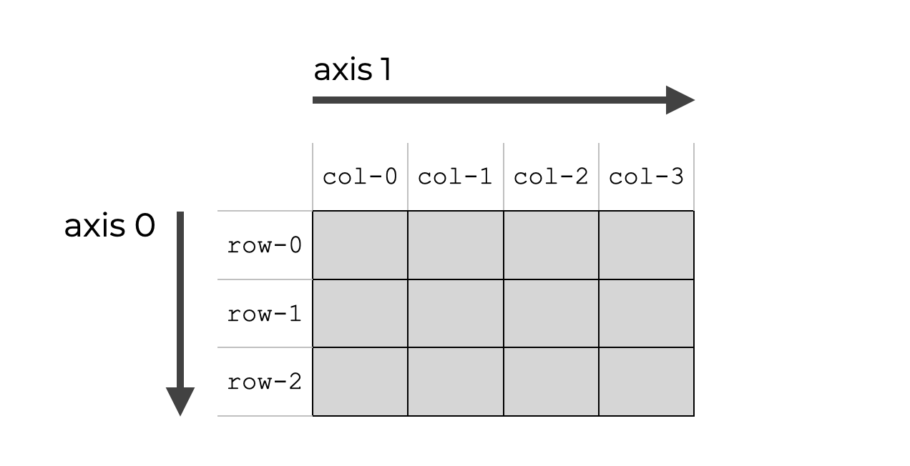

### Array creation

```py
np.array([1, 2, 3, 4]) # array from list

# arrange - (arrayrange) values that grow incrementally
np.arange(10) # array with elements from [0, 10)
np.arange(2, 10, dtype=float) # floats from [2, 10)
np.arange(2, 3, 0.1) # floats from [2,3) growing by .1

# linspace - x values spread over a range
np.linspace(1., 4., 6) # array with 6 values spread over [1, 4]
```

The attributes of an array can be exposed via the properties:
- *shape* - the size of each dimension
- *size* - total number of elements in the array
- *ndim* - number of dimensions (ex: 2)
- *dtype* - data type of each element (ex: `int32`)
- *itemsize* - size in bytes of each elements
- *nbytes* - size in bytes of the whole array

### Array manipulation

Assigning a variable the value of a subarray creates a *view into* the original array, the data isn't copied. `numpy.copy()` should be used when assigning an array to a new variable.

Slice notation: `arr[start:stop:step]`, by default `start=0`, `stop=size_of_dimension`, `step=1`.

```py
a = np.array([1, 2, 3, 4])
b = a[:2].copy()
b += 1
# a = [1,2,3,4], b = [2,3]

# will copy elements with index: 2, 3, 4, end index is exclusive
b = a[2:5] 

# a step can be specified
a = np.array([0,1,2,3,4,5,6,7,8,9])
a[::2] # [0, 2, 4, 6]

a[0] = 3.14 # this will be truncated to 3 as the dtype of array is int
```

**Reversing arrays**
If step is negative then the defaults for start and stop are swapped.
```py
# 1D
x1[::-1]

# 2D
x2[::-1, ::-1]
```

**Reshaping arrays**
```py
# generates a 3x3 array containing the elements 1-9
x1 = np.arange(1, 10).reshape((3,3))

x2 = np.array([1, 2, 3])
# row vector - [[1 2 3]]
print(x2.reshape((1,3))) # or
print(x2[np.newaxis, :])
# column vector
print(x2.reshape((3,1))) # or
print(x2[:, np.newaxis])
```

**Concatenate and split arrays**
```py
arr = np.array([1,2,3])
np.concatenate([arr, arr])

# rows of 2nd array get added after the firsts
grid = np.array([[1,2,3], [4,5,6]])
np.concatenate([grid, grid])

# concatenates along the second axis
print(np.concatenate([grid, grid], axis=1))
# [[1 2 3 1 2 3]
#  [4 5 6 4 5 6]]
```

To make it easier to understand how the arrays will be concatenated we can use the alternative methods:
- `np.vstack` - concatenate along axis 0
- `np.hstack` - concatenate along axis 1
- `np.dstack`

Splitting an array into sub-arrays:
```py
# 1D
x = [1,2,3,99,99,3,2,1]
x1, x2, x3 = np.split(x, (3,5))
print(x1, x2, x3) # [1 2 3] [99 99] [3 2 1]

# 2D
upper, lower = np.vsplit(grid, [2])
left, right = np.hsplit(grid, [2])

# np.dsplit can be used to split along the 3rd axis
```

### Universal Functions (ufuncs)

Python loops can be very slow in situations where many small operations are repeated. This is due to the overhead of dynamic typing. The interpreter has to examine an object's type and lookup the correct function to use for that type. In a compiled environment types are known beforehand and the code can be optimized during compilation.

**Vectorized operations** will push the loop into the compiled layer that underlies NumPy, leading to much faster operation. Vectorized operations are implemented via **ufuncs** which are applied to every element of the array, ex: `my_arr + 2` will add 2 to every element. 

```py
# ufuncs
# can be used on 2 arrays
print(np.arange(5) / np.arange(1, 6))

# can be used with an array and a scalar
x = np.arange(4)
print("x = ", x)
print("x + 5 = ", x + 5)
print("x - 5 = ", x - 5)
print("x * 2 = ", x * 2)
print("x / 2 = ", x / 2)
print("x // 2 = ", x // 2) # floor division
print("-x = ", -x)
print("x ** 2 = ", x ** 2)
print("x % 2 = ", x % 2) # modulo

# can be used on ndarrays
x = np.arange(9).reshape((3, 3))
print (2 ** x) # each element as a power of 2
```

These operations are wrappers for NumPy functions: `np.add()`, `np.subtract()`, `np.negative()`, `np.multiply()`, `np.divide()`, `np,floor_divide()`, `np.power()`, `np.mod()`.

For computing the absolute we can either apply the native function to a NumPy array, `abs(x)`, or use `np.abs()`.

Trigonometric functions: `np.sin()`, `np.cos()`, `np.tan()`, `np.arcsin()`, `np.arccos()`, `np.arctan()`.

Exponents and logarithms:
```py
x = [1, 2, 3]
print("x = ", x)
print("e^x = ", np.exp(x))
print("2^x = ", np.exp2(x))
print("3^x = ", np.power(3, x))

x = [1, 2, 4, 10]
print("x = ", x)
print("ln(x) = ", np.log(x))
print("log2(x) = ", np.log2(x))
print("log10(x) = ", np.log10(x))
```

> For all ufuncs the `out` argument can be used to specify where the result should be stored, ex: `np.multiply(x, 10, out=y)`. The result will be computed directly in the specified location *without* the use of a temporary array.

### Aggregates

An array can be reduced to a single value, for ex: `np.add.reduce(x)` will add up all the elements in the array. It's also possible to store all of the intermediate results of the computation by using `np.add.accumulate(x)`.

Any ufunc can compute the output of all pairs of two different inputs using the `outer` method:
```py
x = [1, 2]
y = [4, 5, 6]

np.multiply.outer(x, y)
# array([[ 4,  5,  6],
#       [ 8, 10, 12]])
```

NumPy has many fast aggregation functions for working on arrays: `np.sum()`, `np.min()`, `np.max()`, `np.prod()`, `np.mean()`, etc. Many of these functions can be called on the array itself, ex: `my_arr.min()`. For n-dimensional arrays the aggregation can be done along an axis, for ex: `x.max(axis=0)` will compute the maximum element for each column.

<figure>

<figcaption>The axis is the direction along which the values will be collapsed.</figcaption>
</figure>

Many aggregation functions have a NaN-safe counterpart which computes the result while ignoring missing values: `np.nansum()`, `np.nanmin()`, `np.nanmax()`, `np.nanprod()`, `np.nanmean()`, etc.

### Broadcasting
Broadcasting is a set of rules for applying binary ufuncs on arrays of different sizes. Types of broadcasting:
1. A singular value across an array `arr + 5`
2. A 1d array over a 2d array `arr2d + arr1d`
3. Differently sized arrays `arr3cols + arr3rows`

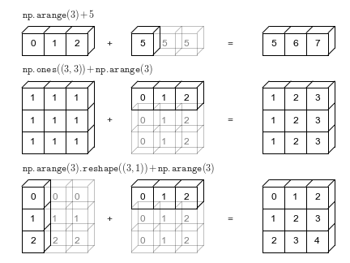

**Rules of broadcasting:**
1. If two arrays differ in their number of dimensions, the shape of the one with fewer dimensions is *padded* with ones on its leading (left) side.
2. If the shape of the two arrays does not match in any dimension, the array with shape equal to 1 in that dimension is stretched to match the other shape.
3. If in any dimension the sizes disagree and neither is equal to 1, an error is raised.

### Comparisons, Masks, and Boolean Logic
Numpy implements comparison operators which when applied to an array will return another array with Boolean data type. The operators are: `==`, `!=`, `<`, `<=`, `>`, `>=` which map to corresponding functions: `np.equal()`, `np.not_equal()`, `np.less()`, `np.less_equal()`, `np.greater()`, `np.greater_equal()`.

```py
x = np.array([1, 2, 3, 4, 5])
print(x < 3)
# [True True False False False]

# same output but using explicit function call
print(np.less(x, 3))
```

Counting entries:
```py
# `True` is interpreted as 1 and `False` as 0
np.count_nonzero(y < 6)
# or
np.sum(y < 6)

# returns True if any of the values is < 6
np.any(y < 6) 

#returns True if all of the values are > 0
np.all(y > 0)
```

It's possible to filter an array by multiple criteria, this is accomplished using boolean operators.

| Operator | Meaning |
|-|-|
| `&` | AND |
| `\|` | OR  |
| `^` | XOR |
| `~` | NOT |

```py
# parentheses are important because of operator precedence rules
np.sum((inches > 0.5) & (inches < 1))
```

Boolean arrays can be used as **masks** to select all elements that match a certain condition.

```py
# masking operation, selects all elements greater than 5
x[x > 5] 
```

### Fancy indexing
Multiple arbitrary indexes can be accessed at once by specifying them in a list.
```py
x = np.random.randint(100, size=10)

print([x[3], x[7], x[2]])
ind = [3, 7, 2]
print(x[ind])
```

With fancy indexing, the shape of the result reflects the shape of the *index arrays* rather than 
the shape of the *array being indexed*.

```py
x = np.array([1, 2, 6, 9, 3, 7, 8, 10])
ind = np.array([[3, 7], 
                [4, 5]])
x[ind]
# array([[ 9, 10],
#       [ 3,  7]])
```

Fancy indexing can be used for n-dimensional arrays, ex: `x[row, col]` and the broadcasting rules apply to how the row and column arrays are used.

### Sorting data

- `np.sort(x)` - returns a sorted version of the array
- `np.argsort(x)` - returns the *indices* of the sorted elements
- `x.sort()` - sorts the 1d array in-place
- `X.sort(axis=0)` - sorts each column of X (2d array)

`np.partition()` takes and array and a number K and returns a new array with the smallest K values to the left of the partition and the remaining values to the right in arbitrary order. `np.argpartition()` returns the indices of the partition.

### Structured arrays
```py
data = np.zeros(4, dtype={'names': ('name', 'age', 'weight'),
                          'formats': ('U10','i4', 'f8')})
print(data.dtype)
data[0] = ('Valentin', 36, 84.)
print(data)
```

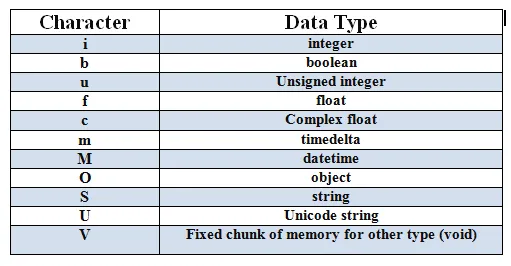

## Week 3 Part 2 - Statistics

Statistics is a major branch of mathematics. It studies the properties of numerical data; more specifically, data points organised into datasets. Statistics can generalise the properties of datasets and draw conclusions based on the data.

Statistics uses two main measurements to describe a dataset:
- measures of central tendency
- measures of spread

**Measures of central tendency** evaluate a central value, around which the data cluster around. There are 3 popular measures for it:
- *Mean* - arithmetic average
- *Median* - splits the dataset into two halves
- *Mode* - the data point which appears most frequently

```py
from scipy import stats as st

S = np.array([3, 8, 6, 3, 8, 5, 1, 5, 3, 6, 4, 5, 2, 4, 1, 5, 8, 4, 7, 5])
newS = np.sort(S)

print('Mean: ', np.mean(S))
print('Median: ', np.median(S))
print('Mode: ', st.mode(S)[0])
```

**Measures of spread** evaluate how data are spread around certain central values. Three common measures for it are:
- *Range* - difference between minimum and maximum
- *Standard deviation* - the average distance from a data point to the mean value
- *Variance* - $variance = sd ^ 2$

```py
print('Range: ', np.max(S) - np.min(S))
print('Standard deviation', np.std(S))
```

### Linear algebra

**Scalar** - values which have only magnitude, ex: $\mathbb{N}, \mathbb{Z}, \mathbb{R}, \mathbb{C}$

**Vector** - a quantity represented by a direction and a magnitude. Vectors can be defined for any dimension (n): $v = (a_1, a_2, ..., a_n)$

1. Scalar multiplication
  - Scalar: $a$
  - Vector: $v = (v_1, v_2, ..., v_n)$
  - $av = a(v_1, v_2, ..., v_n) = (av_1, av_2, ..., av_n)$


```py
np.array([1,2,3]) * 5
```

2. Vector addition
  - Vectors: $x, y, z$ (same dimension)
  - $x = (x_1, x_2, ..., x_n), y = (y_1, y_2, ..., y_n)$
  - $z = x + y = (x_1 + y_1, x_2 + y_2, ..., x_n + y_n)$

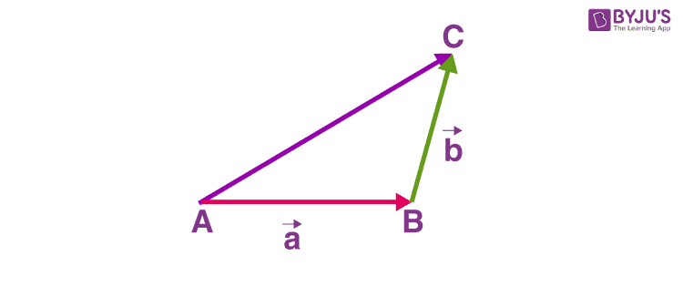

```py
np.add(np.array([1,2,3]), np.array([4,5,6]))
```

3. Dot product
  - Vectors: $x, y$ (same dimension)
  - $x = (x_1, x_2, ..., x_n), y = (y_1, y_2, ..., y_n)$
  - $z = x * y = x_1y_1 + x_2y_2 + ... + x_ny_n$
  - The result of the dot product is a single value, a scalar

```py
np.dot(np.array([1,2,3]), np.array([4,5,6]))
```

**Matrix** -  a rectangular table of components

Every square matrix has a **determinant** which is a single value with important mathematical meanings. 

> A matrix with a determinant of $0$ doesn't have an inverse.

> If one of the rows is a linear combination of another row then the determinant will be $0$.

```py
M = np.array([[1,2,3], [2,3,4], [2,5,6]])
D = np.linalg.det(M)
```

The **rank** of a matrix is the dimension of the largest non-zero determinant formed by the rows and columns of that matrix.

```py
R = np.linalg.matrix_rank(M)
```

The **trace** of a matrix is the sum of the main diagonal.

```py
T = np.trace(M)
```

In matrix **multiplication** the number of columns form the first matrix must equal the number of rows in the second matrix. The operation is *not commutative*, $AB \neq BA$.

$$ c_{ij} = a_{i1}b_{1j} + a_{i2}b_{2j} + ... + a_{in}b{nj} = \sum_{k=1}^n a_{ik}b_{kj}$$

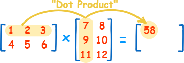

A square matrix with a non-zero determinant has an **inverse**, $M^{-1}$.

$M \times M^{-1} = M^{-1} \times M = I$

$I$ is the identity matrix, $M \times I = M$.

```py
M1 = np.linalg.inv(M)
```

**Linear Equations**

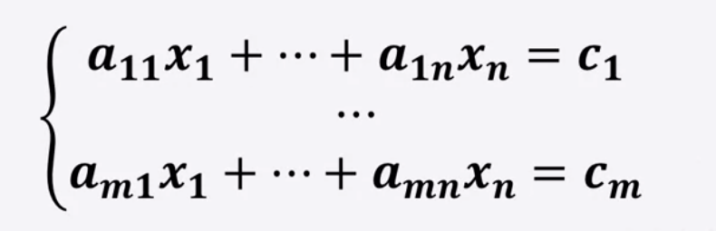

| 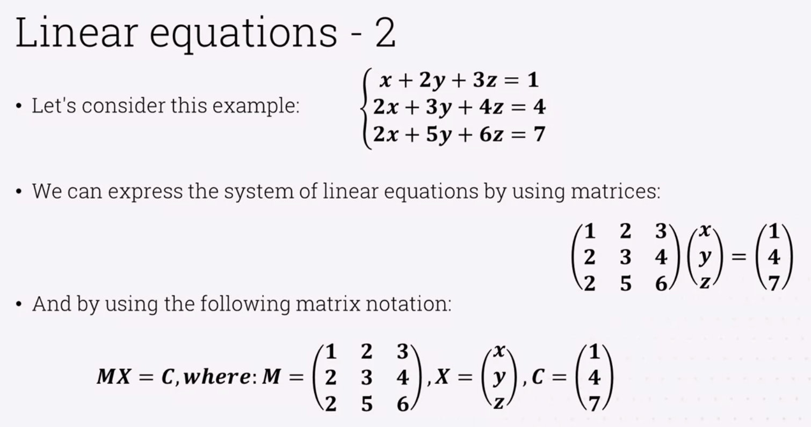 | 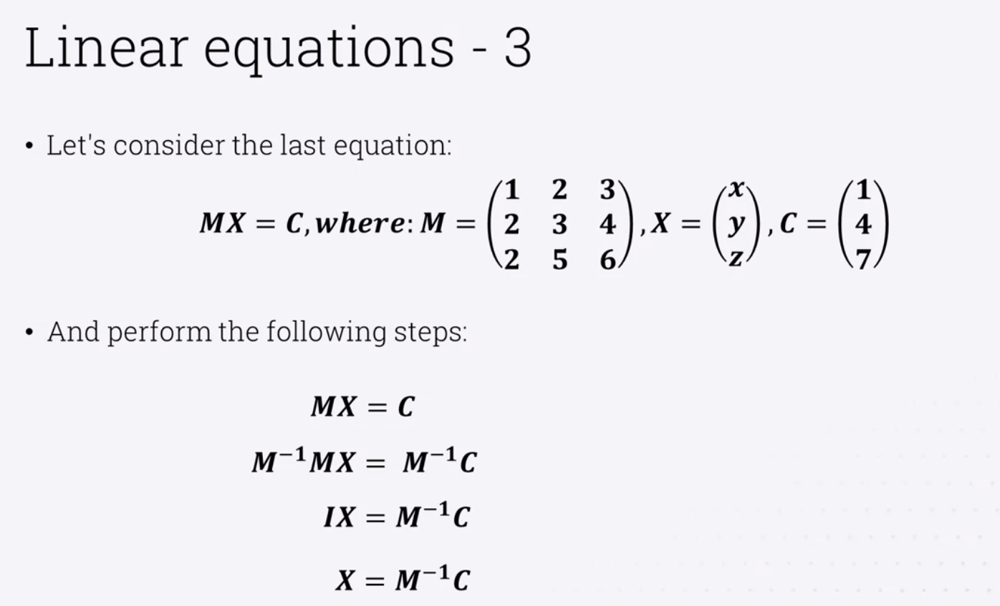 |
|-|-|

```py
C = np.array([[1], [4], [7]])
X = np.matmul(M1, C)
```

Other approaches to solving linear equations include:
- Gaussian estimation
- Cramer's rule

## Week 4 - Pandas

> Documentation: https://pandas.pydata.org/docs/

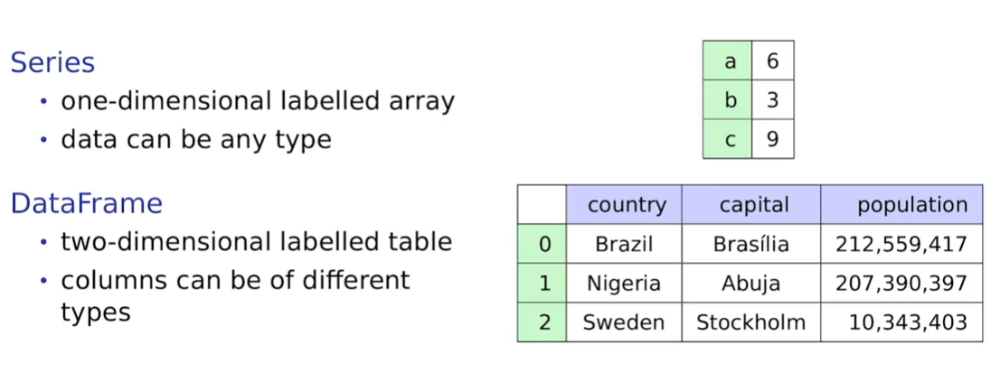

### Series

```py
import pandas as pd

# index generated automatically
q = pd.Series([1, 2, 3])
# custom defined indexes for elements
s = pd.Series([1, 2, 3], ['a', 'b', 'c'])

print(q.index)
print(s.index)

# Indexing
s = pd.Series([1, 2, 3], 
              ['a', 'b', 'c'], 
              name='data')

print(s['a'])
print(s[['a', 'c']])
# label based indexing locator
print(s.loc[['b', 'a']])
# integer based indexing locator
print(s.iloc[0])
# boolean indexing
print(s.loc[[True, False, True]])
print(s.loc[s != 2])
# vectorized operation, multiplies all values by 5
print(s * 5)

print(s * pd.Series([10, 100], ['b', 'c']))
```

### DataFrames

```py
pd.DataFrame([
  [1, 'a'], # row with 2 columns
  [2, 'b'],
  [3, 'c']
], columns=['col1', 'col2'] # column names
)

# different way of specifying the data
data = {
  'col1': [1, 2, 3],
  'col2': ['a', 'b', 'c']
}
pd.DataFrame(data)

df = pd.read_csv('data/class-data.csv',
                 # first column in CSV is the index
                 index_col=0 
                 )
# get 5 random rows
df.sample(5)
# count number of empty cells
df.isna().sum()
# print info about DataFrame  (num entries, column types, etc)
df.info()

# change the type of columns from object(can be anything) 
# to more specific category type
df['gender'] = df['gender'].astype('category')
df['programme'] = df['programme'].astype('category')
df['programme'].dtype

# show descriptive statistics
df.describe()
df[['gender', 'programme']].describe()

# Indexing
# returns a series with the values from a column in a DF
df['gender']
# returns a df
df[['gender', 'programme']] 

df.loc[[1, 13, 20, 28]]
# `loc` includes the last index in a range BUT `iloc` does not
df.loc[10:13]

# select rows and columns
df.loc[40:, ['gender', 'height']]

# boolean indexing
df.loc[df['programme'] == 'ds']

# remove rows with missing values
df = df.dropna(axis=0)
```

### Time series
Time series data looks at changes over time, commonly visualized as line graphs.

Uses: stock price analysis, profit, changes in health, signal processing, etc.

Different kinds of patterns:
- variability
- rate of change
- co-variance and correlation
- cycles
- exceptions

**Sampling rate** - the rate at which we measure a change, ex: one measurement per hour

**Time related concepts in pandas:**
- *Date times* - a specific data and time with timezone support
- *Time deltas* - an absolute time duration
- *Time spans* -  a span of time defined by a point in time and its associated frequency
- *Date offsets* - a relative time duration that respects calendar arithmetic.

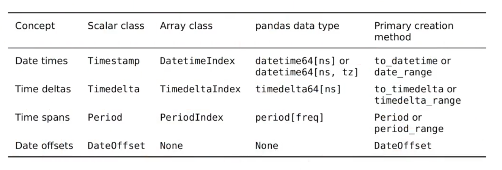

#### Timestamps
```py
# Pandas can also infer other data formats like
# MM/DD/YYYY but it can lead to ambiguity.
# For best results ISO data format is recommended
pd.Timestamp('2020-02-25 09:30')
# date components can also be specified individually
pd.Timestamp(year=2020, month=1, day=16)
# configurable parsing options
pd.to_datetime('10/01/2020', dayfirst=True)
pd.to_datetime('10/04/05', yearfirst=True)
pd.to_datetime('10/04/05', format='%y/%m/%d')
```

#### Generating sequences of timestamps
**DatetimeIndex** is a list of timestamps (date times).

```py
# a list will automatically be converted into a DatetimeIndex
index = pd.to_datetime(['2020-01-01', '2020-01-02', '2020-01-03'])
# a time frequency can be inferred by pandas
index.inferred_freq
# it can also be set
index.freq = 'D' # one day

# we can create a DatetimeIndex from a DF 
df = pd.DataFrame({
  'year': [2015, 2016],
  'month': [2,3],
  'day': [4,5],
  'hour': [2,3],                 
})
# if it has year, month, day,... columns
pd.to_datetime(df[['year', 'month', 'day', 'hour']])

# two-day interval
pd.date_range('2020-01-01', '2020-01-15', freq='2D')
# six timestamps at 6 hour intervals
pd.date_range('2020-01-01', periods=6, freq='6H')

# using timestamps as indexes
s = pd.Series(range(3), 
              index=pd.date_range('2000', freq='D', periods=3))
```

> Missing time data is represented with `pd.NaT`. Equality acts the same as `np.nan`, meaning N/A values are never considered to be equal `pd.NaT != pd.NaT`.

## Week 5
- *Quantitative data* - measurements of quantity
- *Qualitative data* - measurements of quality

Data is not the same as information. Ways of going from the former to the latter are: visualization, data mining, machine learning.

> Data visualization: The representation and presentation of data that exploits our visual perception abilities in order to amplify cognition.

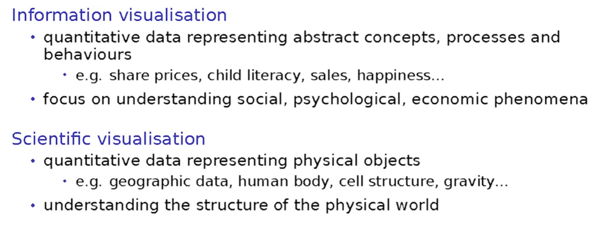

## Week 6 - Visual Perception and Design
> Visual displays provide the highest bandwidth channel from the computer to the human. Indeed, we acquire more information through vision than through all of the other senses combined.
> <p style="text-align:right">(Ware 2012, p.2)</p>

It's important to establish a scientific understanding of visual perception which will allow us to go from subjective interpretations (like, dislike) toward a deeper understanding of how to maximize communication in visual formats.

**Semiotics** is the systematic study of sign processes and the communication of meaning. In semiotics, a *sign* is defined as anything that communicates intentional and unintentional meaning or feelings to the sign's interpreter.

**Semiotics of graphics:**
- study of visual *symbols* and how they convey meaning
- *classical view* based on subjectivity (Saussure)
  - all symbols are arbitrary
  - must be learnt
  - no system of representation can be better than any other
- *scientific view* - contemporary
  - the visual system has particular properties (product of evolution)
  - different forms of representation are more closely aligned with our perception mechanisms
  - there is some grounds for determining better/worse forms of visual communication

**Symbols:**
- *sensory* 
  - "aspects of visualizations that derive their expressive power from their ability to use the perceptual processing power of the brain *without learning*"
  - well matched to the early stages of neural processing. Meaning can be understood *quickly* and *intuitively*.
  - tend to be *stable* across individuals, cultures and time. Stability is not the same as universality.
  - examples: illusions that exploit aspects of the visual system ("Müller-Lyer illusion", Hering(parallel) illusion)
- *arbitrary* - "aspects of representation that must be learned, because the representations have no perceptual basis"
  - derive power from culture
  - dependent on individual cultural knowledge
  - examples: peace symbol ☮️, justice symbol ⚖️

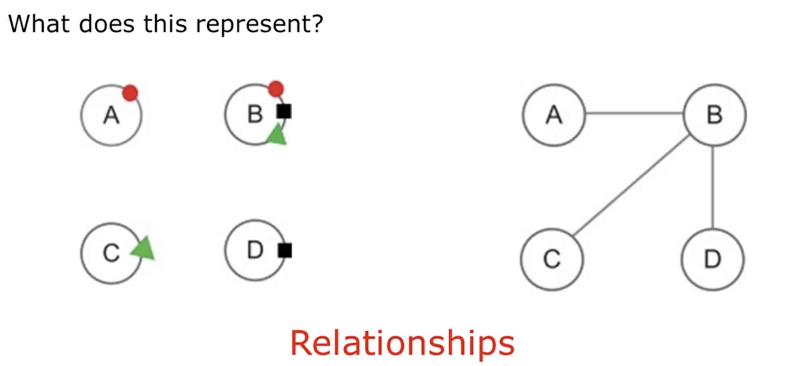

> Data visualization is an umbrella term to cover all types of visual representation that support the exploration, examination, and communication of data.
> <p style="text-align:right">(Few 2009)</p>

**Data Visualization (DV) types**
- *Exploratory*
  - early stages of research
  - interactive
  - quick and dirty
  - helps discover trends and patterns
- *Explanatory*
  - later stages of research
  - polished, publication/presentation ready
  - conveys a clear message
  - makes a point or answers a question

Uses for DV: analysis, communication, monitoring, planning

> "The greatest value of a picture is when it forces us to notice what we never expected to see"
> <p style="text-align:right">(Tukey 1977)</p>

### Matplotlib
Matplotlib is a library for creating static, animated and interactive visualizations. It's highly extensible with packages such as seaborn, HoloViews, ggplot, Cartopy, etc.

Different ways of working with Matplotlib:
1. pyplot API - quick and simple, flat namespace, automatic state management, less fine-grained control
2. object-oriented API - modular structure, more complex, explicit state management, full control
3. `pandas.plot` API - data-oriented API, quick and simple, returns Matplotlib objects, full customization via OOP API

## Week 7 - Statistics
### Descriptive statistics
- also called *summary statistics*
- provide quantitative description or summaries of data
- helps us understand data
- helps us decide *what* data to present and how
- are fundamental quantities visualized in many plot types

**Population:** the collection of all individuals or items under consideration.

**Sample:** the part of population from which information is obtained.

Larger samples more accurately represent the characteristics of their corresponding populations.

**Descriptive statistics** describe, show, or summarize data in a meaningful way such that patterns might emerge from the data.

**Inferential statistics** use techniques that allow us to
1. use samples to make generalizations about populations
2. use data about the past to predict the future

**Univariate analysis** - understand the shape, size and range of quantitative values (a single variable)

**Multivariate analysis** - explore the possible relationships between different combinations of variables and variable types (many variables)

### Central tendency
Central tendency describes the tendency of data points from a data set to cluster around specific values. Most common measures are:
- *mode* 
  - most frequent score in a data set
  - can be numeric or nominal (string)
- *median* - middle score for a set of data arranged in order of magnitude
- *mean ('average')* - `<sum of data points> / <size of data set>`

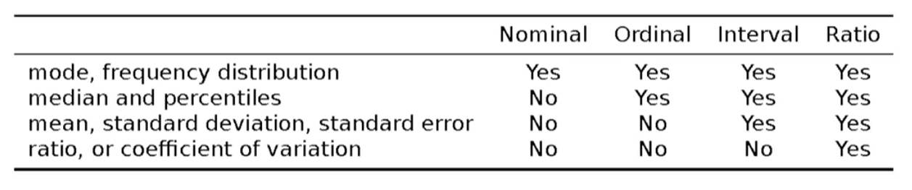

*bimodal*, *trimodal*, etc. - a dataset with more than one value that's the mode.

#### Mode
```py
# specify that "transport" column is of categorical type
df = pd.read_csv('./data/transport-data.csv', 
                 index_col=0,
                 dtype={'transport': 'category'})

# count the number of each type of transport 
# (frequency distribution)
counts = df['transport'].value_counts()
# get the mode
mode = df['transport'].mode()[0]
```

#### Median and mean
Order the data asc. or desc. and pick the value in the middle if there's an odd number of items. If the number is even, calculate the average between the 2 items in the middle.

```py
df = pd.DataFrame({
  'age': [65, 55, 89, 56, 35, 14, 56, 55, 87, 45]
})

# calculate median
df['age'].median()
# calculate mean
df['age'].mean()
```

Marginal and extreme data points affect the mean value, the median is not so susceptible to outliers.

### Quartiles and Percentiles
Quartiles are values which split the dataset into 4 equal parts. In a rank-ordered data set:
- **Q1** is the median of the first half
  - called lower quartile or *25th percentile*
  - splits the data into 25% - 75%
- **Q2** is the median of the entire data set
  - *50th percentile*
  - splits the data into 50% - 50%
- **Q3** is the median of the second half
  - called upper quartile or *75th percentile*
  - splits the data into 75% - 25%

There are 2 ways of computing Q1 or Q3
- by including Q2 when computing Q1 and Q3
  - yes for *odd* number of items
  - default in pandas and R
  - 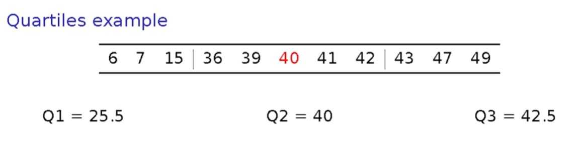
- by not including Q2

```py
s = pd.Series([6, 7, 15, 36, 39, 40, 41, 42, 43, 47, 49],
              name='data')

s.median()
s.quartile([0.25, 0.5, 0.75])

# another way to see statistical information about the data
s.describe()
```

**Interquartile range (IQR):** difference between the upper and lower quartiles. The range of the *middle 50%* of the data. It is not sensible to outliers. 

$IQR = Q3 - Q1$

<figure>
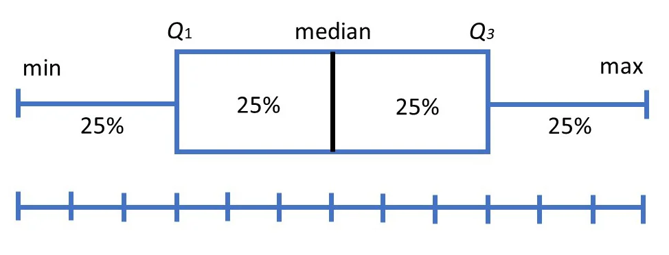
<figcaption>Quartile information can be represented by a box plot.</figcaption>
</figure>

```py
ax = df['height'].plot.box()
ax.set_title('Distribution fo heights')
ax.set_ylabel('cm')
plt.show()
```

A **Tukey plot** is similar to a box plot but the whiskers represent most extreme *non-outlier* data. Dots represent outliers. Whiskers extend to the max/min values within 1.5 IQR from Q3/Q1.

<figure>
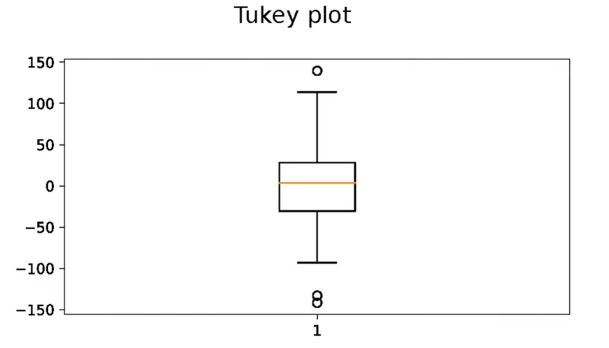
<figcaption>Tukey plot with 3 outliers</figcaption>
</figure>

### Standard deviation
Standard deviation is one of the measures of spread. It measures the average distance from the data points to the mean value.
- high values - data is more spread out
- low values - data is closer to the mean
- written as $\sigma$ (lowercase Sigma)

#### Standard deviation of a population
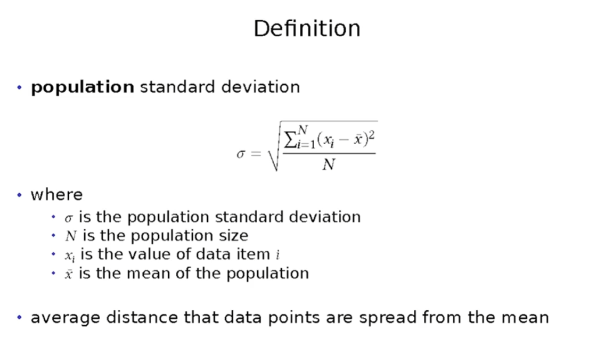

Standard deviation is the square root of the variance, which is another measure of spread. Unlike variance, standard deviation is measured in the *same units* as the data points.

#### Standard deviation of a sample
If we only have data about a **sample** from a population then the previous formula will give a biased result. We can account for this by applying Bessel's correction: changing $N$ to $N-1$. 

There will still be a bias for small sample sizes but this bias will decrease as the sample size increases.

#### Normal distribution
<figure>
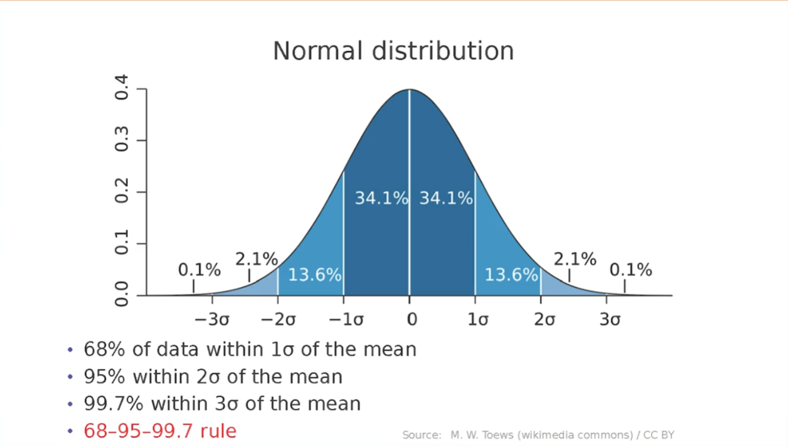
<figcaption>Bell shaped graph of normal distribution</figcaption>
<figure>

Normal distribution occurs frequently in nature. Standard deviation can be used to show how normally distributed data is dispersed around its mean value.

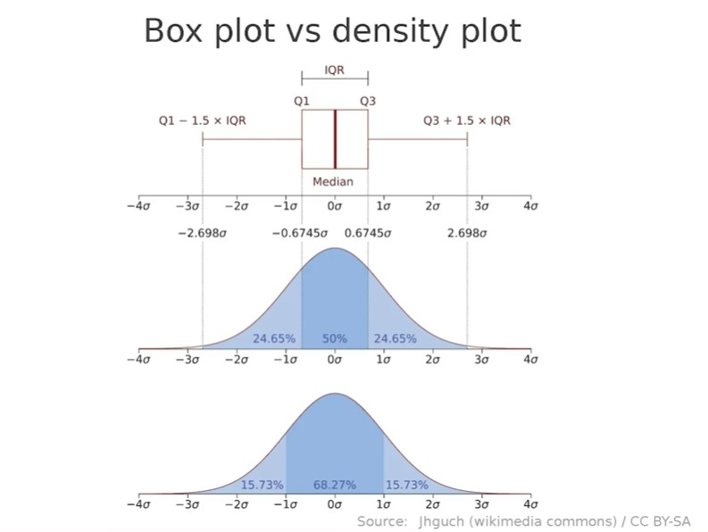

#### z-score normalization
z-scores represent data values in terms of standard deviations from the mean. They're useful for comparing variables measured on different scales. The z-score values are dimensionless.

$$ z = \frac{x_i - \bar{x}}{s} $$
Where $x_i$ is the value of data item $i$, $\bar{x}$ is the mean of the population and $s$ is the standard deviation.

#### Quantile plot
The quantile plot is used to visualize the distribution of numerical data using a scatter plot.

<figure>
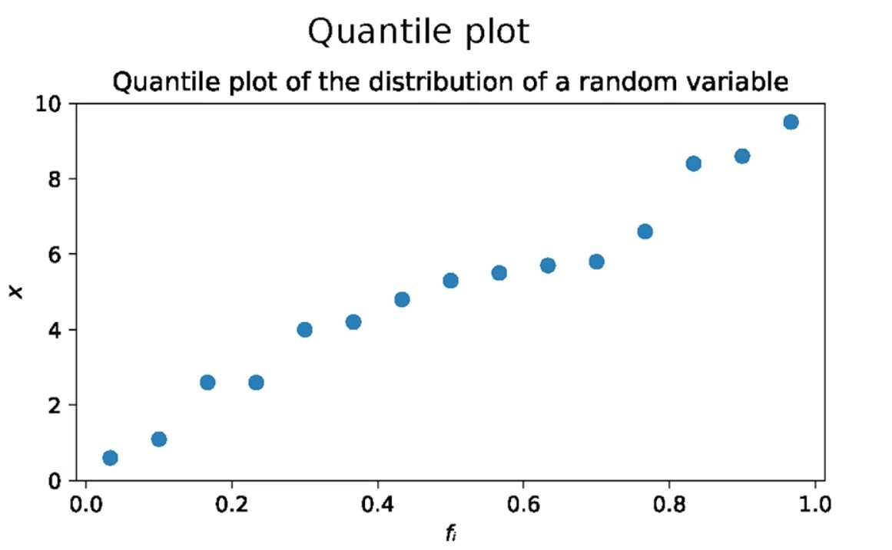
<figcaption>
y - value of data point, x - normalised scale
</figcaption>
</figure>

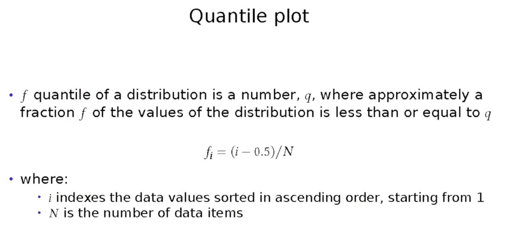

#### Shape
Measures of shape describe the distribution of data:
- **skewness**
  - quantifies the asymmetry of the distribution
  - it measures if the graph leans to the left (positive) or to the right (negative)
- **kurtosis**
  - quantifies the "tailedness"
  - the shape of a distribution's tails in relation to its overall shape
  - it measures the behaviour of the distribution at its extremes (tails)

## Week 8 - Variables
- Univariate analysis (one variable)
  - descriptive statistics of a single variable 
- Multivariate analysis
  - descriptive statistics of a single variable *in relation to* categorical variables
  - relationships between numerical variables, *correlation*

### Nominal variables
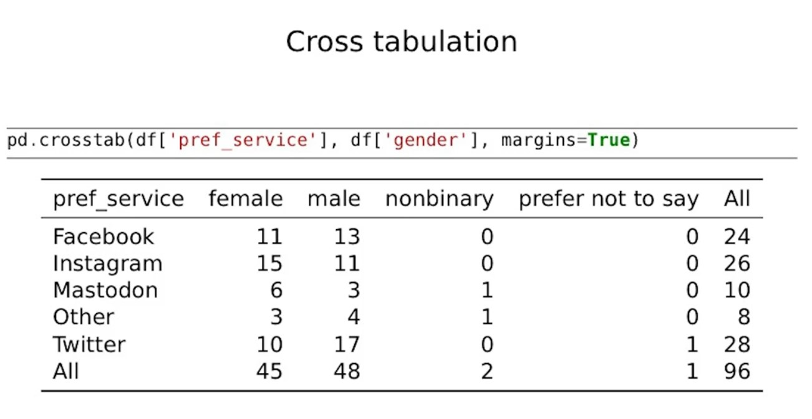

```py
# given a DataFrame with `id`, `gender`, `pref_service` columns
# we can cross tabulate the data to see how the values relate to one another
table = pd.crosstab(df['pref_service'], df['gender'])

# we can then plot the table
ax = table.plot.barh()
ax.invert_yaxis()
plt.show()
```

### Ordinal variables

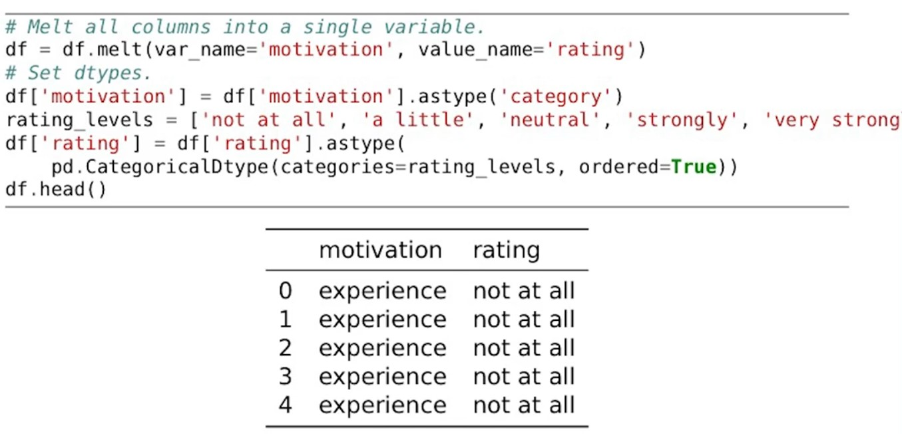

```py
table = pd.crosstab(df['motivation'], df['rating'], normalize='index') * 100

table.sort_values(by='very strongly', inplace=True)
table.round(2)

ax = table.plot.barh(stacked=True)
plt.show()
```

### Numerical vs categorical data
Cat plot: one categorical, one numerical variable:

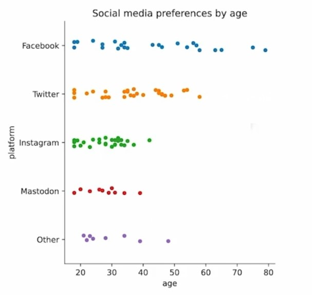

The same data could be represented by a box plot.

Cat plot with 2 categorical variables vs one numeric:

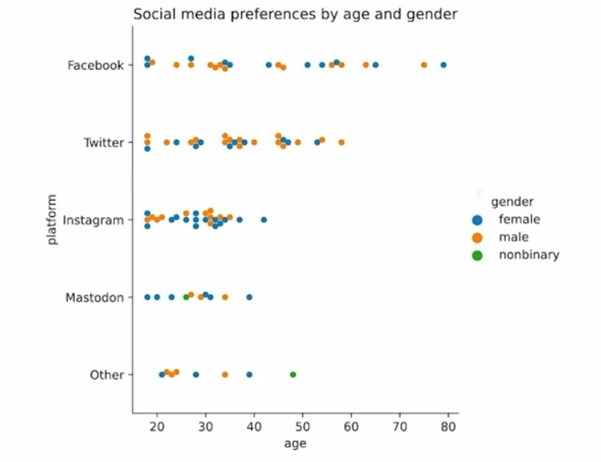

### Processing numerical data
> Correlation is not causation.

**Correlation coefficient**
- a measure how two variables change in a similar way
- relationship is generally assumed to be linear
- quantified on a scale $-1 < r < 1$

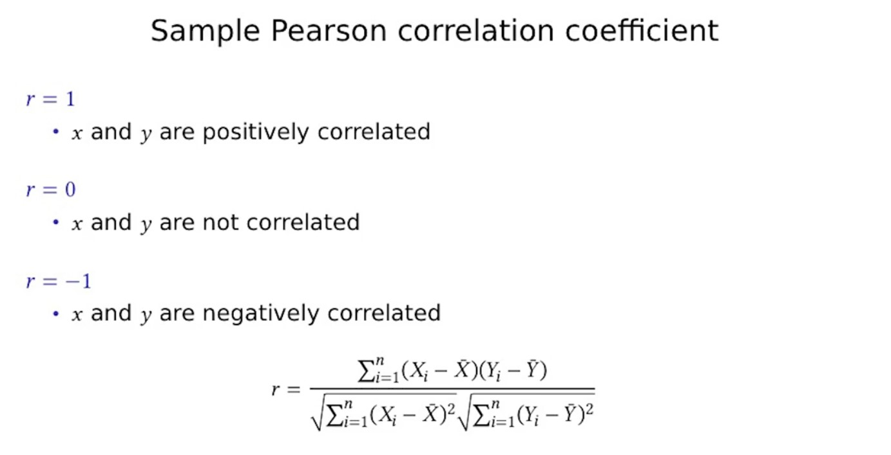

`r = covariance / product of std of both variables`

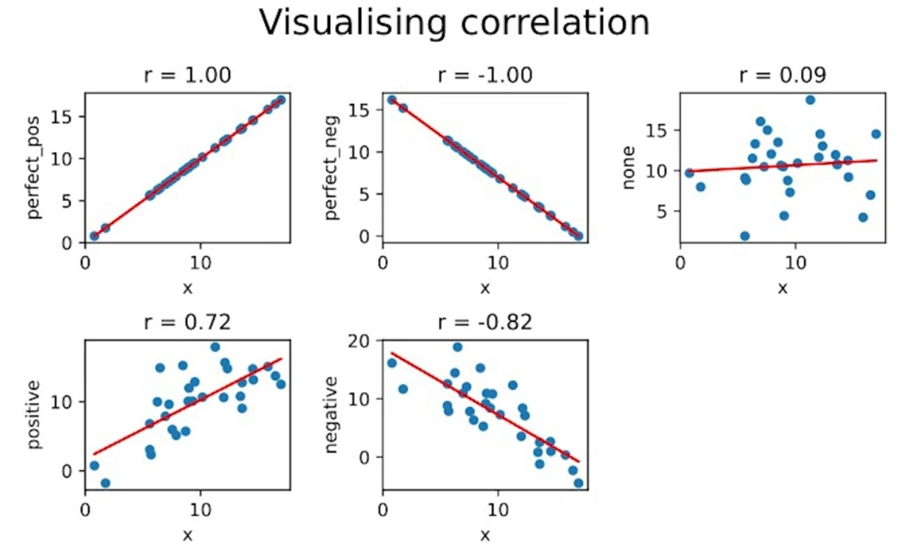

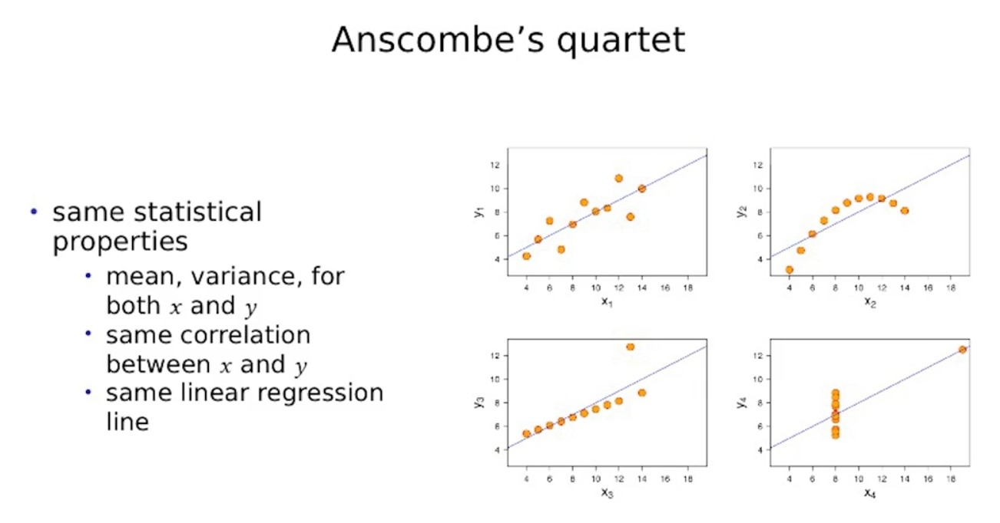

## Week 9 - Machine learning
**Artificial Intelligence:** Mimicking intelligence or behavioural patterns of humans or any other living entity.

**Machine Learning:** A technique by which a computer can "learn" from data, without using a complex set of different rules. This approach is mainly based on training a model from datasets.

**Deep Learning:** A technique to perform machine learning inspired by the brain's own network of neurons.

Machine learning is a subset of AI focused on building **models** from **data**. Parameters are 'learnt' from samples. ML is used to predict, explore and understand.

Machine learning approaches:
- Supervised learning - from data to labels
  - Classification
  - Regression
- Unsupervised learning - finding patterns in data
  - Clustering
  - Dimensionality reduction

### Classification
The goal is to predict *discrete* labels by finding a boundary that *separates* the *classes*.

### Regression
The goal is to predict *continuous* labels by modelling the *relationship* between *variables*. The parameters are leaned from examples.

### Clustering
The goal is to infer *labels* on *unlabelled* data by using intrinsic *structure* to find *groups*.

### Dimensionality reduction
The goal is to infer the *structure* of *unlabelled* data by transforming data from a high-dimensional space to a low-dimensional space. At the same time, the *meaningful properties* of data must be preserved.

### scikit-learn
Data as tables: two-dimensional grid
- Rows are instances (samples)
- Columns are attributes (features)

The data is divided into: the features matrix (ND) and the target array (1D).

Overall process:
- Choose a *class* of model (ex: linear regressor)
- Set model *hyperparameters* - initialize/configure the model
- *Configure* your data (X and Y) - separate features matrix (X) from the target array (Y)
- *Fit* the model to your data - train the model
- *Apply* model to new (unseen data) - generate predictions on unseen/new data

### Linear regression
Predicting continuous labels refers to the task of predicting a value that can take any number within a range. This type of problem is known as a regression problem.

```py
# set up the data
import matplotlib.pyplot as plt
import numpy as np

# random generator with a seed of 42
rng = np.random.RandomState(42)
# generate 50 random values [0,1)
x = 10 * rng.rand(50)
# generate y based on x plus 50 values with normal distribution
y = 2 * x - 1 + rng.randn(50)
# show graph x in relation to y
plt.scatter(x, y)
```

```py
# create a model
from sklearn.linear_model import LinearRegression
# fit_intercept = the line of best fit is centred
# the y axis instead of starting from the origin
model = LinearRegression(fit_intercept=True)

# create the features matrix
# (converts columns to rows)
X = x[:, np.newaxis]

model.fit(X, y)
# slope of the line
print("Coef:", model.coef_)
# starting point
print("Intercept:", model.intercept_)

# create some new unseen data
xfit = np.linspace(-1, 11)
Xfit = xfit[:, np.newaxis]
# predict target array
yfit = model.predict(Xfit)

# visualize the raw data and the model fit
plt.scatter(x, y)
plt.plot(xfit, yfit)
plt.show()
```

### Classification
**Naive Bayes** is a simple classifier that requires minimal configuration and is fast but doesn't learn which features are important to differentiate between classes.

```py
from sklearn.model_selection import train_test_split

# split data into a training set (75%) and testing set (25%)
Xtrain, Xtest, ytrain, ytest = train_test_split(X_iris, y_iris, random_state=1)

# create and train a model
from sklearn.naive_bayes import GaussianNB

model = GaussianNB()
model.fit(Xtrain, ytrain)
preds = model.predict(Xtest)

from sklearn.metrics import accuracy_score
accuracy_score(ytest, preds)
```

**Dimensionality reduction** is the transformation of data from a high-dimensional space into a low-dimensional space while retaining some meaningful properties of the original data. This is a type of unsupervised learning.

**Principal Components Analysis (PCA)** is a dimensionality reduction algorithm.

```py
from sklearn.decomposition import PCA
model = PCA(n_components=2)
model.fit(X_iris)
# transform the data to 2 dimensions
X_2D = model.transform(X_iris) 
```

**Clustering** is a way to find structure in data (e.g. meaningful groups) without knowing the labels. Various techniques: kMeans, Gaussian Mixture Models.

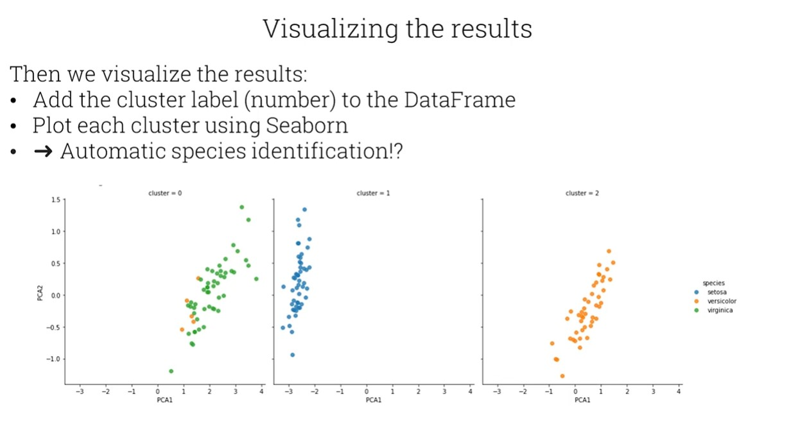

```py
from sklearn.mixture import GaussianMixture
# Model will try to place each sample in one of 3 clusters
model = GaussianMixture(n_components=3, covariance_type='full')
model.fit(X_iris)
y_gmm = model.predict(X_iris)
iris['cluster'] = y_gmm # append prediction as col. in orig. dataset
```

### Validation 
Models should be validated using unseen data. 

```py
from sklearn.metrics import accuracy_score

accuracy_score(y, y_preds)
```

> A k-Nearest Neighbour classifier will attempt to memorize the points in your training data, so testing on the same data could give 100% accuracy.

A **holdout set** is a part of the dataset that's kept for testing. This data won't be used to train the model. The downside is that it "wastes" part of the data.

**Cross validation** is a way of testing the model's ability to predict unseen data. It performs cycles of splitting the data (folds) in different ways and calculating accuracy. Typically, more folds mean more robust estimates. The end result is the mean accuracy.

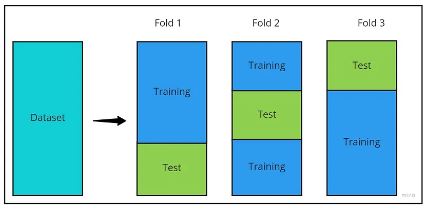

```py
from sklearn.model_selection import cross_val_score

# does 5 cycles (folds)
cross_val_score(model, X, y, cv=5)
```

An extreme example is to perform a number of cycles equal to the number of datapoints, each time leaving out said datapoint.
```py
from sklearn.model_selection import LeaveOneOut
scores = cross_val_score(model, X, y, cv=LeaveOneOut())
```

## Week 10
If the model is underperforming we can try any of the following options but it's not always obvious which approach is better to adopt.
- A more/less complex model
- More training data
- More/different features

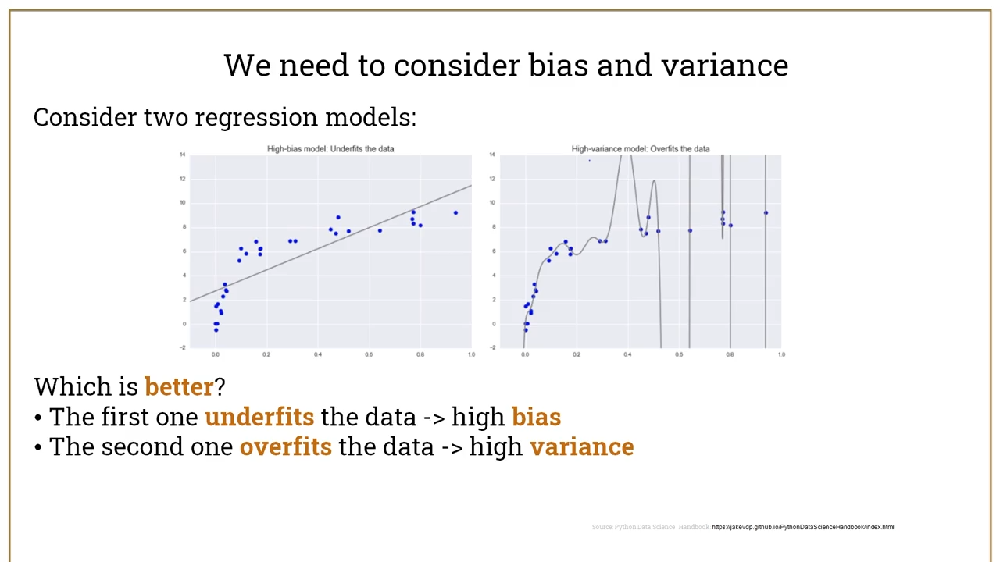
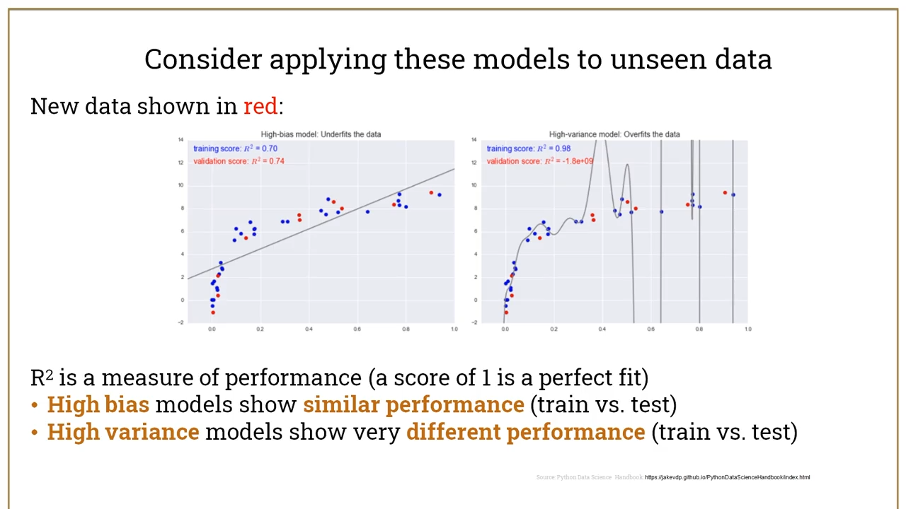

The optimum way may be somewhere between high bias and high variance. One way to find the optimal model is by using a **validation curve** which can describe how the validation score increases/decreases in relation to model complexity.

Optimal model complexity also depends on the size of the training data. A model will tend to overfit a small data set and underfit a large data set.

We can use *Grid Search* in order to find the optimal of 3 dimensions: model complexity, size of data, performance.

### Feature engineering
Feature engineering is the process of selecting, manipulating and transforming raw data into features that can be used in supervised learning.

*Categorical data* can be transformed into numerical data by using a `DictVectorizer` which transforms it through one-hot encoding (binary flag matrix). We could also label each category with a number but this would signify that one is greater/lesser than another (ordinal).

*Textual data* can be encoded into a word frequency matrix (one row per sample) by using a `CountVectorizer`. The downside is that common words (the, and, a, etc) will always have higher frequencies which could be implied as having higher importance. To get around this we can use `TfidfVectorizer` (term-frequency times inverse document-frequency) which scales down the impact of frequent words.

Sometimes features can interact in unexpected ways. We may need to consider *combined* features or mathematically *derived* features.

*Missing data* should first be identified and marked as missing (`None`, `NaN`) then either dropped (`dropna()`) or replaced (`fillna()`).

```py
from sklean.impute import SimpleImputer
# will replace missing values with the most frequent value
im = SimpleImputer(strategy='most_frequent')
X2 = imp.fit_transform(X)
```

The different feature transformations can be chained together in a pipeline:

```py
from sklearn.pipeline import make_pipeline

model = make_pipeline(SimpleImputer(strategy='mean'),
                      PolynomialFeatures(degree=3),
                      LinearRegression())
```

## Week 11
### Text processing
There are many problems associated with processing text data: synonymy, polysemy, word order, language is generative, many different ways to express an idea (paraphrase, metaphor, idiom, etc), language is changing, ill-formed input, co-ordination (negation), multi-linguality, sarcasm, irony, slang, jargon.

Language is ambiguous. To determine structure we must resolve ambiguity which occurs at many levels (word, sentence, etc).

At the word level:
- Lexical analysis (tokenisation)
- Stop word removal
- Stemming - resolving similar words to a common stem, the stem might not be a word.
  - fishing, fished, fish, fisher &rarr; fish
  - argue, argues, argues, arguing &rarr; argu
- Lemmatization - linguistically principled analysis that breaks down words into root words or lemmas.
- Morphology (prefixes, suffixes, etc)

At the sentence level:
- Syntax - tagging words as parts of speech: noun, pronoun, adjective, determiner, verb, adverb, preposition, conjunction and interjection
 - Ambiguity problem for larger sentences
- Parsing (grammar) - parse trees
- Sentence boundary detection - punctuation is not always a good indicator

**NLTK - Natural Language Toolkit** - an open source platform for working with text data. It provides access to many lexical resources and libraries for NLP tasks.

```py
import nltk
# punkt is a pre-trained sentence tokenizer for English
nltk.download('punkt')
text = "Mary had a little lamb..."

# segmentation - split text into sentences
sents = nltk.sent_tokenize(text)

# tokenisation - split 1st sentence into words
words = nltk.word_tokenize(sents[0])
```

#### Text normalization
```py
import nltk
from nltk.stem import PorterStemmer, WordNetLemmatizer
from nltk import wordnet
nltk.download('wordnet') # lexical database

stemmer = PorterStemmer()
wnl = WordNetLemmatizer()

stemmer.stem(word)
# pos param can be used to parse the words as a specific part of speech (ex: v for verb)
wnl.lemmatize(word)
```

**Word morphology:**
- *Inflectional morphology* - variations of a word in the same grammatical category (ex: run, running, runs)
- *Derivational morphology* - variations in different categories (ex: democratic, democracy)

## Week 12
**Regular expressions** are a formal language for defining text strings used for pattern matching.

### Disjunction
A *disjunction* specifies multiple alternatives. Any alternative matching the input causes the entire disjunction to be matched.

```py
import re

# match character sequence `the`
pattern = r"the" # string literal
# substitute `pattern` with "X" in the text
print(re.sub(pattern, "X", text))

# Disjunction
# match `The` and `the`
pattern = r"[T|t]he"
# match digits
pattern = r"[0-9]" # character range
# match uppercase
pattern = r"[A-Z]" # character range
# match any of these words
pattern = r"of|the|we"
```

### Negation
```py
# match anything that's NOT a digit
pattern = r"[^0-9]"
# match anything that's NOT lowercase
pattern = r"[^a-z]"
```

**Note:** `[^a-z]` negates everything that comes after `^` BUT `[a^z]` will match the characters `a`, `^`, `z`.

### Optionality

```py
# . will match any character (wild card)
pattern = r"beg.n" # begin, began, ...
# ? means previous character is optional
pattern = r"colou?r" # color and colour

# * means 0 or more of the previous char (Kleene star)
# this will match "w" and all characters after (greedy)
pattern = r"w.*" # `w`, `we`, `will you`, ...

# make the match non-greedy, will stop at spaces
patten = r"w.*? " # `w `, `we `, `wall `
# + means 1 or more of prev char (Kleene plus)
pattern = r"foo+" # `foo`, `fooo`, ... 
```

### Aliases

- `\w` - match word, equivalent to `[a-zA-Z0-9_]`
- `\d` - match digit
- `\s` - match whitespace
- `\W` - match non-word
- `\D` - match non-digit
- `\S` - match non-whitespace

### Anchors

```py
# match a word at the start of a string
pattern = r"^\w+"

# will delete 1st word on 1st line
re.sub(pattern, "", text)
# will delete 1st word on all lines
re.sub(pattern, "", text, flags=re.MULTILINE)

# match a word at the end of a string
pattern = r"\w+$"
```

### Stop words
- High-frequency words, little lexical content (eg. and, the, of)
- When used for ML tasks can add noise (not always)
- Usually are filtered out beforehand
- They're language specific, there's no universal list even for a single language

```py
import nltk
nltk.download('stopwords')

print(stopwords.words('english'))
# `set` is faster for searching
stop_words = set(stopwords.words('english')) 

words = nltk.word_tokenize(text)
# show words in a text excluding stop words
print([w for w in words if not w in stop_words])
```

## Week 13 - Natural Language Processing
The goal of **Natural Language Processing (NLP)** is to enable computers to understand, interpret and generate human language in a way that's meaningful and useful.

NLP applications:
- Text categorization: search engine results, news articles tagging, spam detection
- Machine translation: Google translate
- Text summarisation: search engine results
- Dialog systems: chatbots, smart assistants
- Sentiment analysis
  - Subjectivity/objectivity identification (fact vs opinion)
  - Polarity identification
  - Emotional state identification
  - Differentiate between specific features or aspects of entities
- Text mining: discover or infer new knowledge from unstructured text resources
- Question answering: an extension of web search
- Natural language generation
- Speech recognition and synthesis

```py
import nltk
# nltk.download() # nltk downloader
# imports example texts
from nltk.book import *

sents() # show sentences from each text sample

len(set(text)) / len(text) # lexical diversity
```

Frequency distribution:
```py
f = FreqDist(text1)
print(f)
f.most_common(10) # top 10 most common words
f.plot(50, cumulative=False)

# distribution of lengths of terms
f = FreqDist([len(w) for w in text1])
```

Collocations - words that sick together, ex: red wine
```py
text1.collocations()
```

### Conditional frequency distributions
The Brown corpus (1961) contains text from 500 sources, categorized by genre (ex: news, editorial, hobbies, fiction, etc).

```py
import nltk
from nltk.corpus import brown
nltk.download('brown')

print(brown.categories())
print(brown.words(categories='lore'))

cfd = nltk.ConditionalFreqDist((genre, word)
  for genre in brown.categories() # generator comprehension
  for word in brown.words(categories=genre)
)

print(cfd['news'])
```

Bigrams are word pairs in a text.

```py
nltk.bigrams(text)
```

## Week 14
Types of tasks that NLP is used for:
- Classification tasks (eg. spam detection)
- Sequence tasks (eg. text generation)
- Meaning tasks
  - Information retrieval
  - Question answering
  - Topic modelling

Dictionaries aren't the best way to represent the meaning of words or identify semantic similarity, instead we use graphs of words (lexical databases).

**WordNet** is a lexical database in which nodes are *synsets* (sets of synonyms) which correspond to words or *abstract concepts*. It has a *polyhierarchical* structure, a node can have many parents.

Using WordNet we can programmatically:
- Identify *parent terms (hypernyms)* and *child terms(hyponyms)*
- Measure semantic similarity

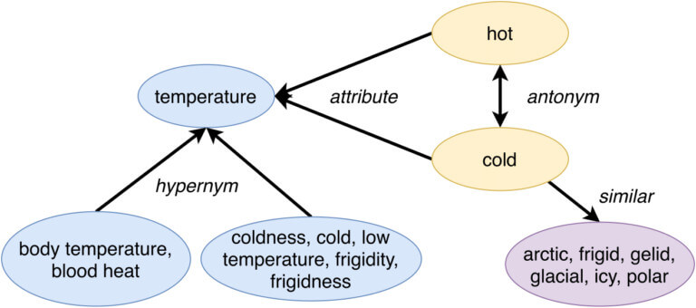

**Lemmas** are the members of a synset. They represent a specific *sense* of a specific word.

### Word embeddings
Lexical databases such as WordNet are manually curated, however it's also possible to define words in an automated manner based on the context they appear in. If two words have almost identical environments then they probably have similar meanings.

In order to represent the environments we can use:
- one-hot encodings (long and sparse)
- dense vectors

Instead of counting terms, we train a classifier on a prediction task: "does A occur near B?". The learned classifier weights become our embeddings.

`gensim` is an open-source library for unsupervised topic modelling and NLP.

```py
import gensim
from nltk.corpus import brown

# train the model
model = gensim.models.Word2Vec(brown.sents())
# save a copy, for later re-use
model.save('brown.embedding')
# we can load models on demand
brown_model = gensim.models.Word2Vec.load('brown.embedding')

# how many words?
len(brown_model.wv.index_to_key)
# how many dimensions
len(brown_model.wv['university'])
# calculate similarity between terms
brown_model.wv.similarity('university', 'school')
```

We can use embeddings to perform verbal reasoning, eg. "A is to B as C is to...".

Example:
"Man is to kind as woman is to ..."
vec("king") - vec("man") + vec("woman") = ~vec("queen")

```py
brown_model.wv.most_similar(positive=['woman', 'king'], negative=['man'], topn=5)

# find the odd one out
brown_model.wv.doesnt_match('breakfast cereal dinner lunch'.split())
```

### Information extraction
Finding structure in unstructured data, identifying entities and relationships. This achieved by implementing a pipeline to:
1. Split raw text into sentences - sentence segmentation
1. Split sentences into tokens - tokenization
1. Tag each token with POS tags - POS tagging
1. Identify interesting entities - entity recognition
1. Find relations between entities - relation extraction

*Note:* Entities can be people, places, organisations, etc. or temporal/numerical expressions.

```py
import nltk

sent = """
Mexico has been trying to stage a recovery since the beginning of this year and it's always been getting ahead of itself in terms of fundamentals," said Matthew Hickman of Lehman Brothers in New York.
"""
# split sentence into tokens
tok_sent = nltk.word_tokenize(sent)
# download a POS tagger
nltk.download('averaged_perceptron_tagger')
# tag the parts of speech
nltk.pos_tag(tok_sent)

# there are multiple tagsets for tagging POS
#nltk.download('tagsets')
nltk.help.upenn_tagset()


# download Named Entity Chunker
nltk.download('maxent_ne_chunker')
nltk.download('words')

nerResults = [nltk.ne_chunk(pts) for pts in pp_sent]
nerResults[0].pprint()
nerResults[0].draw()
```

## Week 15 - Graphs and Networks
### Graphs
**NetworkX** is a library for creating and manipulating graphs in Python.

```py
import networkx as nx
# create an empty graph
MyGraph = nx.Graph()
# create nodes and link them with an edge
MyGraph.add_node('A')
MyGraph.add_node('B')
MyGraph.add_edge('A', 'B')
# the result is an undirected graph with 2 connected nodes

# show the graph
nx.draw_networkx(MyGraph)
plt.show()
```

**Types of graphs:**
- *Undirected graph* (`nx.Graph()`)
  - all connections are bi-directional
  - edges represent a two-way relation 
  - they can be traversed in both directions
- *Directed graph* (`nx.DiGraph()`)
  - all edges have directions, usually represented with arrows
  - edges can be represented as ordered pairs $(A,B)$
  - traversing the edges is restricted to one direction
- *Complete graph*
  - every possible pair of nodes is connected with an unique edge
  - for N nodes it has $\frac{N*(N-1)}{2}$ edges
- *Weighted graph*
  - a value is assigned to every edge (distance, time cost, etc)
- *Trees*
  - one node is the root node and every edge points towards it (in-tree) or away from it (out-tree)
- *Directed Acyclic Graphs (DAG)*
  - a directed graph without cycles
  - all trees are DAGs, but not all DAGs are trees 

Setting attributes for nodes or edges:
```py
# on creation
MyGraph.add_node('A', A1=1)

# later on
# will set values for the attribute named `A1`
nx.set_node_attributes(
  MyGraph, 
  values={'A': 100, 'B': 35, 'C': 2, 'D': 4},
  name='A1'
)

# retrieving attributes
NodeDictionary = nx.get_node_attributes(MyGraph, 'A1')
```

**Isomorphic graphs** are different layouts of the same graph. They same edges and nodes but presented in a different visual manner.

**Planar graph** is a graph that can be embedded in the plane. It can be drawn in such a way that no edges cross each other (`nx.planar_layout(MyGraph)`).

In NetworkX different layout types can be set: `spectral`, `spring`, `shell`.

```py
pos = nx.spring_layout(MyGraph)
nx.draw_networkx(MyGraph, pos)
```

**Clique** is a subgraph where every two nodes are connected with a distinct edge.

### Building and processing networks
Graphs (and networks) are non-linear data structures (unlike arrays and lists) and traversing them is not a trivial task. Most popular traversal algorithms are:
- *Breadth-First Search (BFS)* - visit all nodes connected to the root node, then select one of the already visited notes and visit all nodes connected to it, repeat until all nodes are visited.
- *Depth-First Search (DFS)* - select one node connected to the root node and visit all nodes in that direction until the last node at the lowest level is reached. Select the next node connected to the root node an repeat the steps.

*Note:* Both algorithms repeat their steps until all nodes are visited. To avoid visiting a node more than once (cyclic graphs), visited nodes are marked.

```py
# Return an oriented tree of a BFS/DFS search starting at A (root node)
BFS = nx.bfs_tree(MyGraph, 'A')
DFS = nx.dfs_tree(MyGraph, 'A')
```

```py
# calculate the shortest path based on the number of intermediate nodes
nx.shortest_path(MyGraph, source=StartNode, target=EndNode)
```

## Week 16 - Visualizing multidimensional data
Multidimensional data combine data points from a wide range of data types in a single entity, called *dataset*.

The dimensions of the datasets are represented by the number of *columns* and each column represents one characteristic of an object.

**Heat maps** are graphical representations of multidimensional data that use a two-dimensional plane for visualisation. They're usually used to present summarised information where data is presented in a colour-coded manner.

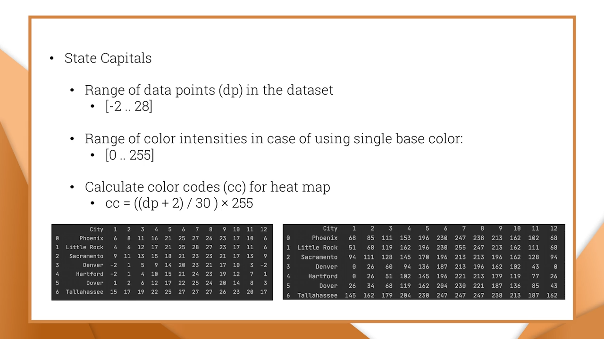

**Parallel coordinates** plots are a common method of visualizing high-dimensional datasets.

A **polyline** is a line that represents the values of one point across multiple dimensions.

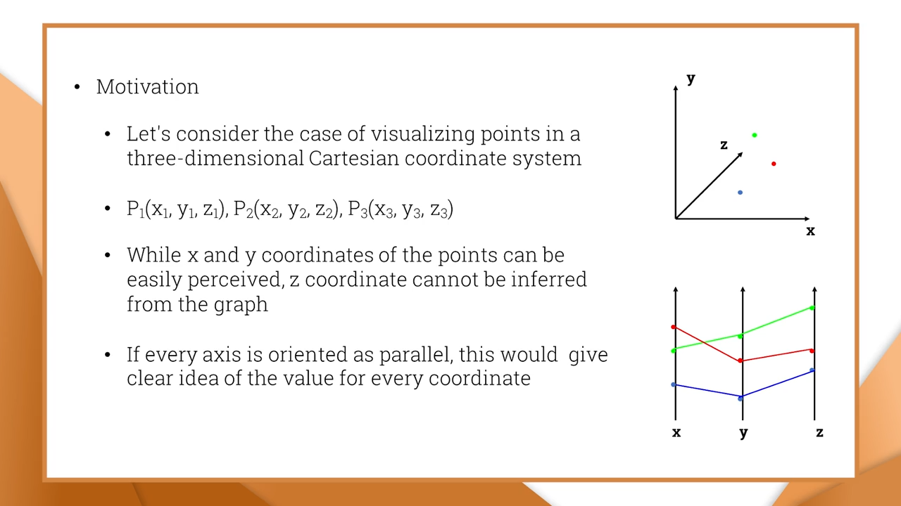

## Week 17 - Machine Learning Cont'd
In many instances people ignore the probabilities when making judgements, usually basing them on stereotypical ideas. A rational judgement would consider both *evidence* and *prior probability*.

**Bayes Theorem**

$$ P(H|E) = \frac{P(H)P(E|H)}{P(E)}$$

- $P(H|E)$ - *posterior probability* - the probability of a hypothesis ($H$) given the evidence ($E$) AKA we're restricting our view to the possibilities where the evidence holds
- $P(E|H)$ - *likelihood* - the probability of the evidence given that the hypothesis is true
- $P(H)$ - *prior probability* of the hypothesis - the probability that the hypothesis holds before considering the evidence
- $P(E)$ - *marginal likelihood* or *model evidence* - the overall probability of the evidence under all possible hypotheses

**Note:** The marginal likelihood is composed of all cases where the evidence holds. <br/>
$P(E) = P(H) P(E|H) + P(\lnot H) P(E|\lnot H)$ - 

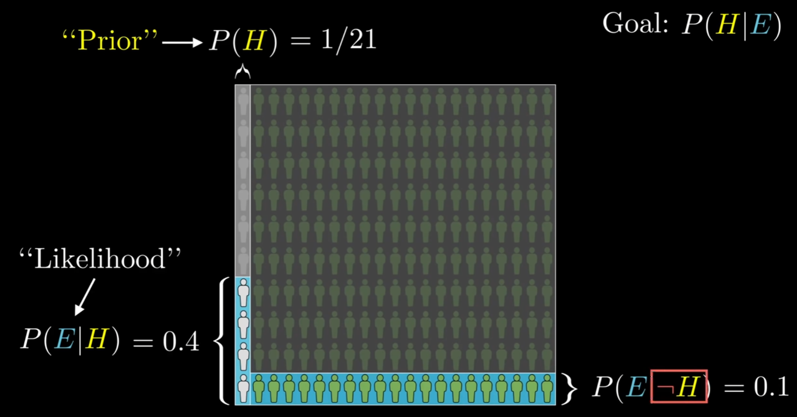
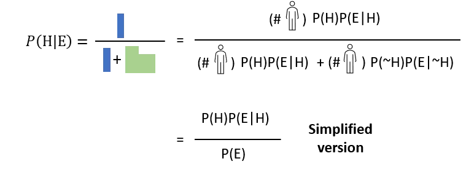

When presented with new evidence, that evidence should be used to *update* your prior beliefs, not *determine* them (treated in a vacuum).

More detailed explanation available [here](https://youtu.be/HZGCoVF3YvM?si=zpxmEBEei5QwyxzT).

### Bayesian Classification
**Naive Bayes Classification** is a fast and simple classification algorithm that can be used on high dimensional datasets and has few tunable parameters. It is a good starting point for classification tasks.

For classification, we can think in terms of *features (input)* and *labels (output, $L$)*:

$$P(L|\text{features})=\frac{P(L)P(\text{features}|L)}{P(\text{features})}$$

To choose between labels, we can compare their *posterior probabilities*:

$$ \frac{P(L_1|\text{features})}{P(L_2|\text{features})} = \frac{P(L_1)P(\text{features}|L_1)}{P(L_2)P(\text{features}|L_2)}$$

Given the features $X=(X_1, X_2, ..., X_n)$  we need to find the label $Y$. This means finding the value of $y$ for which $P(Y=y|X=(x_1,x_2,...,x_n))$ is maximum.

Classification steps:
- Calculate $P(features | L_i)$ for each label
- Assume a *generative* model where each label generates the features???
- Apply some simplifying ("naive") assumptions
  - *Independence* - all features are independent from one-another
  - *Equality* - all features contribute equally to the outcome

A **generative** model doesn't just predict an outcome based on input features; it learns the entire data distribution and can create new data points that fit within that learned distribution.

### Multinomial Naive Bayes (MNB)
In Multinomial Naive Bayes classification we assume that the features are generated from a *multinomial distribution*. It deals with the probability of observing *counts* across various *categories* and the modelling is done by finding a best-fit multinomial distribution.

This approach is useful for text classification where the categories are *word types*. The data needs to be converted from strings to numbers (feature engineering: `TfidfVectorizer()`).

A **confusion matrix** shows the relation (overlap) between true labels and predicted labels.

### Simple linear regression
Simple linear regression is a good starting point for regression tasks. It can be fit very quickly and the results are very interpretable.

Linear regression is commonly used to fit a straight line to 2D data, eg. $y=ax+b$. It can also fit a hyperplane in multidimensional space , eg. $y=a_0+a_1x_1+a_2x_2+...+a_nx_n$.

**Note:** The linear model represents:
- a line in 2D
- a plane in 3D
- a hyperplane 4D+

```py
model.fit(x, y)

print("Model slope: ", mode.coef_[0]) # equivalent to `a`
print("Model intercept: ", model.intercept_) # equivalent to `b`
```

### Basis function regression
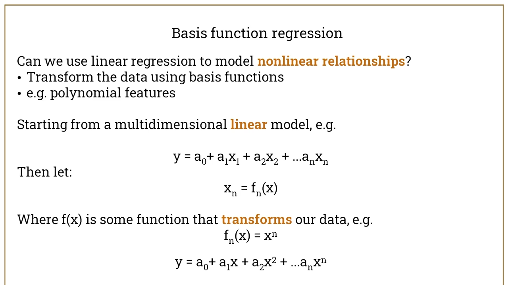
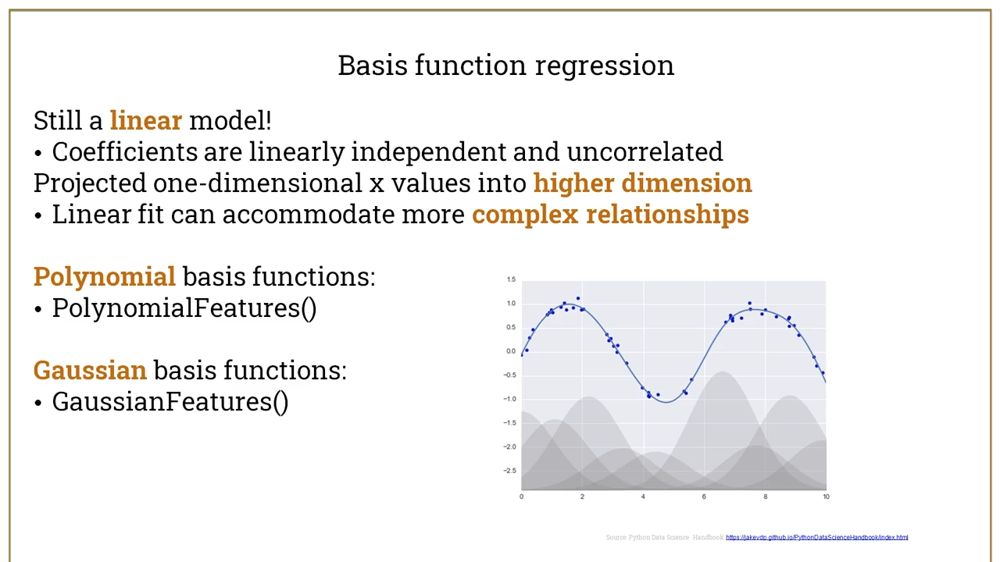

Notes: 
- Linearity refers to the relationship between the coefficients.
- In polynomial regression exponentiation is applied to $x$.
- Gaussian basis functions are the result of combining multiple Gaussian distributions/bases.

### Regularization
Regularization is a technique used to prevent overfitting by adding a penalty to the model's complexity to discourage excessively large coefficients.

Popular types of regularization are:
- *Ridge regression*:  adds a penalty proportional to the sum of the squared values of the coefficients
- *Lasso regression*: adds a penalty proportional to the sum of the absolute values of the coefficients.

Regularization is controlled by setting a parameter ($\alpha$) to control the strength of the penalty.

### Support Vector Machines (SVMs)
SVMs are a type of *discriminative* classifier:
- Rather than modelling each class, we find a line to *separate the classes*
- Can be used for classification and regression
- Insensitive to outliers (distant points) in the dataset

Rather than simply drawing a line, we think in terms of *maximizing* the *margin* between the classes because some separation lines have a wider margin than others. Data points that touch the margin are called *support vectors*.

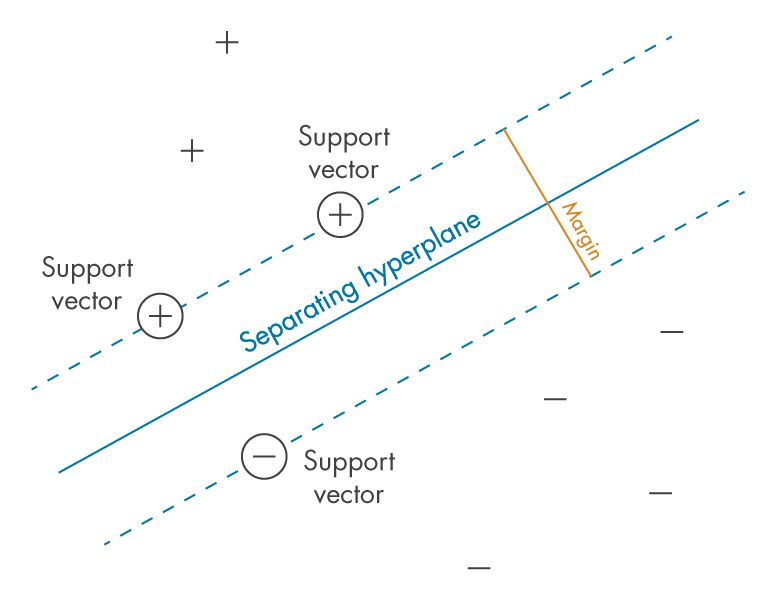

```py
# SVC - Support Vector Classifier
from sklearn.svm import SVC
model = SVC(kernel='linear', C=1E10) 
model.fit(x, y)

# show support vectors
model.support_vectors_
```

### Kernel SVMs
Kernel SVMs are used to project the data into a higher dimensional space when the datapoints are *not linearly separable*.

Increasing the `C` parameter will harden the margin and allow for fewer errors.

## Week 18
### Decision Trees
DTs are a type of discriminative classifier in which questions are asked in order to determine a class.

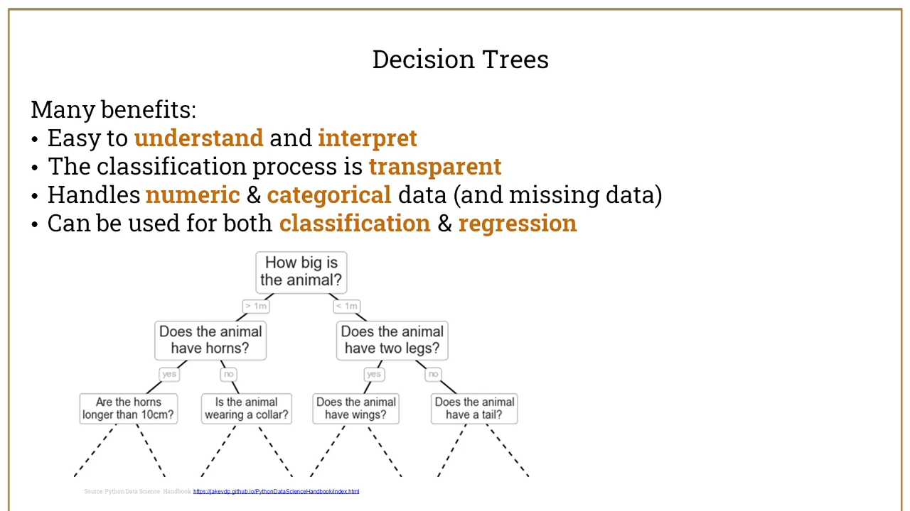

Drawbacks: Difficult to decide which question to ask, easy to overfit, hard to find an optimal DT.

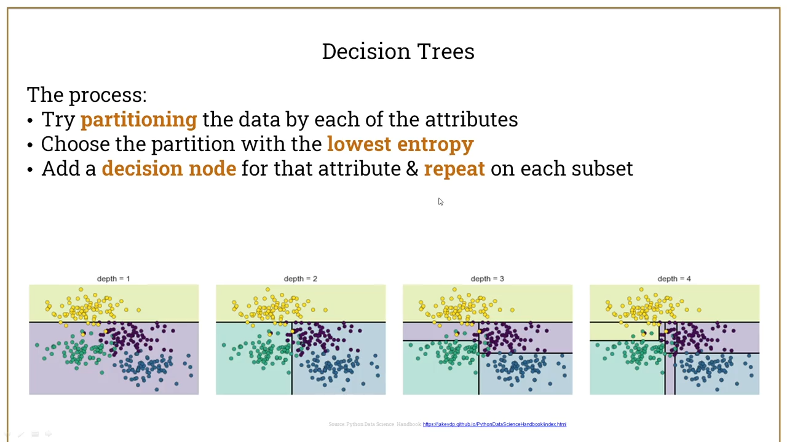

The partition boundaries are relatively ok towards the edges but become irregular towards the center, suggesting that the model is overfit. 

### Random Forests
**Ensemble methods** combine multiple models to generate a better result. An ensemble of decision trees is called a **random forest**.

**Bagging** uses multiple parallel estimators to return an average result.

## Clustering
**Reinforcement learning** - software agents take actions in an environment, in order to maximize a cumulative reward.

**k-Means clustering** seeks to learn an *optimal division* or labelling of a data set. It searches for a predetermined number of clusters within an unlabelled dataset.

An optimal clustering is one where:
- A cluster centre is the arithmetic mean of all its members
- Each point is closed to its own cluster center than to any others

```py
from sklearn.cluster import KMeans
kmeans = KMeans(n_clusters = 4)
kmeans.fit(X)
y = kmeans.predict(X)
```

Finding an optimal division of a data set is difficult. All possible combinations of where to place centers and which points belong to which cluster would take exponential time without a specialized algorithm.

**The Expectation-Maximization algorithm:**
1. Assign some random cluster centres
2. Repeat until converged:
  - E-Step: Assign points to the nearest cluster centre
  - M-Step: Set the cluster centres to the mean

Each repetition will result in a better estimate. The algorithm stops when converged, no new point assignments are made.

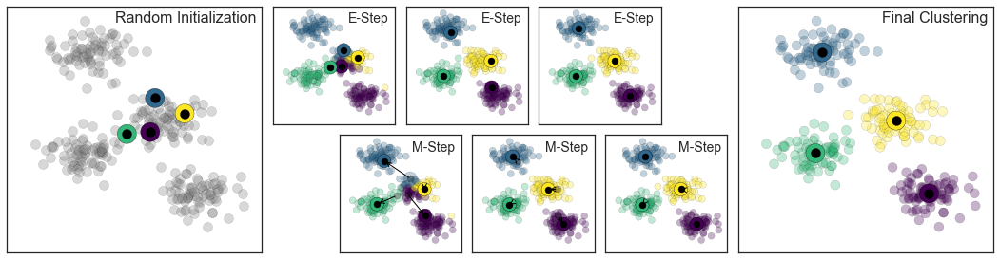

The algorithm is sensitive to how the initials cluster centres are chosen. For best results we should run the algorithm many times with different centres to normalize for the randomization.

Finding the number of clusters that need to be identified can be done by using Gaussian mixture models, DBSCAN or an error function to find the optimum.

K-Means is also limited to linear boundaries. To separate data that's not linearly separable we need to project it to a higher dimension (`SpectralClustering`).

## Week 19 - Evaluation
`Accuracy = num. correct predictions / total predictions`

**Unbalanced dataset** - proportion of positive or negative labels is skewed in favour of a particular class. High accuracy can be achieved by simply selecting the majority class which makes it an imperfect measure of performance.

The cost of a false negative can be higher than a false positive in certain contexts (ex: tumour detection, cancer screening, etc.)

### Confusion matrix
Compares predicted values with the actual values ('ground truth')
- **True Positives - TP**: predicted = positive, actual = positive
- **False Positives - FP**: predicted = positive, actual = negative
- **True Negatives - TN**: predicted = negative, actual = negative
- **False Negatives - FN**: predicted = negative, actual = positive

**Accuracy**
  - (TP+TN) / (TP+TN+FP+FN)

**Recall** 
  - the proportion of actual positive values that are predicted positive
  - TP / (TP+FN)

**Precision** 
  - the proportion of predicted positive values that are actually positive
  - TP / (TP+FP)


