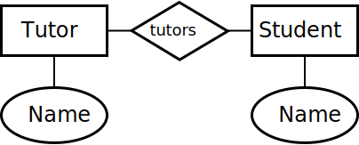
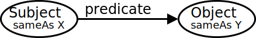
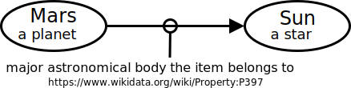

## 1: Working with Data

### Data Sources

- **New Data** – created for the sole purpose of the current application. **Obtaining data**: add on-demand or bulk data entry.
- **Pre-existing Data** – already exist prior to application being created. Need manipulate in order to integrate: 1. **Extraction**: need to recover or extract; 2. **Conversion**: convert to new format; 3.**Cleaning**: may contain erroneous or unnecessary info
- **External Sources** – data providers, crowdsourcing. **Advantage**: come pre-cleaned and in a format easily consumed, save manpower and money, delegate expertise. **Limitation**: no control over quality and structure, may be incomplete, ambigious, may be different from what we need.

### Sharing Data

- There are legal restriction the use of data.
- **Reason to share open data**: commercial reason (drive sales); ethical reason (common good); contractual requirements (gov's budget); interoperability (postcode).
- **Reason NOT to share open data**: restriction on source data; control of use; value of the data; data sensitivity; data privacy. 
- **Challenges**: Default legal positions on data use are complex (differing jurisdictions); Variations in copyright laws globally complicate data usage terms.
- **Licensing Concepts**: Licenses (granting – what a licensee can do) and waivers (relinquish rights – remove infringement concerns) are key legal instrument.
- **Common License Terms**: Attribution; copyleft and non-commerciality clauses

### Shape of Data

- **Programming Languages**: Data types (float, int, etc.); **Data Models**: Relations between different data.; **Data Serialization**: Data formats used for transmission.; **Exchange Protocol**: standardisation for information exchange, i.e. unix socket, named pipes.; **User Interfaces**: for humans to consume.
- **Table**: structured representation of data where info is organised into rows (entities) and columns (attributes). **Strengths**: direct, easy to understand, suitable for structured data, efficient searching. **Weaknesses**: not suitable for hierarchical data.
- **Tree**: based on metaphor of a real tree. **Strengths**: suitable for hierarchical data, can span levels deep. **Weaknesses**: each node can only have single parent.
- **Graph**: nodes can have multiple parents. **Strengths**: flexible than a tree. **Weaknesses**: inefficient for searching in some cases
- **Blobs, Media, Complex Data**: raw data representation without perceivable structure, i.e. raw audio file; use to extracted features instead of structured fields

### Open Data

- generally means: **Cost-free** access; **Barrier-free access** (findable); **Barrier-free use** (accessible); **Restriction-free use** (reusable).

### FAIR Data

- Findable, Accessible, Interoperable, Reusable.

---

## 2: Relational Databases

- A Relational Database implements the **Relational Model**; but not necessarily true. Relation ≈ Table, is a definition of a table and all the values stored in it.
- The set of rules – **Everything is a Relation**: all operations use the relational model; all data is represented and accessed as relations; table and database structure is accessed and altered as relations; **It should be robust abstracted system, unaffected by**: hardware changes; operating system changes; disk replacement; distributed data
- **Relational Model** ≠ **SQL** ≠ **RDBMS implementation**: Relational Model is *not the same as* Entity-Relationship Model; ER Model helps us model concepts, as part of the design of a Relational Database; SQL is *a partial of* the Relational Model.

### The Entity-Relationship Model

- Is a abstract model, not necessary tied to relational database, can be used for other implementation (programming object model). **Entity**: is the thing we want to model, must be uniquely identifiable and may have attributes. **Relationship**: is a connection or dependency between two Entities.



### SQL

- commands for manipulating structures `CREATE`, `DROP`, `TRUNCATE`, `ALTER`, or manipulating data `INSERT`, `SELECT`, `UPDATE`, `DELETE` or retrieve information `SELECT`

```
CREATE TABLE Planets (ID INT AUTO_INCREMENT, PlanetName CHAR(8), DayLength INT, YearLength INT, PRIMARY KEY (PlanetName));

UPDATE Planet SET YearLength = 24 WHERE PlanetName = "Mars";

SELECT PlanetName FROM Planets WHERE DayLength > 200;

SELECT Planet.Name, Moon.Name FROM Planet INNER JOIN Moon ON Planet.Name=Moon.HasPlanet WHERE Planet.DayLength < 11;
```

### Joins

- **Cross Join** (Cartesian Join): `[SELECT * FROM A, B]`
joins all – expensive af – combines each row of first table with each row of second table; total rows is product of all entries in all tables a · b · c...
- **Inner Join**: `[SELECT * FROM A INNER JOIN B ON A.id = B.id]` only combine with matching values
- **Left Join**: `[SELECT * FROM A LEFT JOIN B ON A.id = B.id]` all records on left and matching values on right (right may be empty)
- **Right Join**: `[SELECT * FROM A RIGHT JOIN B ON A.id = B.id]` the opposite of Left Join.

### Cardinality

- refers to how many rows in each of the table participate in a join match with how many rows in other table.
- **1:n** – one row in A joins with zero or more in B, i.e B with a FK referencing a PK in A.
- **1:1** – one row in A with exact one row in B, i.e. a table with a PK
- **m:n** – any number of rows in A joins with any number of rows in B, i.e. a pivot / link / junction table with PK (attributeA, attributeB).

### Database Integrity

- **Common Errors**: Typo; Missing, invalid, inconsistent, duplicate data; Referential integrity error (deleted a planet but not its moon).
- **Join fields must match** – use FK, subsequent `INSERT` with wrong value will fail.
- **Validity check** – use `CHECK` column constraint.
- **Uniqueness** (Consistency) – use PK to guarantee uniqueness.
- **Computed Values** (Consistency) – don't store them, i.e. count, sum, product
- **Change should not cause inconsistency** – use FK rules, i.e. `ON DELETE CASCADE`.
- Table values should not be inconsistent – remove **functional dependencies**.

### Normalisation

- **Non-loss decomposition**: is the decomposition of a single relationship into two or more relations, such that a join on the separate relations reconstructs the original.
    - **Example** – If X = (P, Q, R) decomposes into X1 = (P, Q) and X2 = (Q, W), where Q is a common attribute and is unique, thus non-loss (lossless) join is possible.
- **Functional Dependency (FD)**: the value of one attribute (determinant) determines the value of another attribute (dependent), i.e. ID -> X, ID -> Y. (if we know ID, we also know X and Y, hence ID).
- **Partial Dependency (PD)**: If ID -> {X, Y, Z} but X -> Y and not ID -> Y, then it is PD.
- **Transitive Dependency (TD)**: Indirect relationship. Given FD Book -> Author Country, but Book -> Author and does not Author -> Book. Since Author -> Author Country, hence Book -> Author Country is TD.
- **Candidate Key**: attribute that uniquely identifies a row in a relation, could be a combination of (non-redundant) attributes, whilst each non-key attribute is functionally dependent on every candidate key.
- **Normal forms** – a set of rules to minimise anomalies, allow for insertion, deletion and update without causing data inconsistencies.
- **1NF**: All the attribute are single-valued (atomic) (not array); have unique names; and order in which data is stored does not matter.
- **2NF**: Every non-key attribute is fully dependent on the primary key; does not have partial dependency.
- **3NF**: Does not have any transitive dependency.
- **Boyce and Codd Normal Form (BCNF)**: For all X -> Y, X is a super key.
- **4NF**: No multi-valued dependency (exist multiple of same ID in a table).

### Atomic, Consistency, Isolation, Durability (ACID)

- **Atomicity** (rollback): guarantees an operation that only make sense as a group, either fully completed or nothing happen.
- **Consistency**: guarantees never in inconsistent state, when a group operation is being executed, other operations not allowed to access or modify that will lead to inconsistency.
- **Isolation**: guarantees concurrent transactions leave the database in the same state as if they were executed sequentially.
- **Durability**: guarantees once a transaction is committed, it remains committed in event of failure.
- **Transaction**: mechanism for treating group operation as a block. `BEGIN TRANSACTION, .... COMMIT;` In cases of error, it can be `ROLLBACK;` that undo the inconsistent state.
- **Malice and Accidental Damage**
    - **SQL Injection**: adding malicious code into normal operation.
    - **Privilege Escalation**: malicious agent gaining direct access to the database.
    - **User Error**: intends to do one thing but does something else entirely.
    - **Non-confidential Data Sharing**: being shared inappropriately.
- Security and User Policies with SQL
    - Fine-grained controls – user level, database level, table level and data.
    - Grant access: `GRANT <COMMAND || ALL> ON <RESOURCE> TO <USER / ROLE> WITH GRANT OPTION;`
    - Revoke Access: `REVOKE <COMMAND || ALL> ON <RESOURCE> TO <USER / ROLE>;`
    - Create Role: `CREATE ROLE <Name>;`
    - Delete Role: `DROP ROLE <Name>;`
    - Assign Role: `GRANT <RoleName> TO <USER>;` 

### SQL Functions

- `SUM`, `AVG`, `STD`, `VARIANCE`, `MAX`, `MIN`, `COUNT`, `COUNT(DISTINCT <col>)`, `GROUP_CONCAT(<col1>, <col2, ...)`

### Query Efficiency

- Expensive in DB: **Searching** (checking value on every entry), **Sorting** (ordering data), **Copying** (reading and writing).
- If data is sorted - **using sorted table**: can use binary search (clustered indexing), use no extra space, O(log n) – but can only use one column to be primary key.
- Using indexes: **B-tree** or **Hash table** – keeps in memory, rather than disk. 
- **B-tree** – uses the concept of Binary Search Tree.
- **Hash table** – can't support range searching or approximate searching.
- **Denormalisation** – joins can be expensive, trades off integrity checks and reduce storage requirements.
- **Create a View** – create virtual table (i.e. pre-joined) that can query data.

### Distributed Databases

- **Reason why** – parallelisation, no single point of failure, dividing large dataset (into divided chunk that can be processed locally)
- **Requirements for DD**: **Local Autonomy** (sites operate independently); **No Centralisation** (no single site controls transactions or operations); **Continuous Operation** (available most of time and reliable); **Location Independence** (user doesn't need to know where data is located); **Partition Independence** (user doesn't need to know how data is partitioned); Replication Independence (user doesn't need to be aware replication is used); **Distributed Queries** (query is sent to closest location); **DBMS Independence** (distribute data over different DBMS system)
- **Partitioning** – **Vertical Partitioning** (divide by columns); **Horizontal Partitioning** (divide by rows).
- **Catalogue Management** – information of the data being distributed
- **Recovery Control** – usually **two-phase protocol** (every node is locked for the duration, completes its operations, only confirms when every nodes is happy), where there's one site acts as coordinator in any given transaction.
- **Brewer's Conjecture** – three goals in tension (conflicting with each other, can't fully satisfy all at once): **Consistency** – all parts should converge on consistent state; **Availability** – every request should result in response eventually; **Partition Tolerance** – a network flaw breaks the network into separate subnets, the database should run and recover.

### Alternative Distributed Database

- If distributing databases is complex, why not simplify data structure.
- **Key-Value Databases**: has two columns – key and value. 1. Easy parallel processing; 2. Easy partition; 3. Partition is always horizontal; 4. Processing must happen near the table where possible.
- **MapReduce**: algorithm for processing key-value datasets, consist of **map procedure** (filtering and sorting) and a **reduce procedure** (summary operation), hence MapReduce.
    - **Map Phase** – with direct access to database, loops over all data, outputs a new key-value set. (extract large data to chunks of data, i.e. map(word, value) outputs key "word", value "1")
    - **Reduce Phase** – carried out by reducer workers, summarise the data based on a key. (performs further reduction on mapped chunks of data based on key, i.e. reduce(word, values) adds all values "count" for key "word")

### Document Database; alternative to DD

- **Document Databases**: middle ground between key-value and relational databases. 
- **Less strict**; can be **nested**; can be **repeated**; can be **order-sensitive**. Follows a tree structure.
- **less interlinking**, or less important for data retrieval. (a trade off for the flexibility)
- **Formats**: Markup languages for text; Markup languages for other data; Bespoke formats; JSON.
- **MongoDB** is one implementation of such, capable of distributing by means of sharding (horizontal partitions of data).

### MongoDB "SQL"

```
// INSERT
db.col.insertOne(data);
db.col.insertMany([...])

// READ
db.movies.findOne({year: 2015});
db.movies.find({title: /^Man*/})

// UPDATE
db.movies.updateOne({title: "ABC"}, {$set: {year: 2015}})
db.movies.updateMany({actors: "Elle"}, {"actors.$": "Ele"})
```

---

## 3: Semantic Databases

- share more meanings on the data – specifications about the data and  syntax on how to validate.
- **Machine-readable Semantics**: enabling computer systems to interpret data and make inferences based on shared semantics.
- **Deductive Databases**: rules and logics to deduce new information from existing data.
- **Semantic web**: is a domain that focuses on enhancing the meaning and interoperability of data on the internet.
- **Levels of sharing data**: **1.** Sharing Documents (carry semantics); **2.** Formal Specifications (in computer readable form); **3.** Human-readable Definitions.

### eXtensible Markup Language (XML)

- let us define and store data in a shareable manner, has tree structure.
- **Well-formed XML**: adheres to the basic syntactic rule of XML.
- **Valid XML**: whether it conforms to a specific XML schema or Document Type Definition (DTD)
- **XML vs RDBMS**: XML gives a different; looser structure, harder to index; supports richer searching (and indexing), usually parallelisable; can be shared directly; can be targeted by web links.

### Transforming XML "Querying"

- allow to transform XML into another XML or other formats
- **Two primary languages**: **1.** eXtensible Stylesheet Language Transformation (XSLT); **2.** XQuery.
- **XSLT**: works like templating.

```
<xsl:template match="element">
  <table>
    <xsl:apply-templates select="*" />
  </table>
</xsl:template>

<xsl:template match="child">
  <tr>
    <xsl:apply-templates select="." />
  </tr>
</xsl:template>

<xsl:template match="nestedChild">
  <td>
    <xsl:value-of select="nestedElement" />
  <td>
</xsl:template>
```

```
<xsl:template match="element">
  <table>
    <xsl:for-each select="child">
      <tr>
        <td><xsl:value-of select="nested" /></td>
      <tr>
    </xsl>
  </table>
</xsl:template>
```

- XQuery: intended to be SQL-like, simpler syntax – **FLWOR**: **F** *for* clause, **L** *let* clause, **W** *where* clause, **O** *order by* clause, **R** *return* clause.

```
<table>
{
  let $doc := doc("some.xml")
  for $child in $doc/elementA
  where $doc/price > 30
  order by $doc/title
  return
  <tr>
    <td>{$child/nestedElement/text()}</td>
    <td>{$child/../elementB/text()}</td>
  </tr>
}
</table>
```

### XML Schema

- **Document Type Definition (DTD)**: oldest one, inherited from SGML, limited.

```
in document,
<?xml version="1.0"?> 
<!DOCTYPE authors SYSTEM "http://...library.dtd">

in schema document,
<!ELEMENT authors (authors)+> -- allow one or many
```

- **XML Schema Definition (XSD)**: recommended by W3C for formally describe elements.

```
in document,
<authors xmlns="http://..." xml:id="authors.xsd">
</authors>

in schema document,
<xs:element name="authors">
  <xs:complexType>
    <xs:element ref="author" minOccurs="1" maxOccurs="unbounded" />
  </xs:complexType>
</xs:element>

<xs:element name="author" type="xs:string" />
```

- **RELAX NG**: REgular LAnguage for XML Next-Gen specifies a pattern for the structure and content, whether in XML (below) or other syntax.

```
<element name="authors">
  <oneOrMore>
    <element name="author">
      <text />
    </element>
  <oneOrMore>
</element>
```

- **Schematron**: structural schema language written in XML using elements and XPath, generally used as integrity checks and combine with another schema.

```
<rule context="//date">
  <assert test="date &lt; current-date()">
    Invalid date
  </assert>
</rule>
```

- **One Document Does it all (ODD)**: superset language that generates all the different languages – DTD, XSD, etc. **Text Encoding Initiative (TEI)** develops an ODD.
- **Schema defines** – which **elements** are used, what **can** they contain, what data is passed, what order, what **attributes** are used, what **structures** are equivalent, what structure is mutually exclusive.
- They are used to **encode** structures (create), **validate** encodings (debug or enforce integrity), **support** programming with documents (auto-generate class definitions) or machine reasoning (computer deduce meaning).

---

## 4: Linked Data & Semantic Web

- **Web Links**: Links are one-way, no permission needed, no central registry of links.
- **Uniform Resource Locator (URL)** / **Uniform Resource Identifier (URI)**: Guarantees unique, responsibility of maintenance (has domain name owner), unlimited number of URLs, unique ID independent of server.
- **Remote Description Framework (RDF)**: a model representation of linked data on the web **based on triples**.
- URLs are key to **solving challenges** – maintaining keys on the web; finding data on the web; sharing meaning; sharing entities.

### Remote Description Framework (RDF)



- **Linking Data**: **Subject** and **Predicate** must be URIs (ideally URLs). **Object** can be URI or string, number, date, etc. **sameAs** predicates can connect URIs that represent the same time.



- **Dereferencing**: **OK** – URLs can just be ID – don't need to resolve; **Better**: Give data about the URI; **Best**: Content negotiation (human readable in browsers, linked data for machines)
- **Serialisations**:
- **n-triples** (simple): list the triples

```
<Subject URI> <Predicate URI> <Object URI>.
```

- **Turtle** (easy): written in a compact natural text form.

```
PREFIX et: <http://.../entity>
PREFIX dt: <http://.../direct>

et:Deimos a et:Moon; dt:satelliteOf et:Mars .
```

- **RDFa** (Mixable): add tiny amounts of RDF into HTML

```
<div vocab="http://schema.org/" typeof="Person">
  <a property="image" href="http://...manu.png">
    <span property="name">Manu Sporny</span></a>, 
  <span property="jobTitle">Founder/CEO</span>
  <div>
    E-mail: <a property="email" href="mailto:(your emailid)">msporny@digitalbazaar(.)com</a>
  </div>
</div>
```

- **JSON-LD**: add-on to JS, not exactly a serialisation, graph data

```
{
  "@id": "https://...Deimos"
  "@type": "https://...Moon"
  "https://...satelliteOf": {
    "@id": "https://...Mars"
    "@type": "https://...Planet"
  }
}
```

- **XML/RDF** (Painful): one of the earliest, XML-based serialisation, ugly to read, trying to put tree structure into graph structure (avoid this)

### RDF Schema (Web Ontologies)

- **Web Ontology Language (OWL)**: allow us to encode the logic of the system.
- Designing an ontology: **1.** use existing ontologies where possible; **2.** combine effort with others; **3.** test with real data; **4.** don't get lost in rabbit holes (avoid adding unnecessary details); **5.** don't be wrong; **6.** designing good ontologies takes times; **6.** multiple viewpoints are vital; **7.** drawing helps; **8.** be as explicit as possible to draw out problems; **9.** try out protege for ontology specification

### RDF Query Language

- hard to search efficiently, partly because no registry of information.
- **Triplestore**: one type of graph database, uses RDF to cache a chunk of semantic web.
- **SPARQL**: SPARQL Protocol and RDF Query Language

```
PREFIX foaf: <http://...foaf/0.1>
PREFIX ex: <http://...>
SELECT ?friend
WHERE {
  ex:Alice foaf:knows ?friend .
}
```

If we want to know name of person,

```
SELECT ?fName
WHERE {
  ex:Alice foaf:knows ?friend .
  ?friend foaf:name ?fName .
}
```

If we want a list of name instead,

```
SELECT ?fName
WHERE {
  ex:Alice foaf:knows+ ?friend .
  ?friend foaf:name ?fName .
} LIMIT 20
```

If we want unique list instead,

```
SELECT DISTINCT ?fName
WHERE {
  ex:Alice foaf:knows+ ?friend .
  ?friend foaf:name ?fName .
} LIMIT 20
```

---

## 5: Multimedia & Information Retrieval

- **Core ideas**: User has an information need; A need is expressed as a query; Query is executed over data by Information Retrieval system.
- **Feature**: based on searching the document, but using features; high-level structures created from raw data to extract meaningful information, i.e. metadata. **Reasons**: helps to move from low-level signal to high-level concepts, reduce complex data to simpler data, define expectation of salience, re-weighted based on task or user. **Challenges**: bridging the "semantic gap" between user information needs and low-level data.
- **Types of Features**: tokens (text), zero-crossing (audio), pitch estimation (audio), color regions (image), loudness (audio).
- **Feature Space**: multi-dimensional space where each dimension represents a specific feature.
- **Similarity in Feature Space**: distance metrics can be used – **Euclidean Distance** (shortest distance), **Manhattan Distance** (summing the absolute difference in each dimention), **Identity of Indiscernibles** (identical points - 0 distance), **Symmetry** `d(a,b)=d(b,a)`, **Triangular Inequality** `d(a,c) ≤ d(a,b)+d(b,c) `.
- **Speed & Indexing**: Speed in IR is important. 
    - **Speed**: Precompute feature are indices; Many searches are parellelisable (mapReduce); reduce dimensions – can increase speed and reduce irrelevant results.
    - **Search**: Spatial indexes of metric spaces can be very fast for retrieval; R-trees O(log n) retrieval; built in to some RDBMS packages.
- **Measure Success**:
    - **AT**: Actual Total in the whole collection, including those haven't been classified (False Negatives);<br/>
      ∴ `AT = TP + FN`<br/>
      **TR**: Total Retrieved (the resulting sample size that was retrieved);<br/>
      ∴ `TR = TP + FP`<br/>
      **TP**: True Positives (correctly identified that attribute is present);<br/>
      ∴  `TP = TR * Precision` or `TP = TR - FP`<br/>
      **TN**: True Negatives (correctly identified that attribute is absent);<br/>
      ∴ `TN = Total Collection - AT`<br/>
      **FP**: False Positives (incorrectly identified that attribute is present);<br/>
      ∴ `FP = (TP / Precision) - TP` or `FP = TR - TP`<br/>
      **FN**: False Negatives (incorrectly classified that attribute is absent);<br/>
      ∴ `FN = (TP / Recall) - TP` or `FN = AT - TP`<br/>
    - **Precision**: proportion of positive results that are true positive, with few irrelevant (false positive) entries. (user looks for a match);<br/>
      ∴ **Precision** = `TP / (TP + FP)`
    - **Recall**: proportion of how high relevant results retrieved, with few (false negative) not appearing in result set. (user looks for all matches);<br/>
      ∴ **Recall** = `TP / (TP + FN)`
    - **F1-measure**: a combined measure that balance precision and recall. (user looks for some matches);<br/>
      ∴ **F1** = `(2 * Precision * Recall) / (Precision + Recall)
