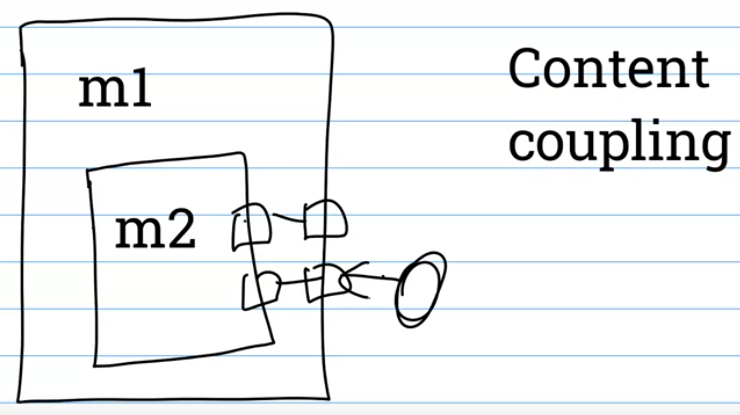
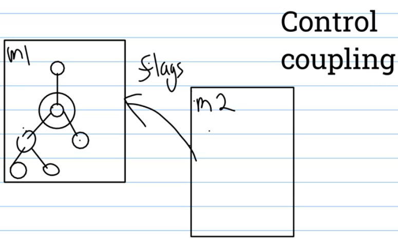
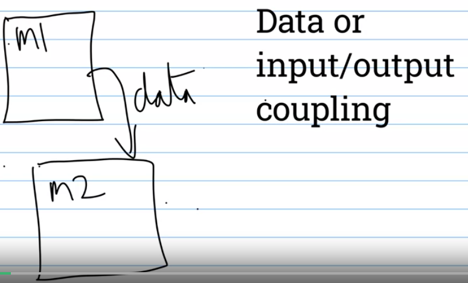
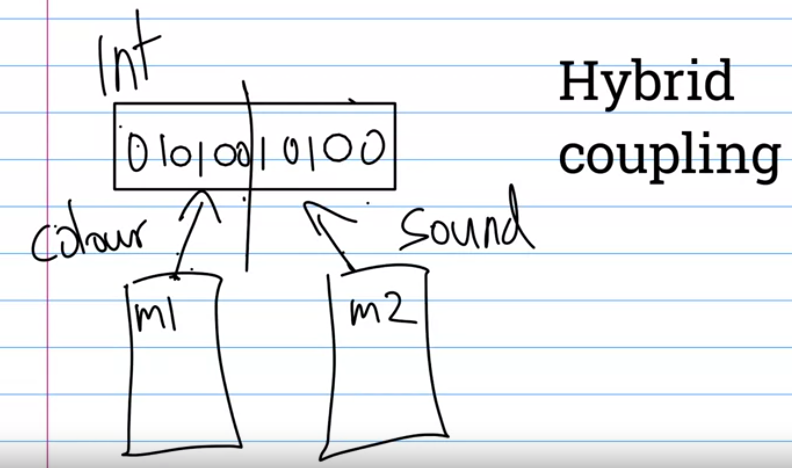
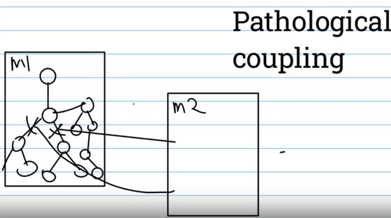
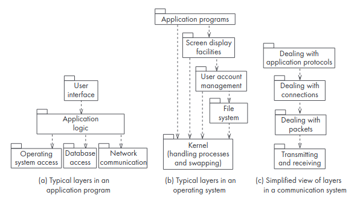
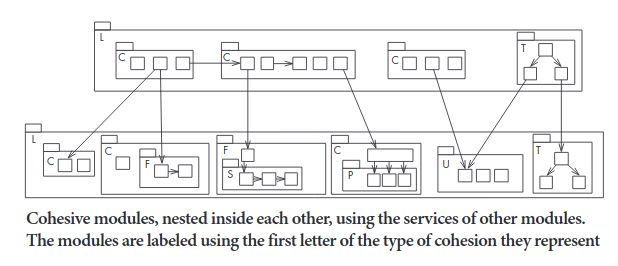

<!-- omit in toc -->
# Software Architecture 

Notes are from the following books:


- Bass, Clements, Kazman: Software Architecture in Practice, 3rd Ed. 2013
- Lethbridge and Laganiere: Object-Oriented Software Engineering, 2nd Ed. 2005
- McConnell: Code Complete, 2nd Ed. 2004 
- Pressman and Maxim: Software Engineering, 9th Ed. 2020
- Riel: Object Oriented Design Heuristics, 1996


- [Overarching Ideas](#overarching-ideas)
  - [Notes from McConnell, *Code Complete*, ch. 5](#notes-from-mcconnell-code-complete-ch-5)
    - [Complexity](#complexity)
    - [Levels of Design](#levels-of-design)
      - [1) The software system](#1-the-software-system)
      - [2) Division into subsystems/packages](#2-division-into-subsystemspackages)
      - [3) Division into classes within packages](#3-division-into-classes-within-packages)
      - [4) Division into data and routines within classes](#4-division-into-data-and-routines-within-classes)
      - [5) Internal routine design](#5-internal-routine-design)
- [Module Coupling](#module-coupling)
  - [IEEE Definitions](#ieee-definitions)
  - [MYK Diagrams](#myk-diagrams)
    - [Content Coupling](#content-coupling)
    - [Control Coupling](#control-coupling)
    - [Data Coupling](#data-coupling)
    - [Hybrid Coupling](#hybrid-coupling)
    - [Pathalogical Coupling](#pathalogical-coupling)
  - [Notes from *Object Oriented Software Engineering*, p. 321](#notes-from-object-oriented-software-engineering-p-321)
    - [Content Coupling](#content-coupling-1)
    - [Common Coupling](#common-coupling)
    - [Control Coupling](#control-coupling-1)
    - [Stamp Coupling](#stamp-coupling)
    - [Data Coupling](#data-coupling-1)
    - [Routine Call Coupling](#routine-call-coupling)
    - [Type Use Coupling](#type-use-coupling)
    - [Inclusion or Import Coupling](#inclusion-or-import-coupling)
    - [External Coupling](#external-coupling)
  - [Notes from *Code Complete* - pp. 100-102](#notes-from-code-complete---pp-100-102)
    - [Coupling Criteria](#coupling-criteria)
    - [Kinds of Coupling](#kinds-of-coupling)
  - [Notes from Pressman and Maxim, *Software Engineering*](#notes-from-pressman-and-maxim-software-engineering)
    - [Separation of Concerns](#separation-of-concerns)
    - [Modularity](#modularity)
  - [Notes from Bass et al, *Software Architecture in Practice*, p. 123](#notes-from-bass-et-al-software-architecture-in-practice-p-123)
  - [Notes from Riel, *Object Oriented Design Heuristics*, p. 18](#notes-from-riel-object-oriented-design-heuristics-p-18)
- [Module Cohesion](#module-cohesion)
  - [IEEE Definitions](#ieee-definitions-1)
  - [Notes from *Object Oriented Software Engineering* p. 315](#notes-from-object-oriented-software-engineering-p-315)
    - [Functional Cohesion](#functional-cohesion)
    - [Layer Cohesion](#layer-cohesion)
    - [Communicational Cohesion](#communicational-cohesion)
    - [Sequential Cohesion](#sequential-cohesion)
    - [Procedural Cohesion](#procedural-cohesion)
    - [Temporal Cohesion](#temporal-cohesion)
    - [Utility Cohesion](#utility-cohesion)
  - [Notes from *Code Complete*, p. 105](#notes-from-code-complete-p-105)
  - [Notes from Riel, *Object Oriented Design Heuristics*, p. 19](#notes-from-riel-object-oriented-design-heuristics-p-19)

## Overarching Ideas

### Notes from McConnell, *Code Complete*, ch. 5

#### Complexity

At a construction level software design's primary imperative should be to manage complexity (p. 78). 
Dijkstra observed that the challenge of CS is that it forces to people to think from a semantic scale of a single bit to 10^9 bits.
The goal is to minimize the amount of a program you have to think about at any one time, minimize the scales we're thinking about at any one time.

At a software-architecture level, the complexity of a problem is reduced by dividing the system into subsystems. The more independent the subsystems are, the more you make it safe for people to focus on one bit of complexity and ignore the rest.

At a routine level, keeping routines short can reduce mental workload.

#### Levels of Design

Design is needed at several levels of detail in a software system, with some techniques applying to all levels, others applying to only one or two. The levels described are:

##### 1) The software system

The entire system. It can be a mistake to jump from this level into level 3. It is often helpful to think through higher level combinations of classes, like subsystems or packages.

##### 2) Division into subsystems/packages

The design task here is to think about how to partition the whole system into cohesive subsystems, and defining how each subsystem is allowed to use each other subsystem. The communication rules are particularly important or entropy will set in and you'll end up with a spaghetti network of subsystems talking to all others. Some common subsystems are:

- *Business Logic*. Business rules are the laws, regulations, policies, and procedures that you code into the software. These change frequently so should be isolated in their own subsystem. Eg if you're writing payroll software this is where the rules about IRS would live, along with business policies on holidays etc.

- *User Interface*. Create a subsystem to isolate user-interface components so that the UI can evolve without damaging the rest of the program.

- *Database Access*. Hide the implementation details of accessing the database so that most of the program doesn't need to worry about the messy detail of manipulating low-level structures and can deal with the data in terms of how it's used at a domain problem level.

- *System Dependencies*. If you have dependencies on OS system calls isolate these in a subsystem. Often such subsystems are provided by code libraries or languages.

##### 3) Division into classes within packages

The design task here is to identify all classes in the system. For example the database access subsystem might be divided into classes for data access, persistence framework classes, and database metadata classes. The interfaces of classes is also defined.

##### 4) Division into data and routines within classes

Design at this level breaks each class down into its internal routines and data. The level above will identify some routines, those at the interface level, but here we identify the private routines we'll need. This often sheds more light on the interface we'll need and may revise the work at level 3.

##### 5) Internal routine design

Here we design the specific implementation of each routine, we might look up optimal algorithms, write pseudocode etc. Often this level of design is done unconsciously and poorly.

We can think of the concept of *modules* as discrete units at different levels of the design. For example we can think of different subsystems in level 2, different classes in level 3, and different routines in level 4. Sometimes the concept of *module* is used more strictly as being a software component *that is defined in the language used*, for example in Java methods, classes, and packages, but in C files and functions.

## Module Coupling

### IEEE Definitions


*IEEE Definition of a Module - 3.1827:*

> **Module:** 1. A program unit that is discrete and identifiable with respect to compiling, combining with other units, and loading. 2. A logically separate part of a program. 3. A set of source code files under version control that can be manipulated together as one. 4. A collection of both data and the routines that act on it.

> NOTE The terms 'module', 'component', and 'unit' are often used interchangeably or defined as sub-elements of one another in different ways. The relationship between these terms is not yet standard.


*IEEE Definition of Modularity - 3.1826:*

> **Modularity:** 1. The degree to which a system or computer program is composed of discrete components such that a change to one component has minimal impact on other components. 2. Software attributes that provide a structure of highly independent components. 3. The extent to which a routine or module is like a black box.


*IEEE Definition of Coupling - 3.657:*

> **Coupling:** 1. The manner and degree of interdependence between software modules. 2. The strength of the relationships between modules. (*SWEBOK 1.4.2*). 3. A measure of how closely connected two routines or modules are. 4. In software design, a measure of the interdependence among modules in a computer program.


| Coupling Type | Reference | Definition |
| ------------- | --------- | ---------- |
| Common Environment | 3.474 | Two software modules access a common data area. *Syn:* common coupling |
| Content | 3.584 | Some or all of the contents of one software module are included in the contents of another module |
| Control | 3.609 | One software module communicated information to another module for the explicit purpose of influencing the latter module's execution |
| Data | 3.713 | A type of coupling in which output from one software module serves as input to another module. *Syn:* input-output coupling |
| Hybrid | 3.1324 | Different subsets of the range of values that a data item can assume are used for different and unrelated purposes in different software modules |
| Pathological | 3.2092 | One software module affects or depends on the internal implementation of another |


### MYK Diagrams

#### Content Coupling



#### Control Coupling



#### Data Coupling



#### Hybrid Coupling



#### Pathalogical Coupling



### Notes from *Object Oriented Software Engineering*, p. 321

Lethbridge and Lagraniere give the following taxonomy of types of coupling:

| Coupling Type | Comments |
|---------------|----------|
| Content | A component *surreptitiously modifies* the internal data of another component. Always avoid. |
| Common | The use of *global variables*. Severely restrict this. |
| Control | One procedure *directly controls another* using a flag. Reduce this using polymorphism. |
| Stamp | One of the *argument types* of a method is one of your *application classes*. If it simplifies the system, replace each such argument with a simpler argument (an interface, a superclass or a few simple data items). |
| Data | The use of *method arguments that are simple data*. Where possible, reduce the number of arguments. |
| Routine call | A *routine calling another*. Reduce the total number of separate calls by encapsulating repeated sequences. |
| Type use | The use of a *globally defined data type*. User simpler types wherever possible (superclasses or Java interfaces) |
| Inclusion/Import | *Including a file or importing a package*. Eliminate unless necessary.|
| External | A *dependency exists to elements outside the system scope*, such as the OS, shared libraries or hardware. Reduce the number of places where such dependencies exist. |

#### Content Coupling

When one component *surreptitiously* modifies data that is *internal* to another component. This should always be avoided.

A form of content coupling occurs whenever you modify a public instance variable in a way that designers did not intend. So you should always *encapsulate* instance variables by declaring them *private* in OO languages, providing `get()` and `set()` methods if needed.

A worse form of content coupling, harder to detect, is where you directly modify an instance variable of another instance variable. For example if `ClassA` contains a private instance of `ClassB` and a public method of `ClassA` changes a private variable of `ClassB` even though it has no explicit interface to do so.

State changes should always be explicit, look at immutable data types too as a potential solution to this.

#### Common Coupling

MYK refers to this as Common Environment Coupling. This occurs whenever you use a global variable. All the modules using the variable become coupled to each other and to the module that declares the variable. Global does not necessarily mean the entire system, it can mean the subsystem/package.

Common coupling should be avoided wherever possible. Sometimes a case can be made that it is sensible to create system-wide default values rather than passing messages between a large number of routines. But typically those values are constants, rather than variables.

Common coupling can be reduced by encapsulation. For each global constant/variable create a module that has public methods for getting or setting the data. The internal representation of the data can be changed, and it can be protected from inadvertent changes from 'rogue' users.

Also consider immutable data types, if available, for global constants.


#### Control Coupling

When one procedure calls another with a 'flag' or 'command' that controls what that second procedure does. It should be avoided as you would then have to change the second procedure whenever a new command becomes required or an old one obsolete.

It can be refactored to break out separate methods (for example `drawCircle()` and `drawSquare()` rather than `drawShape('circle')`). Often polymorphism is the best way to reduce control coupling. For example have a `Shape` class with descendants `Circle` and `Square` and a common `draw()` method. Then the caller can just call `draw()`.

Sometimes control coupling is unavoidable. For example a server with a `handleClientMessage` process will be instructed by the client message. Consider here alternatives to long if/else blocks, such as lookup tables.


#### Stamp Coupling

When one of your application classes is declared as the type of a method argument. It is often necessary but should be reduced or avoided if possible.

For example, imagine you have an `Employee` class and in another part of the system a `SendEmail` method that can take an `Employee` record as an argument. Then the email method gets access to the full data, and whenever someone changes the `Employee` class they have to check and test the interface of the email method. The method is also then not reusable by anyone who doesn't know the `Employee` class.

Again we can either break down the argument to just the data it needs (like `string email, string name`). Or else have `Employee` inherit from an abstract, simple `Addressee` interface that others can use too. The former switches stamp coupling for data coupling, the latter is still stamp coupling, but now is less likely to be affected by any changes to other classes and is easier to use elsewhere.


#### Data Coupling

This occurs when method arguments are primitive or simple data types. The more methods the argument has, the tighter the coupling.

There is a trade off between stamp coupling and data coupling. If there's just a single argument needed, data coupling is considered looser than stamp coupling. However if you replace a single complex argument with many data arguments you could end up with tighter coupling overall.

As a rule of thumb, if you're just adding one or two extra data arguments, OK. But three or four, maybe stick with a complex type.

Don't add unnecessary arguments.


#### Routine Call Coupling

Whenever one routine calls another the routines are then coupled because they depend on each other's behaviour and the caller depends on the interface of the called routine.

This is present in any system. It can be helpful to encapsulate frequent combinations of routine calls in another routine. For example if you frequently have to write the following over and over:

```
shape.drawBackground();
shape.drawForeground();
shape.drawBorder();
```

It might be better to encapsulate in a `shape.draw()` method that provides a single point of change if any of the three methods changes their parameters.


#### Type Use Coupling

When a module uses a data type defined in another module. Occurs often in typed languages like Java or C++.

Similar to common coupling, except that only data types are shared, not data values. The impact is usually less as a result and this is not as problematic a form of coupling. If the type definition changes, the users of that type may have to change. Similar to stamp coupling so see those methods for dealing with this if problematic.

Also consider abstract types with a common interface that can leave flexible the implementation. EG `List` might provide common operations across `LinkedList`, `Vector`, `ArrayList` (see C++ templates, for another example).


#### Inclusion or Import Coupling

When a module imports another package (eg Java, JS, Python) or includes it (C++). Exposes the surface of the imported thing to the importer, and can sometimes introduce unwelcome changes (like naming in the environment).

The bigger the imported component, the worse the coupling, with the possible exception of standard language imports (like the C++ STL).

Minimize imports, eg named imports over `import *`. Scope naming wherever possible.


#### External Coupling

When a module has  dependency on anything outside the system scope, like the OS, or the hardware. Reduce the number of places in the code where such dependencies are found.


### Notes from *Code Complete* - pp. 100-102

Coupling describes how tightly a class or routine is related to other classes or routines. The goal is to create classes and routines where the relations to others are:

- small
- direct
- visible
- flexible

This is known as **loose coupling**

Coupling goals apply equally to classes or routines, we can use the term modules to cover both (as well as larger software elements).

As an analogy, think of railroad cars, you can easily connect or disconnect cars by one hook, imagine the scenario where you could only connect certain cars to certain other types, or where you had to connect multiple different sets of wires. Coupling cars works because the coupling is simple. In software, make the connections between software components as small and simple as possible.

Try to create modules that depend little on other modules. Good: a *sin(x)* routine where everything it needs to know is in one variable. Potentially bad: an *initVars(var x, var y, var z ... var N)* routine where the caller and the routine are tightly coupled, the caller practically knows the implementation. Two classes sharing global variables are even more tightly coupled.

#### Coupling Criteria

We can use several criteria for evaluating coupling between modules:

- **Size** The number of connections between modules. Small is beautiful because it's less work to connect the modules. A routine with one parameter is more loosely coupled than one with six. A class with four well-defined public methods is more loosely coupled than one that exposes dozens of public methods.

- **Visibility** The prominence of the connection between two modules. Make the connections as blatant as possible. Passing data in a parameter list is making an obvious connection and is better than modifying global data which is sneaky, or passing a flexible object that may not have the properties required. If you do the latter you must at least document the connection clearly.

- **Flexibility** How easily connections can be changed. You ideally want a plug-in, plug-out flexibility like a USB cable rather than bare wire and solder. For example a routine that takes an object might look friendly because it just has one parameter. But we now need to know about the structure of the object and what properties it needs. Maybe we don't have that class defined in a new caller? Maybe it's more flexible to list the couple of properties it needs.

#### Kinds of Coupling

Some common kinds of coupling:

- **Simple-data-parameter coupling** Where all the data passed between modules are of primitive data types and all the data is passed through parameter lists. Normal and acceptable.

- **Simple object coupling** Where a module instantiates an object. Also fine.

- **Object-parameter coupling** Where *Object 1* requires *Object 2* to pass it to *Object 3*. A tighter form of coupling because it requires both caller and callee to know about *Object 2*.

- **Semantic coupling** The most insidious form of coupling, where a module makes use not of a syntactic element of another module but some semantic knowledge about its inner workings. This is really dangerous as changes in implementation for one module can break the module using it in subtle ways that are hard to debug. Examples of semantic coupling include:

    - *Module 1* passes a control flag to *Module 2* to tell the latter what to do. It means *Module 1* has to make assumptions about what *Module 2* will do with that flag.

    - *Module 2* uses global data after it has been modified by *Module 1*, assuming it has been modified and called in a correct sequence.

    - *Module 1* has an *Initialize()* routine that needs to be called before other methods. *Module 2* knows that *Module1.process()* calls the *Initialize()* method itself so it just goes directly to that process.

    - *Module 1* passes *Object* to *Module 2*. It knows that *Module 2* only needs three of *Object*'s properties so it only initializes those three properties.

    - *Module 1* passes *Base Object* to *Module 2*, but *Module 2* knows it is actually passing a *Derived Object* so it casts the parameter to that derived object type and uses the derived methods.

### Notes from Pressman and Maxim, *Software Engineering*

#### Separation of Concerns

*Separation of Concerns* is a design concept that suggests any complex problem can be more easily handled if it is subdivided into pieces that can be solved and/or optimized independently. A *concern* is is a feature or behaviour that is specified as part of the requirements model for the software.

The perceived complexity of two problems combined will be greater than the sum of the perceived complexity of when each is taken separately. This leads to a divide and conquer approach to software engineering, it is easier to solve a complex problem when you divide it into manageable pieces.

#### Modularity

Modularity is the most common manifestation of separation of concerns. Software is divided into separately named and addressable components that are integrated to satisfy problem requirements. As the number of discrete modules grows, the complexity and cost of each module decreases, but the cost of integrating them increases. So we have an optimal number *M* which will minimize the overall cost. But we cannot predict *M* with assurance.

The principle of *information hiding* (Parnas), suggests that modules "should be characterized by design decisions that (each) hides from the others". Hiding implies that effective modularity can be achieved by defining a set of independent modules that communicate with one another only the information necessary to achieve software function.

The concept of *functional independence* is an outgrowth of thinking about SoC, modularity, and information hiding. It is achieved by developing modules with a "single-minded" function and aversion to excessive interaction with other modules. Independence is assessed through the concepts of *cohesion* - a measure of how "single-minded" a module is, and *coupling* - a measure of interconnections between modules.

### Notes from Bass et al, *Software Architecture in Practice*, p. 123

Strategies to reduce coupling:

- *Encapsulate*. Encapsulation introduces an explicit interface to a module. This interface includes an API and its responsibilities, such as "perform a syntactic transformation on an input parameter to an internal representation" (parsing). The most common tactic, encapsulation ensures changes to one module are less likely to propagate to other modules.

- *Use an intermediary*. This breaks a dependency. Given a dependency between module A and module B (for example carrying out A first requires carrying out B), the dependency can be broken by using an intermediary. THe type of intermediary depends on the type of dependency. For example, a pub-sub intermediary will remove the data producer's knowledge of its consumers. A directory service might serve as an intermediary in a service-oriented architecture.

- *Restrict dependencies*. Restricts the modules a given module interacts with or depends on. Achieved by restricting a module's visibility and by authorization (modules can only be accessed by authorized modules). Particularly common in layered architectures.

- *Refactor*. Undertaken when two modules are impacted by a single change because they are (part) duplicates of each other. The common functionality is *factored out* and found a more suitable home.

- *Abstract common services*. In the case where two modules provide similar services it may be better to implement the services once in a more abstract form.

### Notes from Riel, *Object Oriented Design Heuristics*, p. 18

Strive for loose couping and tight cohesion. There are five types of coupling between classes:

- **Nil Coupling** is the best, as it implies two classes that have absolutely no dependency on each other. You may eliminate one of the classes without affecting the other class. The best we can do with nil coupling is a class library of stand-alone classes. For an application, some coupling is of course required.

- **Export Coupling** states that one class is dependent on the public interfaces of another.

- **Overt Coupling** occurs when one class uses the implementation details of another class with explicit permission. For example in the language feature the *friend* class of C++.

- **Cover Coupling** occurs when a class uses the implementation details of another class with no explicit permission. It is the most dangerous form of coupling as it creates a strong, implicit dependency.

This leads to the following design heuristics:

**Heuristic 2.7** Classes should only exhibit nil or export coupling with other classes.


## Module Cohesion

### IEEE Definitions


*IEEE Definition of Cohesion - 3.448:*

> **Cohesion:** 1. The manner and degree to which the tasks performed by a single software module are related to one another. 2. In software design, a measure of the strength of association of the elements within a module. *Syn:* module strength


| Type | Reference | Definition |
| ---- | --------- | ---------- |
| Coincidental | 3.449 | The tasks performed by a software module have no functional relationship to one another |
| Communicational | 3.477 | The tasks performed by a software module use the same input data or contribute to producing the same output data |
| Functional | 3.1216 | The tasks performed by a software module all contribute to the performance of a single function |
| Logical | 3.1626 | The tasks performed by a software module perform logically similar functions. Example processing of different types of input data |
| Procedural | 3.2213 | The tasks performed by a software module all contribute to a given program procedure, such as an iteration or decision process |
| Sequential | 3.2694 | The output of one task performed by a software module serves as input to another task performed by the module |
| Temporal | 3.3053 | The tasks performed by a software module are all required at a particular phase of program execution |


### Notes from *Object Oriented Software Engineering* p. 315

Lethbridge and Lagraniere offer this taxonomy of cohesion:

| Cohesion Type | Comments |
| ------------- | -------- |
|Functional | Facilities are kept together that perform only *one computation* with no *side effects*. Everything else is kept out. |
| Layer | *Related services* are kept together, everything else is kept out, and there is a *strict hierarchy* in which higher-level services can access only lower-level services. Accessing a service may result in side-effects. |
| Communicational | Facilities for operation on the *same data* are kept together, and everything else is kept out. Good classes exhibit communicational cohesion. |
| Sequential | A set of procedures, which work in sequence to perform some computation, is kept together. *Output from one is input to the next*. Everything else is kept out. |
| Procedural | A set of procedures, which are called *one after another* is kept together. Everything else is kept out. |
| Utility | *Related utilities* are kept together, when there is no way to group them together using a stronger form of cohesion. |

#### Functional Cohesion

Achieved when a module only performs a single computation, and returns a result, with no side effects.

A module lacks side effects when performing the computation leaves the system in the same state as before. The result of performing the computation is the only thing that should affect subsequent computations.

The inputs to a functionally cohesive module are typically function parameters, but can also include files or data streams. Whenever the same input is provided, the same result should be returned.

Some modules cannot be functionally cohesive by nature. For example modules that create a file or update a database. Similarly modules that interact with the user, since prompting the user is a type of output, and this violates the principle that the only output is the return value.

The following are examples of modules that can be functionally cohesive:

- A module that calculates a mathematical function (like sine).
- A module that takes a set of equations and solves for unknowns.
- A module in a chemical factory that takes data from various monitoring devices and computes the yield of a process as a percentage of the theoretical maximum.

A functionally cohesive module can call other modules, providing they preserve the functional cohesion. For example a mathematical function may call other mathematical functions.

The benefits of functional cohesion are:

- It is easier to understand a module when you know that all it does is generate a specific output with no side effects.
- It is more likely to be reusable due to its lack of side effects.
- It is easier to replace a functionally cohesive module with another module that performs the same function.

(AF note: not mentioned in the book, but elsewhere testability and concurrency are mentioned as other benefits).

#### Layer Cohesion

This is achieved when facilities for providing a set of related *services* to the user or to higher-level layers are kept together and everything else is kept out. The layers must form a hierarchy. Higher layers may access lower layers, but lower layers cannot access higher layers. For example:



An individual service in a layer may have functional cohesion but it is not necessary, side effects are often essential.

Example of related services that could form a layer include:

- services for transmission of messages or data
- services for storing data
- services for managing security
- services for interacting with users
- services to interact with the OS
- services to interact with hardware

The set of procedures through which a layer provides its services to a higher layer is often called its *API* or *application programming interface*. The specification of the API must describe the protocol that higher level layers use to access it.

Advantages of layer cohesion are:

- You can replace higher level layers without impacting lower level layers at all
- You can replace a lower level layer without interfering with a higher level layer by replicating its API.

#### Communicational Cohesion

This is achieved when modules that access or manipulate certain data are kept together (eg in the same class). One of the main selling points of OOP is that it helps ensure communicational cohesion if the principles of object orientation are followed.

The term 'communicational' is used for historic reasons, think about it in the following terms: All the procedures that 'communicate' with the data are kept together.

For example, a class called `Employee` would show good communicational cohesion if all the system's facilities for storing and manipulating employee data were contained in the class, and if the class did nothing but manage employee data.

Similarly, imagine a module that updates a database, and another module that logs all changes to the database. Since both the database and the log files are representations of the same data, both modules should be kept together in a higher-level module or subsystem.

A communicationally cohesive module can be embedded in a layer. Part of a layer's API can involve manipulating a particular class of data and returning objects manipulated to higher levels in response to API calls.

The main advantage to communicational cohesion is that if you want to make a change to the data you will find one place to do it. But you shouldn't sacrifice layer cohesion for the sake of communicational cohesion. Eg the following image shows communicationally cohesive modules (marked 'C') within layers (marked 'L'):



#### Sequential Cohesion

This is achieved when a set of procedures, in which the output of one procedure provides the input to the next, are kept together and everything else excluded. In the diagram above this is shown by the module marked 'S'.

As an example, imagine a text-recognition subsystem. One module is given a bitmap image and divides it into areas that appear to contain separate glyphs. This output is then fed into a second module that recognizes shapes and determines the probability that each area corresponds to a particular character. The output of the second module is fed to a third that uses probabilities to determine the sequence of words in the input. If these modules were grouped together, we would have sequential cohesion.

The aim should be sequential cohesion once you have already achieved the types of cohesion above. It does not take priority over communicational, layer, or functional cohesion.


#### Procedural Cohesion

This is where a set of procedures are kept together when they are called one after another, even though the output of one does not provide the input of the next. It is therefore weaker than sequential cohesion. 

As an example, in a university system the set of independent steps required to register a new student in a course could be kept in a single module.


#### Temporal Cohesion

This is where a set of operations that are executed during the same phase of program execution are kept together. This is weaker than procedural cohesion.

For example, all the code for system initialization, or termination, might be kept together. Or for occasionally used features. This can be OK provided that it does not violate any of the stronger forms of cohesion.

Take an initialization routine for example. It would be a violation of communicational cohesion to create a module that *directly* initializes the static variables of different classes or the services of different layers. However it would be OK to have a temporally cohesive module that *calls* the initialization procedures of other modules.

#### Utility Cohesion

This is achieved when related utilities that cannot be logically placed in other more strongly cohesive units need a home. See the `utils` directories and files on open source projects...

### Notes from *Code Complete*, p. 105

Cohesion refers to how closely all the routines in a class, or all the code in a routine, support a central purpose. ie, how focused the module is. Classes that contain strongly related functionality are described as having strong cohesion, and the goal is to make cohesion as strong as possible.

Cohesion is a useful tool for managing complexity because the more the code in a class/routine supports a central purpose, the easier your brain can parse and remember it.

Nowadays, cohesion is still very useful in thinking about routines, but at a class or higher level it has been subsumed into broader heuristics of well-defined abstractions. See chapter 6 of *CC* for more on class design and good abstractions.

### Notes from Riel, *Object Oriented Design Heuristics*, p. 19

A number of heuristics apply to class cohesion:

**Heuristic 2.8** A class should capture one and only one key abstraction. A *key abstraction* is defined as a main entity within the domain model. They are usually nouns. If the domain entity maps to more than one class, it is likely the designer is capturing each function as a class. If more than one key abstraction is mapped to a single class, likely the designer is creating a centralized system with *vague classes* that should be broken up.

**Heuristic 2.9** Keep related data and behaviour in one place. Check if an atomic system requirement requires affecting the state in more than one area. Warning signs include *get()* methods being used to retrieve atomic data. For example in an oven system, a user of a stove system should only call a single *is_oven_preheated()* method, the oven itself should be responsible for all the granular data and functions associated with preheating. If the user is relying on *get_temperature*, *get_desired_temp()*, *get_valve_status()* etc likely this is being violated.

**Heuristic 2.10** Spin off non-related data into another class. Check for subsets of methods that operate only on a subset of a class's data members. If that is the case likely the class should be divided.
