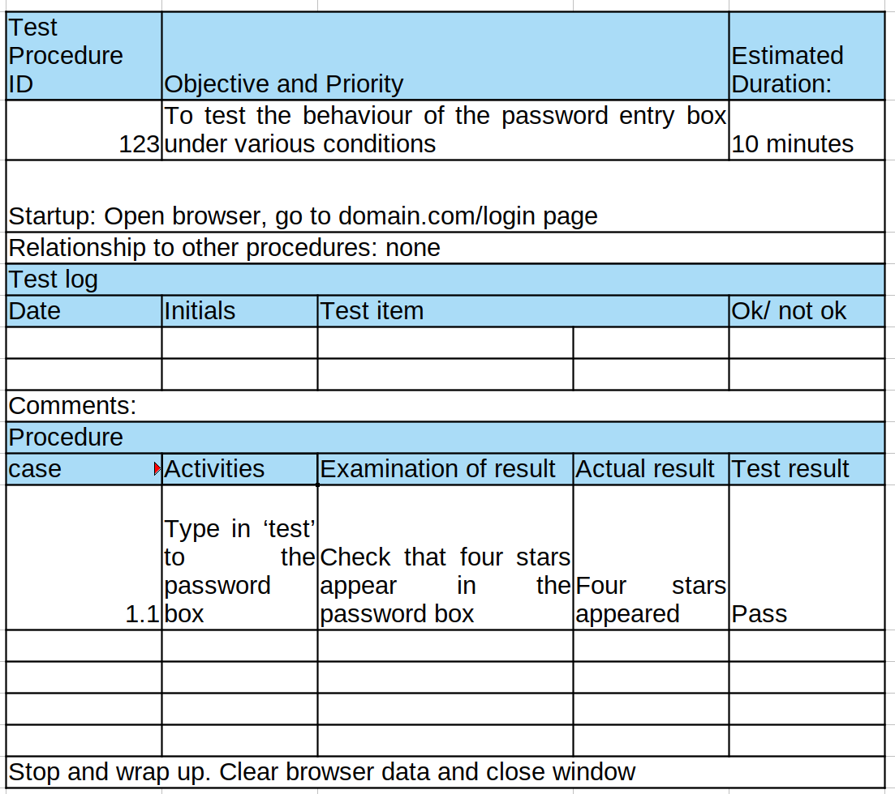
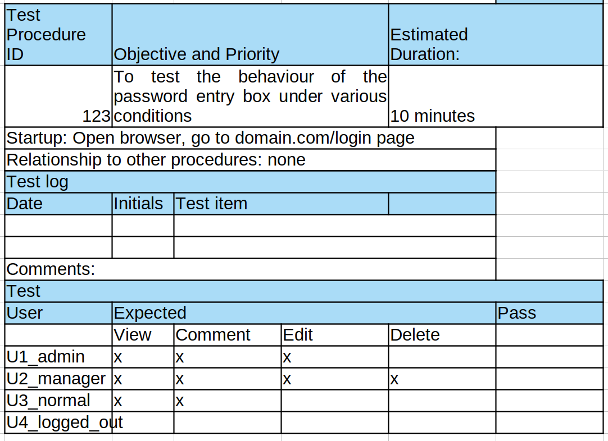

<!-- omit in toc -->
# Testing

- [Classification of Testing](#classification-of-testing)
  - [IEEE Definitions](#ieee-definitions)
  - [Glass's Taxonomy](#glasss-taxonomy)
    - [The Goals Axis](#the-goals-axis)
    - [The Phase Axis](#the-phase-axis)
    - [The Matrix](#the-matrix)
- [Test Procedure Templates](#test-procedure-templates)
  - [Step by Step](#step-by-step)
  - [Matrix](#matrix)
- [Developer Testing Strategies](#developer-testing-strategies)
  - [Notes from MYK's 'What to Test' Video](#notes-from-myks-what-to-test-video)
  - [Notes from *Object Oriented Software Engineering*, ch. 10](#notes-from-object-oriented-software-engineering-ch-10)
    - [Choosing what to test](#choosing-what-to-test)
    - [Common Defects in ordinary algorithms](#common-defects-in-ordinary-algorithms)
    - [Common Bugs in Numerical Algorithms](#common-bugs-in-numerical-algorithms)
    - [Writing formal test cases and plans](#writing-formal-test-cases-and-plans)
- [Test Driven Development](#test-driven-development)

## Classification of Testing

### IEEE Definitions

*Definition of Black Box - 3.272:*

> ***Black Box:*** 1. A system or component whose inputs, outputs, and general function are known but whose contents or implementation are unknown or irrelevant. 2. Pertaining to an approach that treats a system or component whose inputs, outputs, and general function are known but whose contents or implementation are unknown or irrelevant.

*Definition of Glass/White Box - 3.1257:*

> ***Glass Box:*** 1. A system or component whose internal contents or implementation are known.  2. pertaining to an approach that treats a system or component as in (1). *Syn:* white box

### Glass's Taxonomy

Notes from the two Robert Glass articles in the reading for the course. [Article one](https://ieeexplore.ieee.org/document/4670725), [article two](https://ieeexplore.ieee.org/document/4721193).

The taxonomy is a 2D matrix, down one axis are the four testing goals:

#### The Goals Axis

***Requirements Driven Testing***

This testing examines the requirements for the artifact being tested and explores whether the artifact satisfies them. This most often happens in practice through a requirements/test-case matrix. Such testing is often called "black-box" testing because those conducting it need not know how the software is built, they only need the requirements or user documentation. This is the first line of testing attack and you should have 100% coverage.

***Structure Driven Testing***

This testing whether the as-built artifact's elements work correctly. These might be modules, statements, logic branches, or logic paths. This is often called "white-box" because those conducting it (usually programmers) must know how the software is built in order to perform it. Likely 85% coverage is the best we can often hope for here.

***Statistics Driven Testing***

This testing determines how well the software product satisfies the customers' or users' needs for trustworthiness. Customers often don't like the first two approaches because they don't answer the customer's fundamental question = can I rely on this software? This kind of testing is the focus of approaches like "cleanroom" testing, which chooses test-case inputs on the basis of a random sampling of the typical usage profiles for the product.

***Risk Driven Testing***

This testing wards off the most serious problems the software might encounter. It identifies potential risks and constructs tests to determine whether the software product is vulnerable to them. This is vital for software requiring high reliability.

#### The Phase Axis

There is another axis reflecting the software life cycle in three phases.

***Unit Testing***

Involves the lowest level components of the evolving software product. Typically the unit being tested is a module or collection of modules.Typically you have to build a framework to test the unit as the software is incomplete.

***Integration Testing***

The intermediate level of software production. Here the artifacts under test are integrated clusters of units, often a partial or complete set of modules. You can test the software as a finished product without building a framework.

***System Testing***

The final level of software production. Many software systems fit in larger systems of some sort. Test the entire system, usually something much larger than the software system, to determine whether the software plays satisfactorily with the system's different pieces.

#### The Matrix

The axis are combined in the following matrix to show the degree of each kind of testing that should occur in each phase:

| Testing Approach | Unit Testing | Integration Testing | System Testing |
| ---------------- | ------------ | ------------------- | -------------- |
| Requirements-driven | 100% unit requirements | 100% product requirements | 100% system requirements |
| Structure-driven | 85% logic paths | 100% modules | 100% components |
| Statistics-driven | -- | -- | 90-100% of usage profiles if required |
| Risk-driven | As required | As required | 100% if required |

## Test Procedure Templates

Two ISO templates are shared in the module:

### Step by Step

This is the ISO original I think:

### Matrix

This is MYK's adaptation. The matrix bit at the bottom is his original tweaking.

## Developer Testing Strategies

### Notes from MYK's 'What to Test' Video

What to test:

- *Interface Testing*. Verify that the types accepted and returned are correct. What about default arguments? Check properties of complex structures.

- *Exercising Data Structures*. Is the code using data structures correctly? Is it storing what we're putting in containers. Is the data structure complete and integral after use. Can it handle the size of data we need?

- *Boundary Testing*. Most testing is around this. What happens if I pass 0 or a negative integer? Can I find the last element in an array?

- *Execution Paths*. Does the software successfully execute all logical paths. Does it return correctly from all possible exit points.

- *Error Handling*. Are the error messages intelligible? Does the reported error match the encountered error? Does the code reach the error handling logic?

No sources were given for this classification scheme.

### Notes from *Object Oriented Software Engineering*, ch. 10

#### Choosing what to test

If using white box testing, code can be analyzed to to ensure that the testing strategy has reached a target *coverage* of statements and branches, for example that 90% of all statements have been executed and 80% of all branches taken.

Use equivalence classes to limit the range of values to test. For example if testing an integer to be in a valid range, we could define three equivalence classes - too low, in range, and too high. Then we don't need to test every integer. Identifying equivalence classes can be tricky and often requires understanding of the underlying data representation. Values at the boundaries of equivalence classes should be tested, they are more likely to produce errors than values in the middle.

It is also subject to combinatorial explosion. Imagine testing a form with ten fields, with interdependent validity criteria. You cannot realistically test every scenario. A reasonable approach would be to test each equivalence class for each individual input, and combinations where the input of one will affect the interpretation of another.

#### Common Defects in ordinary algorithms

***Incorrect logical conditions***

*Problem* The logical conditions that govern looping and if-else conditions are wrongly formulated. Sometimes parentheses are wrong, or < has been substituted for >.

*Strategy* Use boundary testing on equivalence classes. To determine the equivalence classes, treat each variable used in the condition as input.

***Performing a Calculation in the wrong part of a control block***

*Problem:* The program performs an action where it should not, for example wrongly putting a statement inside or outside a loop or if-else block.

*Strategy:* Design tests that execute each loop zero times, exactly once, and more than once.

***Not terminating a loop or recursion***

*Problem* A loop or recursion does not terminate.

*Strategy* Assume there is a flaw in the loop/recursion and identify what should be a terminating condition, then test it.

***Not setting up correct preconditions***

*Problem* An algorithm is specified by its preconditions, what must be true for the algorithm to execute. A common error is for an algorithm to execute regardless of its preconditions not being satisfied.

*Strategy* Identify the preconditions and test on input just outside the range the algorithm should accept.

***Not handling null conditions***

*Problem* A null condition is where there normally exists one or more data items to process, but sometimes there are none. A program should often 'do nothing, gracefully' in those circumstances, it is a failure if the program behaves abnormally.

*Strategy* Determine all possible null conditions and run test cases to highlight inappropriate behaviour.

***Not handling singleton or non-singleton conditions***

*Problem* These are similar to the null condition. A singleton condition is where there are normally more than one of something, but sometimes only one. Non-singleton is the inverse. These are commonly overlooked.

*Strategy* Brainstorm unusual conditions and run appropriate tests.

***Off-by-one errors***

*Problem* A program inappropriately adds or subtracts 1, or loops one too many or too few times.

*Strategy* Develop boundary tests where you verify the program produces the correct numerical answer or the correct number of iterations.

***Operator precedence errors***

*Problem* Occurs when a programmer omits needed parentheses or adds them in the wrong place. Usually these are obvious, but they can sometimes lie hidden.

*Strategy* Code inspections are the best route to catch these most likely.

***Use of inappropriate standard algorithms***

*Problem* Use of an algorithm with known issues, for example an inefficient sort, a non-stable sort, a search that is case sensitive when it should not be or vice versa.

*Strategy* Code inspection or testing around known issues.

#### Common Bugs in Numerical Algorithms

***Not enough bits to store maximum values***

*Problem* The program uses types that are not capable of representing the largest values that could be needed.

*Strategy* Test using extreme values.

***Using insufficient places after the decimal or too few significant figures***

*Problem* A floating point value may not be wide enough to store enough significant figures. A fixed point value might not store enough places after the decimal. Can lead to inaccuracies due to values being rounded.

*Strategy* Perform calculations with many significant figures and large differences in magnitude and verify the results.

***Ordering operations poorly so that mistakes build up***

*Problem* For example, doing small operations on large floats will often lead to rounding errors, if you rely on the value changing you are in trouble. An artificial example - imagine you are working with 4 sig. figures and you want to delete small amounts from 9876. If you repeatedly delete 0.42, 0.35, 0.27. 0.47 you will be left with 9876. However if you first add the numbers to be deleted and then subtract 1.51 from 9876 you get 9874. Which do you intend?

*Strategy* Test result accuracy when floats are repeatedly incremented or decremented by small amounts.

***Assuming a float will exactly equal another value***

*Problem* If you perform arithmetic on a float the result will rarely be exact, therefore it's a defect to test whether a float is exactly equal another value. You should test whether it's in a small range instead.

*Strategy* Boundary testing should pick this up.

#### Writing formal test cases and plans

A *test case* is an explicit set of instructions designated to detect a particular class of defect in a system by bringing about a failure. Each test case can produce several *tests* which is a particular run of the test case on a particular version of the system.

A *test plan* is a document that contains a complete set of test cases for a system, along with other info on the testing process. Without this, testing will be done ad-hoc and likely badly.

Each test case should have:

- *Identification and Classification* An id, a descriptive title, the software unit tested, related requirements, and an importance value.
- *Instructions*. Telling the tester what to do.
- *Expected result*. Telling the tester what they should see.
- *Cleanup* How to reset the system after use.

## Test Driven Development

Notes from Martin, 'Professionalism and Test Driven Development', 2007

TDD practitioners follow three laws:

1. You may not write production code unless you've written a failing unit test

2. You may not write more of a unit test than is sufficient to fail

3. You may not write more production code than is sufficient to make the failing unit test pass

There follows a tight loop, maybe two minutes long, where you write a portion of a unit test that fails, write just enough code to make it pass, then repeat.

Following the laws perfectly doesn't always make sense, sometimes you write a larger test, sometimes you'll write extra code, sometimes you'll write the tests after the code etc. 

> The goal isn't perfect adherence to the laws - it's to decrease the interval between writing tests and production code to a matter of minutes.

This is counter-intuitive to common practice where you might write whole a whole module and then write a suite of tests for it. Martin compares the discipline of TDD with hygiene in hospitals(!) - it affects the minute by minute work of developers and has profound results.

Impediments to implementing TDD include - batch compiles, embedded development, untestable legacy code, third-party packages.

Benefits of TDD as seen by Martin:

*Flexibility:* Developers stick with old code because they're afraid they'll break it if they start meddling. TDD alleviates the fear and lets us clean up messy code.

*Documentation:* Tests are a form of unambiguous documentation, written in a language spoken by developers. They will call a critical API function and give a guide for how to do that.

*Minimal Debugging:* If you follow the three laws within reason you're never more than a few minutes from seeing all the tests run. You'll detect any bug that creeps in within minutes. You'll know where you introduced it. (Not quite that simple as tests can take time so you end up partitioning them)

*Better Design:* Most of our code will be, by definition, testable. This is good OOP design. It provides a strong impetus to decouple.

